In this article we will be sharing a break down of over over 15 completely free REACT landing page templates that you can use to launch your next product:

[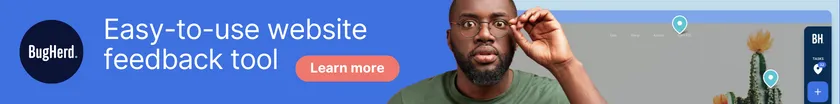](https://gbti.network/outbound/bugherd)

Open this link in a new tab to learn about **BugHerd**, our sponsor for this article.

## #1 Shadcn Landing Page (by leoMirandaa)

This REACT landing page template uses the Shadcn library, Tailwind, and Typescript:

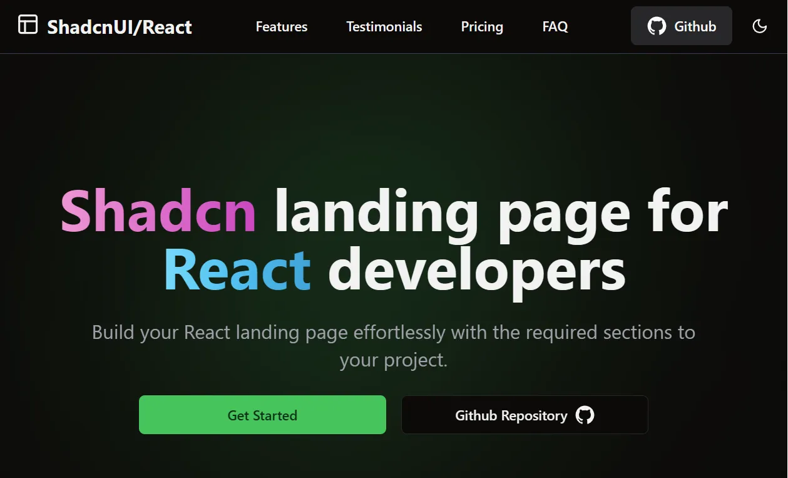

[VIEW THE DEMO](https://shadcn-landing-page.vercel.app/)

[VISIT THE GITHUB](https://github.com/leoMirandaa/shadcn-landing-page)

## #2 Shadcn Landing Page (by nobruf)

This REACT landing page template uses the Shadcn library, Tailwind, and Typescript:

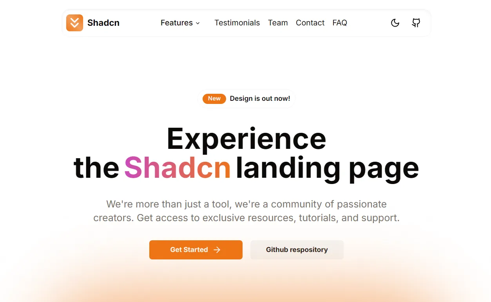

[VIEW THE DEMO](https://shadcn-landing-page-livid.vercel.app/)

[VISIT THE GITHUB](https://github.com/nobruf/shadcn-landing-page)

## #3 Nefa (by RSurya99)

Free landing page template built using NuxtJS and TailWindCSS

[VIEW THE DEMO](https://nefa-rsurya99.vercel.app/)

[VISIT THE GITHUB](https://github.com/RSurya99/nefa)

## #4 Ada-HTML (by Tailus-UI)

Modern html landing page built with [Tailus](https://tailus.io/). Users TailwindCSS.

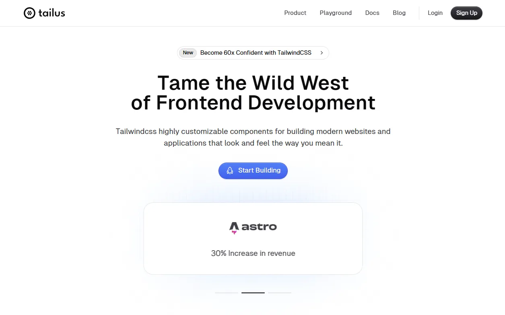

[VIEW THE DEMO](https://ada.tailus.io/)

[VISIT THE GITHUB](https://github.com/Tailus-UI/ada-html)

## #5 LandWind (by Themesberg)

Responsive and clean landing page built with Tailwind CSS and [Flowbite](https://flowbite.com/).

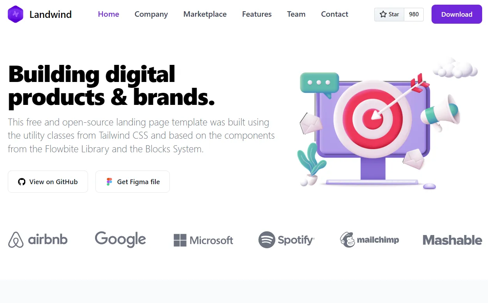

[VIEW THE DEMO](https://demo.themesberg.com/landwind/)

[VISIT THE GITHUB](https://github.com/themesberg/landwind)

## #6 Play Tailwind (by TailGrids)

Play is free and open source Tailwind CSS template for – Startup, SaaS, Apps, Business and More. It comes with a high-quality design and all essential components & pages you need to launch a complete website.

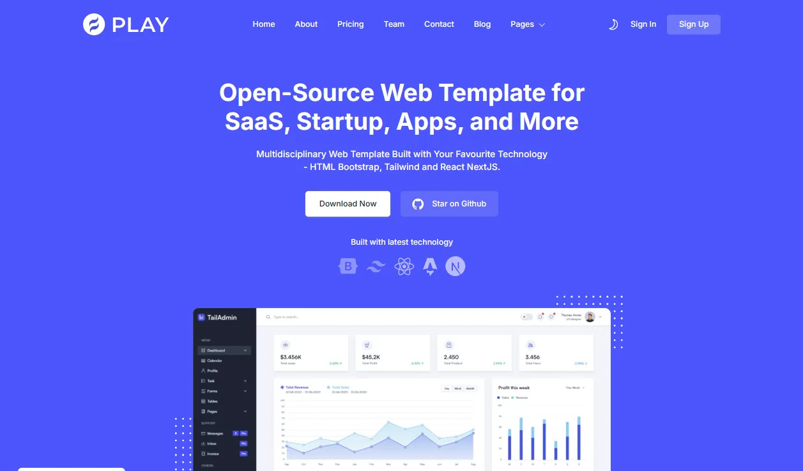

[VIEW THE DEMO](https://play-tailwind.tailgrids.com/)

[VISIT THE GITHUB](https://github.com/TailGrids/play-tailwind)

## #7 Landing Page Boilerplate (by Weijunext)

A versatile landing page boilerplate, ideal for various projects and marketing campaigns.

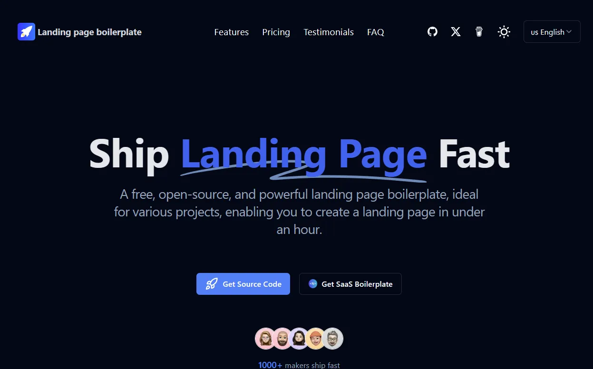

[VIEW THE DEMO](https://landingpage.weijunext.com/)

[VISIT THE GITHUB](https://github.com/weijunext/landing-page-boilerplate)

## #8 Next Landing VPN (by naufaldi)

An Open Source Landingpage For VPN or Apps. Build using NextJS 12 and Tailwind v3.0

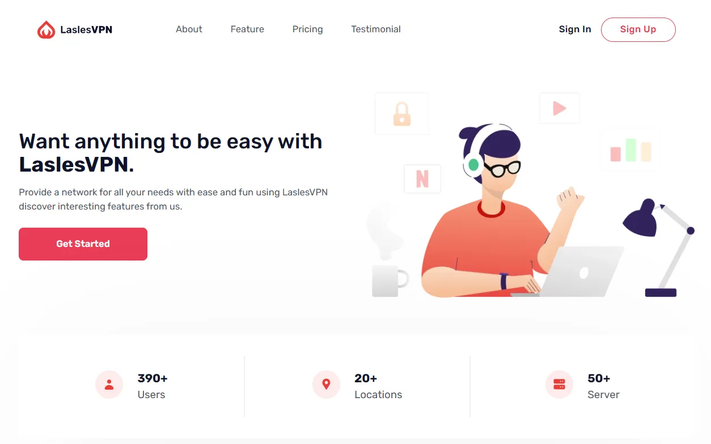

[VIEW THE DEMO](https://next-landing-vpn.vercel.app/)

[VISIT THE GITHUB](https://github.com/naufaldi/next-landing-vpn)

## #9 Nextly Template (by web3templates)

Nextly Landing Page Template built with Next.js & TailwindCSS

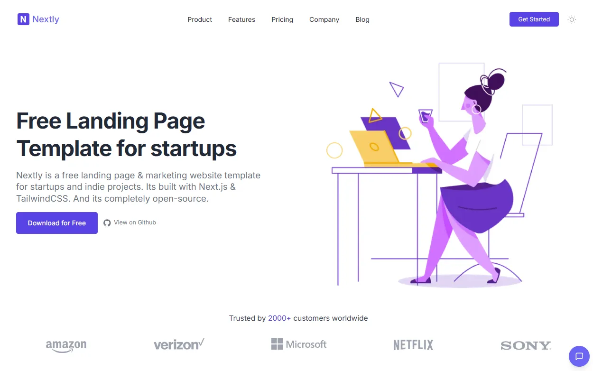

[VIEW THE DEMO](http://nextly.web3templates.com/)

[VISIT THE GITHUB](https://github.com/web3templates/nextly-template)

## #10 Astro Theme (by Tailus-UI)

Home page template built with astro and tailwindcss using tailus blocks

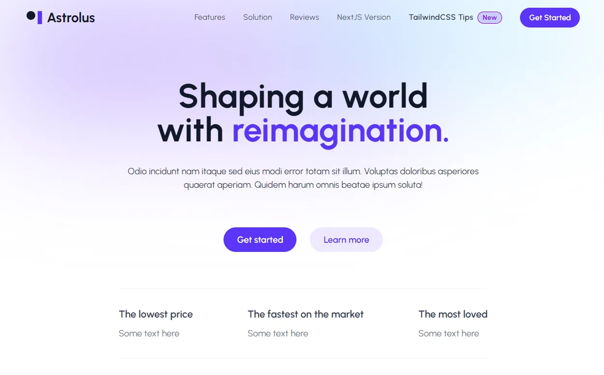

[VIEW THE DEMO](https://astrolus-free.tailus.io/)

[VISIT THE GITHUB](https://github.com/Tailus-UI/astro-theme)

## #11 Modilla Connect (by Ekaji)

A modern, responsive landing page for a team collaboration and project management platform built with React, TypeScript, and Tailwind CSS.

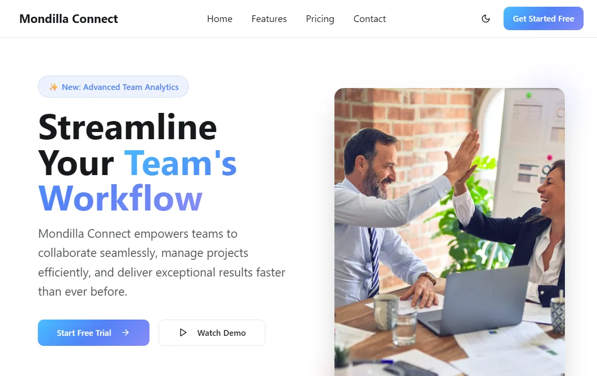

[VIEW THE DEMO](https://mondilla-saas.vercel.app/)

[VISIT THE GITHUB](https://github.com/Ekaji/Mondilla-Connect)

## #12 Open React Template (by cruip)

A free React / Next.js landing page template designed to showcase open source projects, SaaS products, online services, and more. Made by [cruip.com](https://cruip.com)

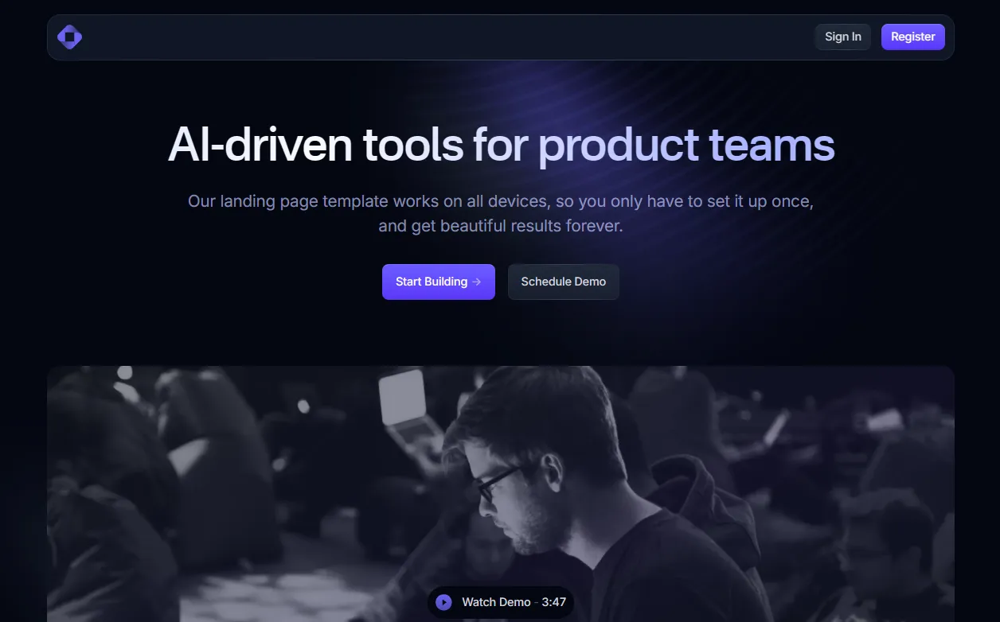

[VIEW THE DEMO](https://open.cruip.com/)

[VISIT THE GITHUB](https://github.com/cruip/open-react-template)

## #13 Notus NextJS (by creativetimofficial)

Notus NextJS: Free Tailwind CSS UI Kit and Admin

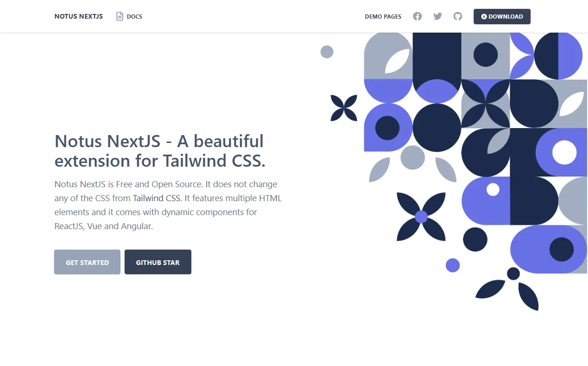

[VIEW THE DEMO](https://demos.creative-tim.com/notus-nextjs)

[VISIT THE GITHUB](https://github.com/creativetimofficial/notus-nextjs)

## #14 Landy (by Adrinlol)

Landy is an open-source React landing page template designed for developers and startups, who want to create a quick and professional landing page for their business or project.

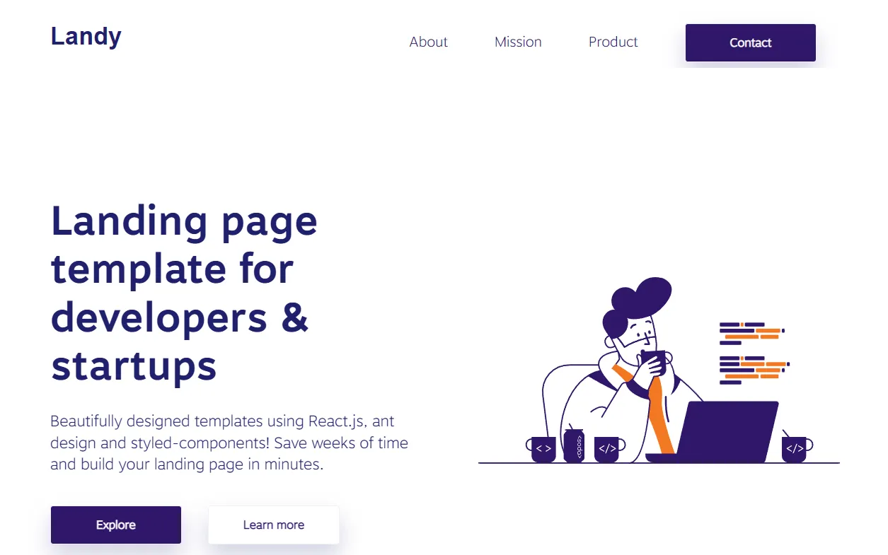

[VIEW THE DEMO](https://landy-web.netlify.app/)

[VISIT THE GITHUB](https://github.com/Adrinlol/landy-react-template)

## #15 Bizflow(by adityadomle)

BizFlow is a sleek, responsive business landing page built with React, Tailwind CSS, and Framer Motion. Designed with modular components and smooth animations, it’s ideal for startups, agencies, and SaaS businesses aiming for a premium online presence.

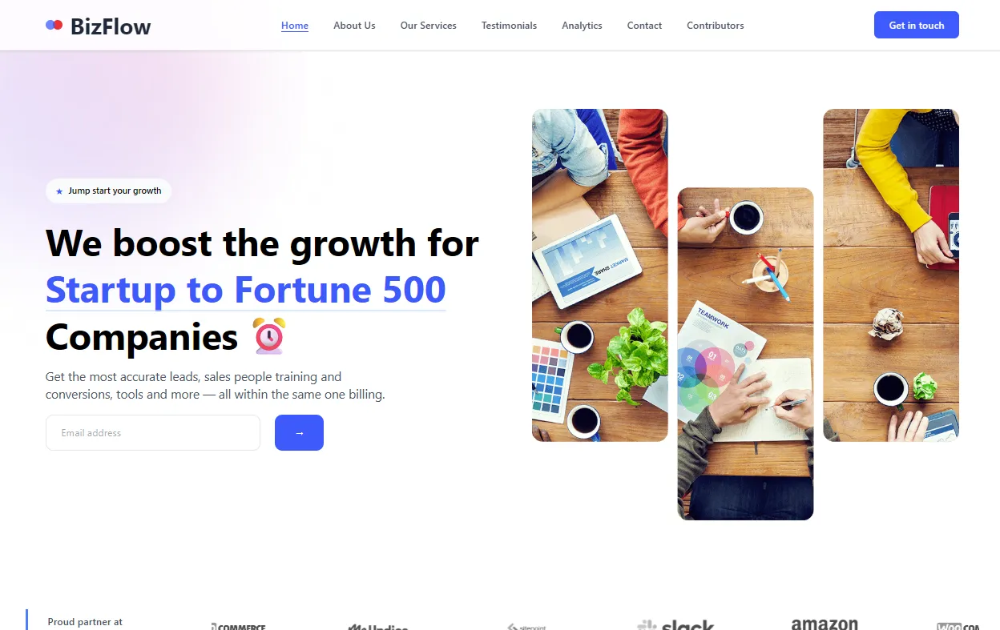

[VIEW THE DEMO](https://biz-flow-alpha.vercel.app/)

[VISIT THE GITHUB](https://github.com/adityadomle/BizFlow)

Open this link in a new tab to learn about **BugHerd**, our sponsor for this article.

## Follow the GBTI Network for more content like this

Leave a comment below if you would like us to consider adding your free REACT landing page template and follow us on your favorite platforms for updates, news, and community discussions:

-   **[Twitter/X](https://twitter.com/gbti_network)**
-   **[GitHub](https://github.com/gbti-network)**
-   **[YouTube](https://www.youtube.com/channel/UCh4FjB6r4oWQW-QFiwqv-UA)**
-   **[Dev.to](https://dev.to/gbti)**
-   **[Daily.dev](https://dly.to/zfCriM6JfRF)**
-   **[Hashnode](https://gbti.hashnode.dev/)**
-   **[Discord Community](https://gbti.network/)**
-   **[Reddit Community](https://www.reddit.com/r/GBTI_network)**
