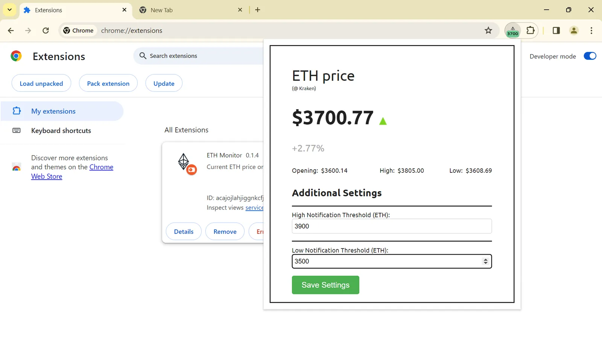

GBTI Labs is happy to introduce [ETH Monitor](https://github.com/gbti-labs/chrome-extension-eth-monitor), a Chrome Extension designed to keep you updated on Ethereum prices directly from your browser while also allowing push notifications on certain price events.

**What is ETH Monitor?**

**ETH Monitor** is a simple, yet powerful Chrome extension that displays the current Ethereum (ETH) price on your extension’s badge icon. It is designed for those who seek to keep an eye on Ethereum’s market price with ease and efficiency. The extension leverages the [Kraken API](https://docs.kraken.com/rest/) to fetch real-time price data, ensuring that users receive the most current information available.

**Core Features**

-   **Real-Time Price Updates:** The extension refreshes Ethereum prices periodically, offering up-to-the-minute accuracy directly on your browser’s icon.
-   **Detailed Market Insights:** Beyond the badge icon display, ETH Monitor provides a popup window that offers more detailed market information. This includes data points like opening price, current high and low thresholds, and an option for users to set custom push notification thresholds for price alerts.
-   **Customizable Alert Thresholds:** Users can set specific high and low price thresholds. When these thresholds are met, ETH Monitor will send push notifications to alert the user, making it easier to stay informed about significant market movements.

**Getting Started with ETH Monitor**

Installation is straightforward:

1.  Download or clone the [ETH Monitor repository](https://github.com/gbti-labs/chrome-extension-eth-monitor).
2.  Navigate to `chrome://extensions/` in your Chrome browser and enable Developer mode.
3.  Select “Load unpacked” and choose the `src` directory from the ETH Monitor project.
4.  The extension is now installed and ready to use.

Once installed, the extension will begin tracking Ethereum’s price and display it on the badge icon. For those interested in more detailed information or wishing to set price alerts, a click on the badge icon reveals a popup window filled with additional data and settings.

**Additional Information**

This is a very simple prototype that we built for fun. If you like it, or have ideas for something more grandiose, feel free to [follow us on X](https://twitter.com/gbtilabs) and @ us for a DM.
