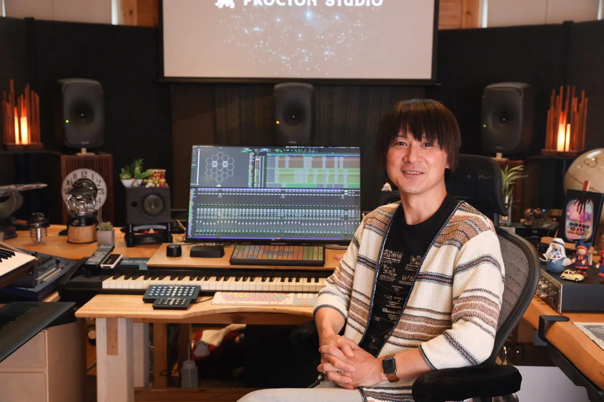
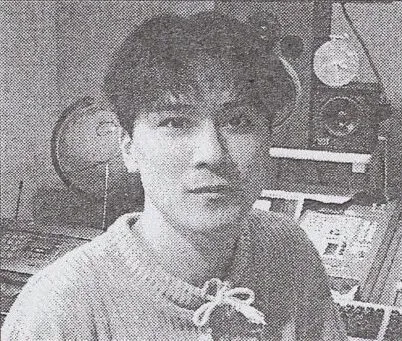
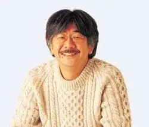

## Yasunori Mitsuda: Upstart and Composer

[Yasunori Mitsuda](https://en.wikipedia.org/wiki/Yasunori_Mitsuda) began his journey in a modest role at a well known game development company as a sound engineer.

In 1992, at the age of 20, he joined Square (now [Square Enix](https://en.wikipedia.org/wiki/Square_Enix)), handling sound effects rather than music composition.

Despite working on notable titles like **[Final Fantasy V](https://en.wikipedia.org/wiki/Final_Fantasy_V)** and **[Secret of Mana](https://en.wikipedia.org/wiki/Secret_of_Mana)**, Mitsuda felt unfulfilled. His passion lay in composing music, not just designing sound effects.

Determined to change his fate, Mitsuda mustered the courage to confront Square’s vice president, [Hironobu Sakaguchi](https://en.wikipedia.org/wiki/Hironobu_Sakaguchi).

 **“I told Sakaguchi-san that I would quit if I couldn’t compose music,”** recalled Mitsuda. **“I was young and reckless, but I needed to follow my passion.”**

Impressed by his determination, Sakaguchi assigned him to **Chrono Trigger**, a highly anticipated project that would become a cornerstone in gaming history.[^1]

## A Dream Project

Chrono Trigger was no ordinary project. Dubbed the **“Dream Project,”** it brought together an all-star team, including Dragon Quest creator [Yuji Horii](https://en.wikipedia.org/wiki/Yuji_Horii), Dragon Ball artist [Akira Toriyama](https://en.wikipedia.org/wiki/Akira_Toriyama), and Final Fantasy talents like [Hironobu Sakaguchi](https://en.wikipedia.org/wiki/Hironobu_Sakaguchi). The pressure to deliver a groundbreaking game was immense. Mitsuda felt this weight acutely.[^2]

“I was surrounded by legends,” he said. “I knew I had to create something extraordinary to stand alongside their work.”

Mitsuda immersed himself in the project, often working late into the night. Mitsuda even moved his bed into the office and slept in the studio to maximize his working hours.[^3]

To craft the game’s unique soundscape, Mitsuda drew inspiration from various sources, including world music and his own dreams.[^4]

“I wanted to create music that players had never heard before” – “Sometimes, melodies would come to me in my sleep, and I’d rush to write them down.”

CjxmaWd1cmUgY2xhc3M9IndwLWJsb2NrLWVtYmVkIGlzLXR5cGUtdmlkZW8gaXMtcHJvdmlkZXIteW91dHViZSB3cC1ibG9jay1lbWJlZC15b3V0dWJlIHdwLWVtYmVkLWFzcGVjdC0xNi05IHdwLWhhcy1hc3BlY3QtcmF0aW8iIGRhdGEtbGF6eS1sb2FkPSJ0cnVlIj48ZGl2IGNsYXNzPSJ3cC1ibG9jay1lbWJlZF9fd3JhcHBlciI+CjxpZnJhbWUgdGl0bGU9IkNocm9ubyBUcmlnZ2VyIFNvdW5kdHJhY2sgLSBTY2hhbGEmIzAzOTtzIFRoZW1lIFtIUV0iIHdpZHRoPSI3NjAiIGhlaWdodD0iNDI4IiBzcmM9Imh0dHBzOi8vd3d3LnlvdXR1YmUuY29tL2VtYmVkL2JRNmthTmNzdzRRP2ZlYXR1cmU9b2VtYmVkIiBmcmFtZWJvcmRlcj0iMCIgYWxsb3c9ImFjY2VsZXJvbWV0ZXI7IGF1dG9wbGF5OyBjbGlwYm9hcmQtd3JpdGU7IGVuY3J5cHRlZC1tZWRpYTsgZ3lyb3Njb3BlOyBwaWN0dXJlLWluLXBpY3R1cmU7IHdlYi1zaGFyZSIgcmVmZXJyZXJwb2xpY3k9InN0cmljdC1vcmlnaW4td2hlbi1jcm9zcy1vcmlnaW4iIGFsbG93ZnVsbHNjcmVlbj48L2lmcmFtZT4KPC9kaXY+PC9maWd1cmU+Cg==

In the above track, _Schala’s Theme_, there is an an ethereal quality, signifying the passing of time while invoking a haunting, if not otherworldly beauty filled with somber journey and desert emotion.

### Hard Drive Failure

Midway through development, disaster struck. A hard drive crash resulted in the loss of around 40 completed tracks.[^5]

**“It was devastating,”** Mitsuda lamented. **“Months of work vanished in an instant.”**

The team scrambled to recover what they could, but most of the data was irretrievable.

Mitsuda began reconstructing the lost pieces from memory.

### Life and health; against a deadline.

The mounting stress against a production deadline took a toll on Mitsuda’s health. He began experiencing severe stomach pains, later diagnosed as stomach ulcers.[^6] He was known to have caughing fits at the office that would include blood. He continued to push himself until he collapsed and was hospitalized.

Mitsuda needed a helping hand and , [Nobuo Uematsu](https://en.wikipedia.org/wiki/Nobuo_Uematsu), known for his work on the _Final Fantasy_ series, stepped in to complete the remaining tracks, hoping to relieve the deadline pressure that Mitsuda was experiencing.

**Uematsu**, a veteran composer, was extremely impressed with Mitsuda’s work and vowed to bring it to completion with great care and consideration to honor his collegauges progress.  
  
This would lead to two great composures contributing to one of the greatest RPGs of all time.

  
  
  
[Nobuo Uematsu](https://www.google.com/url?sa=i&url=https%3A%2F%2Fwww.vgmpf.com%2FWiki%2Findex.php%2FNobuo%2520Uematsu&psig=AOvVaw1QIxgdEbJ33hJzpp811LPm&ust=1726099131601000&source=images&cd=vfe&opi=89978449&ved=0CBcQjhxqFwoTCLjRosLKuYgDFQAAAAAdAAAAABAK)

**“I was amazed by what Mitsuda had accomplished,”** Uematsu said. **“He poured his heart into the music, and I wanted to honor that.”** – Nobuo Uematsu

Uematsu composed ten tracks, including “[Underground Sewer](https://www.youtube.com/watch?v=ldMCo4Aj7fA)” and “[People Who Threw Away the Will to Live,](https://www.youtube.com/watch?v=jLozZBiSJmw)” ensuring the project stayed on schedule.[^7]

CjxmaWd1cmUgY2xhc3M9IndwLWJsb2NrLWVtYmVkIGlzLXR5cGUtdmlkZW8gaXMtcHJvdmlkZXIteW91dHViZSB3cC1ibG9jay1lbWJlZC15b3V0dWJlIHdwLWVtYmVkLWFzcGVjdC0xNi05IHdwLWhhcy1hc3BlY3QtcmF0aW8iIGRhdGEtbGF6eS1sb2FkPSJ0cnVlIj48ZGl2IGNsYXNzPSJ3cC1ibG9jay1lbWJlZF9fd3JhcHBlciI+CjxpZnJhbWUgdGl0bGU9IlVuZGVyZ3JvdW5kIFNld2VyIiB3aWR0aD0iNzYwIiBoZWlnaHQ9IjQyOCIgc3JjPSJodHRwczovL3d3dy55b3V0dWJlLmNvbS9lbWJlZC9sZE1DbzRBajdmQT9mZWF0dXJlPW9lbWJlZCIgZnJhbWVib3JkZXI9IjAiIGFsbG93PSJhY2NlbGVyb21ldGVyOyBhdXRvcGxheTsgY2xpcGJvYXJkLXdyaXRlOyBlbmNyeXB0ZWQtbWVkaWE7IGd5cm9zY29wZTsgcGljdHVyZS1pbi1waWN0dXJlOyB3ZWItc2hhcmUiIHJlZmVycmVycG9saWN5PSJzdHJpY3Qtb3JpZ2luLXdoZW4tY3Jvc3Mtb3JpZ2luIiBhbGxvd2Z1bGxzY3JlZW4+PC9pZnJhbWU+CjwvZGl2PjwvZmlndXJlPgo=

### Tracks that Nobuo Uematsu created:

1.  **“[Silent Light](https://www.youtube.com/watch?v=YW2J96RVN64)“**  
    _Used in eerie or mysterious locations, this track sets an atmospheric tone._
2.  **“[Mystery of the Past](https://www.youtube.com/watch?v=eb7rgUw6pWk)“**  
    _This piece underscores scenes involving historical revelations and time travel._
3.  **“[Ruined World](https://www.youtube.com/watch?v=txsgzJyBPp4)“**  
    _Reflecting the desolation of a post-apocalyptic future, it conveys a sense of despair._
4.  **“[Underground Sewer](https://www.youtube.com/watch?v=ldMCo4Aj7fA)“**  
    _An ambient track that accompanies the exploration of subterranean areas._
5.  **[“Burn! Bobonga!”](https://www.youtube.com/watch?v=KhChHmk1o8c)**  
    _A lively and rhythmic piece used in prehistoric settings._
6.  **[“Boss Battle 2”](https://www.youtube.com/watch?v=SI-tAn2AkHs)**  
    _An intense battle theme for specific boss encounters, adding urgency to the fights._
7.  [**“Bike Chase”**](https://www.youtube.com/watch?v=MSvolFrWlbs)  
    _A fast-paced track used during the jet bike racing sequence, enhancing the action._
8.  **[“Sealed Door”](https://www.youtube.com/watch?v=zCSG-jBm0qY)**  
    _A mysterious and somber piece associated with hidden truths and revelations._
9.  **[“Primitive Mountain”](https://www.youtube.com/watch?v=-_z22FrMEKk)**  
    _Captures the raw energy of ancient landscapes and primeval challenges._
10.  **“[People Who Threw Away the Will to Live](https://www.youtube.com/watch?v=jLozZBiSJmw)“**  
     _A melancholic track reflecting themes of hopelessness and resignation._

The Chono Trigger soundtrack spanned **64 tracks over three discs**, including both unreleased pieces and experimental compositions.

### Tracks that Yasunori Mitsuda created:

Here are tracks composed by **Yasunori Mitsuda** for **Chrono Trigger**, before handing the project over to Mitsuda:

1.  **“[Chrono Trigger](https://www.youtube.com/watch?v=Fi_D97cHcbQ)“**  
    The main theme of the game, encapsulating the adventurous spirit of time travel.
2.  **“[Morning Sunlight](https://www.youtube.com/watch?v=X5nN0calkss)“**  
    A serene piece that plays during peaceful mornings in Crono’s hometown.
3.  **“[Peaceful Days](https://www.youtube.com/watch?v=YIcuOCFBM28)“**  
    Reflects the tranquility of everyday life before the journey begins.
4.  **“[Memories of Green](https://www.youtube.com/watch?v=WDpPMu8EApg)“**  
    The overworld theme for 1000 A.D., evoking nostalgia and exploration.
5.  **“[Guardia’s Millennial Fair](https://www.youtube.com/watch?v=5yZqUZln6so)“**  
    An upbeat track that plays during the festive fair at the game’s start.
6.  **“[Gato’s Song](https://www.youtube.com/watch?v=Fy5VBn2VHN4)“**  
    A whimsical tune sung by the robot Gato at the fair, featuring humorous lyrics.
7.  **“[A Strange Happening”](https://www.youtube.com/watch?v=D-gVKEsuurI)**  
    Conveys mystery during unusual events, hinting at the unfolding adventure.
8.  **“[Wind Scene](https://www.youtube.com/watch?v=pUFELL5hHbg)“**  
    The overworld theme for 600 A.D., with a sense of history and heroism.
9.  **“[Good Night](https://www.youtube.com/watch?v=FsNUuOHIQgI)“**  
    A short lullaby that plays when characters rest at an inn.
10.  **“[Secret of the Forest](https://www.youtube.com/watch?v=fKex3QoPc8A)“**  
     An atmospheric piece for forested areas, mysterious and calming.
11.  **“[Battle 1](https://www.youtube.com/watch?v=UDG39ug8Bpo)“**  
     The standard battle theme for most encounters, energetic and engaging.
12.  **“[Guardia Castle ~ Pride & Glory](https://www.youtube.com/watch?v=2HwvlQR1Ex0)“**  
     A majestic theme representing the grandeur of Guardia Castle.
13.  **“[Huh?!](https://www.youtube.com/watch?v=7MQCozxzdhE)“**  
     A brief, comical piece used during surprising or humorous moments.
14.  **“[Manoria Cathedral](https://www.youtube.com/watch?v=myVrxIy_Cng)“**  
     An eerie track setting the mood inside the mysterious cathedral.
15.  **“[A Prayer to the Road That Leads](https://www.youtube.com/watch?v=i2rHcx_UbcE)“**  
     A short contemplative melody associated with moments of reflection and hope.
16.  **“[Frog’s Theme](https://www.youtube.com/watch?v=snl8txz5Xo0)“**  
     A heroic tune representing Frog’s noble character and quest for redemption.
17.  **“[Fanfare 1](https://www.youtube.com/watch?v=Qls9xNJ_dyQ)“**  
     A triumphant jingle played after victorious battles.
18.  **“[The Trial](https://www.youtube.com/watch?v=oqfhQJWNHP8)“**  
     Dramatic music during Crono’s trial, highlighting tension and intrigue.
19.  **“[The Hidden Truth](https://www.youtube.com/watch?v=0i1E1Zb8SZ0)“**  
     A mysterious piece accompanying revelations and discoveries.
20.  **“[A Shot of Crisis](https://www.youtube.com/watch?v=QdnEhGC09IQ)“**  
     An urgent track underscoring critical and high-stakes moments.
21.  **“[Boss Battle 1](https://www.youtube.com/watch?v=xV5zQlX3VzU)“**  
     The standard boss battle theme, intensifying major encounters.
22.  **“[The Brink of Time](https://www.youtube.com/watch?v=xN4hXbx4e2s)“**  
     A mystical piece associated with the End of Time location.
23.  **“[Delightful Spekkio](https://www.youtube.com/watch?v=22a8X58BwyU)“**  
     A whimsical theme for Spekkio, the Master of War, lighthearted and fun.
24.  **“[Fanfare 2](https://www.youtube.com/watch?v=iYLXrlnlUDE)“**  
     Another victory jingle, celebrating achievements.
25.  **“[Rhythm of Wind, Sky, and Earth](https://www.youtube.com/watch?v=_1RgJEWfVW8)“**  
     A lively track from the prehistoric era, capturing primal energy.
26.  **“[Ayla’s Theme](https://www.youtube.com/watch?v=ctvSG5xfIDw)“**  
     A spirited theme representing Ayla, full of strength and vitality.
27.  **“[Tyran Castle](https://www.youtube.com/watch?v=Ltn9SmLbyDY)“**  
     An ominous piece for the Reptite lair, conveying danger and tension.
28.  **“[The Last Day of the World](https://www.youtube.com/watch?v=9F99QkbBdH0)“**  
     A somber melody reflecting the impending doom of the world.
29.  **“[World Revolution](https://www.youtube.com/watch?v=3sXiZbqZZ4A)“**  
     The first phase of the final battle theme, epic and climactic.
30.  **“[Last Battle](https://www.youtube.com/watch?v=vuW4UnWOucg)“**  
     The second phase of the final battle, conveying the ultimate confrontation.
31.  **“[The Day the World Revived](https://www.youtube.com/watch?v=xpoPnN8Dz2w)“**  
     A hopeful piece played after restoring the world, filled with optimism.
32.  **“[Chrono and Marle ~ A Distant Promise](https://www.youtube.com/watch?v=u-AR3vwUJ-8)“**  
     A romantic theme reflecting the bond between Crono and Marle.
33.  **“[Zeal Palace](https://www.youtube.com/watch?v=maYxTlz5pQo)“**  
     A regal theme that conveys the majesty and mystery of Zeal Palace.
34.  **[“Schala’s Theme](https://www.youtube.com/watch?v=bQ6kaNcsw4Q)“**  
     A hauntingly beautiful melody representing Schala’s character.
35.  **“[Corridors of Time](https://www.youtube.com/watch?v=BXo3DrXHY8w)“**  
     The theme for the Kingdom of Zeal, featuring exotic and timeless sounds.
36.  **“[Undersea Palace](https://www.youtube.com/watch?v=o7pML9YzOYg)“**  
     An atmospheric track for the enigmatic underwater palace, filled with tension.
37.  **“[Epoch ~ Wings of Time](https://www.youtube.com/watch?v=ptNG1ZUq17o)“**  
     The theme for the time-traveling ship Epoch, evoking wonder and possibility.
38.  **“[Black Dream](https://www.youtube.com/watch?v=NPSjh35eaWo)“**_(also known as “Black Omen”)_  
     The theme for the Black Omen dungeon, dark and foreboding.
39.  **“[Determination](https://www.youtube.com/watch?v=GtyyAf87B_A)“**  
     A motivational track that plays during pivotal, decisive moments.
40.  **“[Fanfare 3](https://www.youtube.com/watch?v=YwOR86tIl8I)“**  
     A celebratory jingle played at key victorious moments.
41.  **“[At the Bottom of Night](https://www.youtube.com/watch?v=yvyXqmDAZpk)“**  
     A somber melody associated with moments of introspection and melancholy.
42.  **“[Outskirts of Time](https://www.youtube.com/watch?v=Tdpeg781OwQ)“**_(also known as “To Far Away Times”)_  
     The ending theme, a reflective and emotional piece concluding the journey.
43.  **“[Epilogue ~ To Good Friends”](https://www.youtube.com/watch?v=cvJozq7k2aI)**  
     A warm piece that plays during the game’s epilogue, celebrating friendship and new beginnings.
44.  **“[Singing Mountain](https://www.youtube.com/watch?v=RooECSbuLro)“**_(Unused Track)_  
     An ethereal piece intended for an area that was cut from the game, but included in the soundtrack.
45.  **“[Boss Battle 3](https://www.youtube.com/watch?v=vbtehgTOPv8)“**_(Unused Track)_  
     An intense battle theme that was not used in the final game.
46.  **“[Festival of Stars](https://www.youtube.com/watch?v=Vs9yozaxB4I)“**  
     A joyous piece celebrating the culmination of the characters’ journey.
47.  **“[Remains of Factory](https://www.youtube.com/watch?v=oQQuC99vGoI)“**  
     An industrial-sounding piece set in the derelict factory of the future.
48.  **“[Robo’s Theme](https://www.youtube.com/watch?v=aLis3WHJzMk)“**  
     A catchy tune embodying Robo’s character and journey towards humanity.
49.  **“[The Brink of Time](https://www.youtube.com/watch?v=xN4hXbx4e2s)“**  
     A mystical piece associated with the End of Time location.
50.  **“[Light of Silence](https://www.youtube.com/watch?v=YW2J96RVN64)“** (Silent Light)  
     A serene and contemplative track, evoking a sense of calm.

**Note:** Some track names may vary slightly depending on the translation or version of the soundtrack.

## Editorial Picks:

The _Chrono Trigger_ soundtrack is celebrated for its thematic depth. Tracks like “[Secret of the Forest](https://www.youtube.com/watch?v=H92jEdiyQxE)” are some of the most memorable:

CjxmaWd1cmUgY2xhc3M9IndwLWJsb2NrLWVtYmVkIGlzLXR5cGUtdmlkZW8gaXMtcHJvdmlkZXIteW91dHViZSB3cC1ibG9jay1lbWJlZC15b3V0dWJlIHdwLWVtYmVkLWFzcGVjdC0xNi05IHdwLWhhcy1hc3BlY3QtcmF0aW8iIGRhdGEtbGF6eS1sb2FkPSJ0cnVlIj48ZGl2IGNsYXNzPSJ3cC1ibG9jay1lbWJlZF9fd3JhcHBlciI+CjxpZnJhbWUgdGl0bGU9IkNocm9ubyBUcmlnZ2VyICAtIFNlY3JldCBvZiB0aGUgRm9yZXN0IC0gT1NUIiB3aWR0aD0iNzYwIiBoZWlnaHQ9IjQyOCIgc3JjPSJodHRwczovL3d3dy55b3V0dWJlLmNvbS9lbWJlZC9IOTJqRWRpeVF4RT9mZWF0dXJlPW9lbWJlZCIgZnJhbWVib3JkZXI9IjAiIGFsbG93PSJhY2NlbGVyb21ldGVyOyBhdXRvcGxheTsgY2xpcGJvYXJkLXdyaXRlOyBlbmNyeXB0ZWQtbWVkaWE7IGd5cm9zY29wZTsgcGljdHVyZS1pbi1waWN0dXJlOyB3ZWItc2hhcmUiIHJlZmVycmVycG9saWN5PSJzdHJpY3Qtb3JpZ2luLXdoZW4tY3Jvc3Mtb3JpZ2luIiBhbGxvd2Z1bGxzY3JlZW4+PC9pZnJhbWU+CjwvZGl2PjwvZmlndXJlPgo=

Mitsuda’s use of innovative techniques, such as the cross-rhythms in “[Corridors of Time](https://www.youtube.com/watch?v=GcIL-RIld94),” stand out.

CjxmaWd1cmUgY2xhc3M9IndwLWJsb2NrLWVtYmVkIGlzLXR5cGUtdmlkZW8gaXMtcHJvdmlkZXIteW91dHViZSB3cC1ibG9jay1lbWJlZC15b3V0dWJlIHdwLWVtYmVkLWFzcGVjdC0xNi05IHdwLWhhcy1hc3BlY3QtcmF0aW8iIGRhdGEtbGF6eS1sb2FkPSJ0cnVlIj48ZGl2IGNsYXNzPSJ3cC1ibG9jay1lbWJlZF9fd3JhcHBlciI+CjxpZnJhbWUgdGl0bGU9IkNocm9ubyBUcmlnZ2VyICAtIENvcnJpZG9ycyBvZiBUaW1lIC0gT1NUIiB3aWR0aD0iNzYwIiBoZWlnaHQ9IjQyOCIgc3JjPSJodHRwczovL3d3dy55b3V0dWJlLmNvbS9lbWJlZC93QUNFSzQ5ZGs4QT9mZWF0dXJlPW9lbWJlZCIgZnJhbWVib3JkZXI9IjAiIGFsbG93PSJhY2NlbGVyb21ldGVyOyBhdXRvcGxheTsgY2xpcGJvYXJkLXdyaXRlOyBlbmNyeXB0ZWQtbWVkaWE7IGd5cm9zY29wZTsgcGljdHVyZS1pbi1waWN0dXJlOyB3ZWItc2hhcmUiIHJlZmVycmVycG9saWN5PSJzdHJpY3Qtb3JpZ2luLXdoZW4tY3Jvc3Mtb3JpZ2luIiBhbGxvd2Z1bGxzY3JlZW4+PC9pZnJhbWU+CjwvZGl2PjwvZmlndXJlPgo=

### Global Recognition and Performances of _Chrono Trigger_‘s Music

Musicians worldwide celebrate the _Chrono Trigger_ soundtrack through concerts, cover performances, and online tributes. Organizations like the [Video Game Orchestra](https://www.vgo-online.com/) and _[Distant Worlds](https://ffdistantworlds.com/)_ have arranged _Chrono Trigger_ pieces for live performances, blending orchestral sounds with the original game’s melodies.[^6]

Musicians of all kinds, from classical to chiptune, continue to remix and reinterpret _Chrono Trigger_’s score.

### Fan covers

CjxmaWd1cmUgY2xhc3M9IndwLWJsb2NrLWVtYmVkIGlzLXR5cGUtdmlkZW8gaXMtcHJvdmlkZXIteW91dHViZSB3cC1ibG9jay1lbWJlZC15b3V0dWJlIHdwLWVtYmVkLWFzcGVjdC0xNi05IHdwLWhhcy1hc3BlY3QtcmF0aW8iIGRhdGEtbGF6eS1sb2FkPSJ0cnVlIj48ZGl2IGNsYXNzPSJ3cC1ibG9jay1lbWJlZF9fd3JhcHBlciI+CjxpZnJhbWUgdGl0bGU9IkNvcnJpZG9ycyBvZiBUaW1lIC0gQ0hST05PIFRSSUdHRVIgQ292ZXIgfCBGYW1pbHlKdWxlcyIgd2lkdGg9Ijc2MCIgaGVpZ2h0PSI0MjgiIHNyYz0iaHR0cHM6Ly93d3cueW91dHViZS5jb20vZW1iZWQvQzNxX2pCOUFpVDg/ZmVhdHVyZT1vZW1iZWQiIGZyYW1lYm9yZGVyPSIwIiBhbGxvdz0iYWNjZWxlcm9tZXRlcjsgYXV0b3BsYXk7IGNsaXBib2FyZC13cml0ZTsgZW5jcnlwdGVkLW1lZGlhOyBneXJvc2NvcGU7IHBpY3R1cmUtaW4tcGljdHVyZTsgd2ViLXNoYXJlIiByZWZlcnJlcnBvbGljeT0ic3RyaWN0LW9yaWdpbi13aGVuLWNyb3NzLW9yaWdpbiIgYWxsb3dmdWxsc2NyZWVuPjwvaWZyYW1lPgo8L2Rpdj48L2ZpZ3VyZT4K

CjxmaWd1cmUgY2xhc3M9IndwLWJsb2NrLWVtYmVkIGlzLXR5cGUtdmlkZW8gaXMtcHJvdmlkZXIteW91dHViZSB3cC1ibG9jay1lbWJlZC15b3V0dWJlIHdwLWVtYmVkLWFzcGVjdC0xNi05IHdwLWhhcy1hc3BlY3QtcmF0aW8iIGRhdGEtbGF6eS1sb2FkPSJ0cnVlIj48ZGl2IGNsYXNzPSJ3cC1ibG9jay1lbWJlZF9fd3JhcHBlciI+CjxpZnJhbWUgdGl0bGU9IkNocm9ubyBUcmlnZ2VyOiBUaGUgQ09NUExFVEUgU291bmR0cmFjayB+IFBpYW5vLCBQaXBlIE9yZ2FuLCBIYXJwc2ljaG9yZCIgd2lkdGg9Ijc2MCIgaGVpZ2h0PSI0MjgiIHNyYz0iaHR0cHM6Ly93d3cueW91dHViZS5jb20vZW1iZWQvMGZHcTJCZnN0WnM/ZmVhdHVyZT1vZW1iZWQiIGZyYW1lYm9yZGVyPSIwIiBhbGxvdz0iYWNjZWxlcm9tZXRlcjsgYXV0b3BsYXk7IGNsaXBib2FyZC13cml0ZTsgZW5jcnlwdGVkLW1lZGlhOyBneXJvc2NvcGU7IHBpY3R1cmUtaW4tcGljdHVyZTsgd2ViLXNoYXJlIiByZWZlcnJlcnBvbGljeT0ic3RyaWN0LW9yaWdpbi13aGVuLWNyb3NzLW9yaWdpbiIgYWxsb3dmdWxsc2NyZWVuPjwvaWZyYW1lPgo8L2Rpdj48L2ZpZ3VyZT4K

CjxmaWd1cmUgY2xhc3M9IndwLWJsb2NrLWVtYmVkIGlzLXR5cGUtdmlkZW8gaXMtcHJvdmlkZXIteW91dHViZSB3cC1ibG9jay1lbWJlZC15b3V0dWJlIHdwLWVtYmVkLWFzcGVjdC0xNi05IHdwLWhhcy1hc3BlY3QtcmF0aW8iIGRhdGEtbGF6eS1sb2FkPSJ0cnVlIj48ZGl2IGNsYXNzPSJ3cC1ibG9jay1lbWJlZF9fd3JhcHBlciI+CjxpZnJhbWUgdGl0bGU9IuOBv+OBqeOCiuOBruaAneOBhOWHuihNZW1vcmllcyBvZiBHcmVlbikt44Kv44Ot44OO44OI44Oq44Ks44O8IChDaHJvbm8gVHJpZ2dlcikgSGFycCBjb3ZlciIgd2lkdGg9Ijc2MCIgaGVpZ2h0PSI0MjgiIHNyYz0iaHR0cHM6Ly93d3cueW91dHViZS5jb20vZW1iZWQvTXdIVmRIblFZQTQ/ZmVhdHVyZT1vZW1iZWQiIGZyYW1lYm9yZGVyPSIwIiBhbGxvdz0iYWNjZWxlcm9tZXRlcjsgYXV0b3BsYXk7IGNsaXBib2FyZC13cml0ZTsgZW5jcnlwdGVkLW1lZGlhOyBneXJvc2NvcGU7IHBpY3R1cmUtaW4tcGljdHVyZTsgd2ViLXNoYXJlIiByZWZlcnJlcnBvbGljeT0ic3RyaWN0LW9yaWdpbi13aGVuLWNyb3NzLW9yaWdpbiIgYWxsb3dmdWxsc2NyZWVuPjwvaWZyYW1lPgo8L2Rpdj48L2ZpZ3VyZT4K

CjxmaWd1cmUgY2xhc3M9IndwLWJsb2NrLWVtYmVkIGlzLXR5cGUtdmlkZW8gaXMtcHJvdmlkZXIteW91dHViZSB3cC1ibG9jay1lbWJlZC15b3V0dWJlIHdwLWVtYmVkLWFzcGVjdC0xNi05IHdwLWhhcy1hc3BlY3QtcmF0aW8iIGRhdGEtbGF6eS1sb2FkPSJ0cnVlIj48ZGl2IGNsYXNzPSJ3cC1ibG9jay1lbWJlZF9fd3JhcHBlciI+CjxpZnJhbWUgdGl0bGU9IkNocm9ubyBUcmlnZ2VyIDogU2NoYWxhJiMwMzk7cyBUaGVtZSArIENvcnJpZG9ycyBvZiBUaW1lIC0gQFBpeGVsb3Bob25pYSIgd2lkdGg9Ijc2MCIgaGVpZ2h0PSI0MjgiIHNyYz0iaHR0cHM6Ly93d3cueW91dHViZS5jb20vZW1iZWQvSzhCY3pVRkRsX2s/ZmVhdHVyZT1vZW1iZWQiIGZyYW1lYm9yZGVyPSIwIiBhbGxvdz0iYWNjZWxlcm9tZXRlcjsgYXV0b3BsYXk7IGNsaXBib2FyZC13cml0ZTsgZW5jcnlwdGVkLW1lZGlhOyBneXJvc2NvcGU7IHBpY3R1cmUtaW4tcGljdHVyZTsgd2ViLXNoYXJlIiByZWZlcnJlcnBvbGljeT0ic3RyaWN0LW9yaWdpbi13aGVuLWNyb3NzLW9yaWdpbiIgYWxsb3dmdWxsc2NyZWVuPjwvaWZyYW1lPgo8L2Rpdj48L2ZpZ3VyZT4K

CjxmaWd1cmUgY2xhc3M9IndwLWJsb2NrLWVtYmVkIGlzLXR5cGUtdmlkZW8gaXMtcHJvdmlkZXIteW91dHViZSB3cC1ibG9jay1lbWJlZC15b3V0dWJlIHdwLWVtYmVkLWFzcGVjdC0xNi05IHdwLWhhcy1hc3BlY3QtcmF0aW8iIGRhdGEtbGF6eS1sb2FkPSJ0cnVlIj48ZGl2IGNsYXNzPSJ3cC1ibG9jay1lbWJlZF9fd3JhcHBlciI+CjxpZnJhbWUgdGl0bGU9Illhc3Vub3JpIE1pdHN1ZGEgLSBEZWxpZ2h0ZnVsIFNwZWtraW8gW0Nocm9ubyBUcmlnZ2VyXSIgd2lkdGg9Ijc2MCIgaGVpZ2h0PSI0MjgiIHNyYz0iaHR0cHM6Ly93d3cueW91dHViZS5jb20vZW1iZWQvMkhKUm9nWjdwdVk/ZmVhdHVyZT1vZW1iZWQiIGZyYW1lYm9yZGVyPSIwIiBhbGxvdz0iYWNjZWxlcm9tZXRlcjsgYXV0b3BsYXk7IGNsaXBib2FyZC13cml0ZTsgZW5jcnlwdGVkLW1lZGlhOyBneXJvc2NvcGU7IHBpY3R1cmUtaW4tcGljdHVyZTsgd2ViLXNoYXJlIiByZWZlcnJlcnBvbGljeT0ic3RyaWN0LW9yaWdpbi13aGVuLWNyb3NzLW9yaWdpbiIgYWxsb3dmdWxsc2NyZWVuPjwvaWZyYW1lPgo8L2Rpdj48L2ZpZ3VyZT4K

**Do you have a cover that should be added? Leave a comment!**

## Legacy forever

**Mitsuda** and **Uematsu** continue to inspire and move people worldwide though their music part in the Chrono Trigger game. Their accomplishments are a dedication to spirit, dicipline and will power and we’re very happy they created the works they did.  

“Music is a universal language. If my work can speak to people, then I’ve accomplished something truly meaningful.  
– **Yasunori Mitsuda**

If you are a musician and have covered music from the Chrono Trigger OST, please feel free to share it with us using the connected subreddit post. Your comments there will appear here for others to see.

[^1]: Parish, Jeremy. “Yasunori Mitsuda on Composing the Timeless Music of Chrono Trigger.” USgamer, 25 Mar. 2014.
[^2]: [Jeriaska. “Interview: Yasunori Mitsuda Discusses Chrono Trigger Soundtrack.” 1UP, 16 Dec. 2008.](https://www.chronocompendium.com/Term/January_28,_2008_-_1UP_Interview_with_Yasunori_Mitsuda.html)
[^3]: Kalata, Kurt. “Chrono Trigger: Behind the Scenes.” Hardcore Gaming 101, 22 Oct. 2010.
[^4]: Sheffield, Brandon. “Sampling the Sound: Yasunori Mitsuda’s Musical Dreamscapes.” Gamasutra, 21 Jul. 2009.
[^5]: Schweitzer, Ben. “The Influence of Chrono Trigger’s Soundtrack on Game Music.” Game Music Online, 12 Feb. 2015.
[^6]: Parkin, Simon. “The Making of Chrono Trigger.” Eurogamer, 7 Feb. 2011.
[^7]: Mackey, Bob. “Nobuo Uematsu on Working with Mitsuda.” 1UP, 14 May 2008.

**Editor notes:**

1\. Narratives provided inside this content have sourced through various language models and has been produced under the direction of a human editor for composition and quality.
