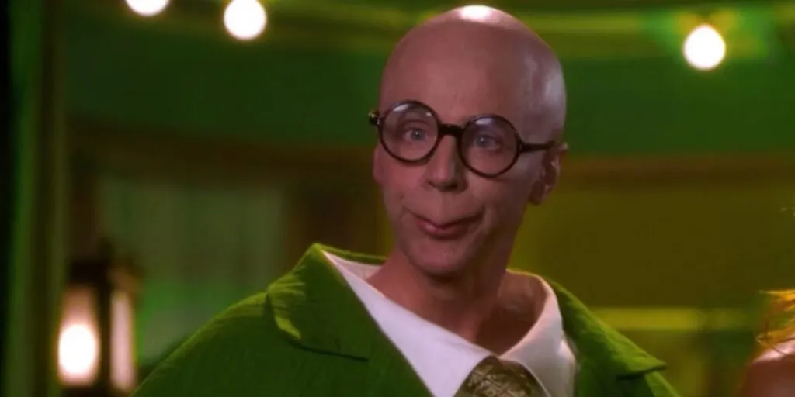
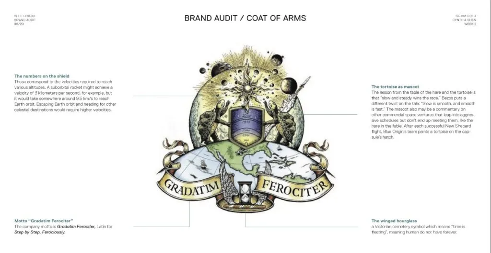

In a world where billionaires and tech moguls are often likened to superheroes or visionary geniuses, Jeff Bezos, the founder of Amazon and space exploration company [Blue Origin](https://www.blueorigin.com/), has garnered a unique and somewhat whimsical comparison: the turtle.

Bezos’ resemblance to other famous turtles has been a playful topic on [social media](https://twitter.com/search?q=bezos%2Bturtle&src=typed_query). We particularly like this rendition played by Dana Carvey in the movie [The Master of Disgu](https://www.imdb.com/title/tt0295427/)[i](https://www.imdb.com/title/tt0295427/)[se](https://www.imdb.com/title/tt0295427/).

Dana Carvey from the movie The Master of Disguise

Listening to Jeff Bezos on the latest [Lex Fridman podcast](https://www.youtube.com/watch?v=DcWqzZ3I2cY) you get a sense of how _tutrly_ Bezos really can be as you can easily imagine this highly interesting conversation being held with the famous turtle from the Pixar movie Finding Nemo:

“Righteous! Righteous!” – Crush rides the East Aulstrailian Current, Finding Nemo

## Leaning into the theme: The Blue Origin Coat of Arms

Blue Origin’s coat of arms includes turtles reaching for the stars, symbolizing the company’s philosophy of steady progress in space exploration, mirroring a turtle’s journey.

Image sourced from Blue Origin [brand audit](https://cynthiashen.design/blue-origin/blue-origin-process/) by [Cynthia Shen](https://cynthiashen.design/).

The coat of arms features a central shield with a graphical representation of Earth and space, flanked by two turtles looking upwards the celestial kingdom.

Above the shield is a banner with the company’s motto, **“Gradatim Ferociter”** which translates to _“Step by Step, Ferociously.”_ This coat of arms encapsulates Blue Origin’s mission and philosophy, with the turtles symbolizing steady, determined progress towards space exploration goals.

## The Tortoise and the Hare

In July of 2021, [Trung Phan](https://twitter.com/TrungTPhan) a developer, writer, and podcaster, produced an [X/Twitter thread](https://twitter.com/TrungTPhan/status/1416416608990294017) that highlighted the relationship between Elon Musk and Jeff Bezos and their mutual interest in space travel. Elon, musk noticed this thread, specially a tweet that highlighted a reference to the story [Tortoise and Hare](https://en.wikipedia.org/wiki/The_Tortoise_and_the_Hare) in comparison to the Blue Origin strategy of approaching space travel, reading:

> The lesson from “tortoise & hare” is not that tortoises are faster, but rather that hares should not be complacent
> 
> — Elon Musk (@elonmusk) [September 17, 2021](https://twitter.com/elonmusk/status/1438780252474560513?ref_src=twsrc%5Etfw)

## The Master’s Chamber

Mackenzie Bezos, Jeff’s ex-wife, reportedly had [turtle-themed dreams](https://www.nationalenquirer.com/celebrity/jeff-bezos-shared-wifes-pillow-talk-with-mistress-lauren-sanchez/) before their split, adding a surreal layer to the turtle motif in Bezos’ life.

> “MacKenzie dreamt I redecorated the bedroom.”
> 
> “I kept doing it and it got weirder and weirder and weirder. Until I was sewing stuffed turtles into the comforter.”
> 
> [https://www.nationalenquirer.com/celebrity/jeff-bezos-shared-wifes-pillow-talk-with-mistress-lauren-sanchez/](https://www.nationalenquirer.com/celebrity/jeff-bezos-shared-wifes-pillow-talk-with-mistress-lauren-sanchez/)

Jeff Bezos, intentional or coincidental, seems to lean into the appeal of the long-living turtle. And Jeff, in case you are reading this. This isn’t a bad thing at all. We can only hope and even request that we get more turtle content in the future.  
  
For this reason, in the spirit of The Doors, we have lovingly dubbed Jeff Bezos the _Turtle King_.

* * *

Thanks for reading! Please leave your turtle-related comments below. 🐢

If you like our content, please consider following us! If you like our free [open-source assets](https://github.com/gbti-labs), please give them a github star. We’re also happy to have lurkers on our [Discord community](#join-gbti) where we manage our syndication network and curate together.

-   [X](https://twitter.com/gbti_network)
-   [GitHub](https://github.com/gbti-labs)
-   [YouTube](https://www.youtube.com/channel/UCh4FjB6r4oWQW-QFiwqv-UA)
