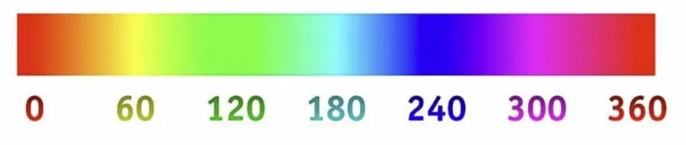
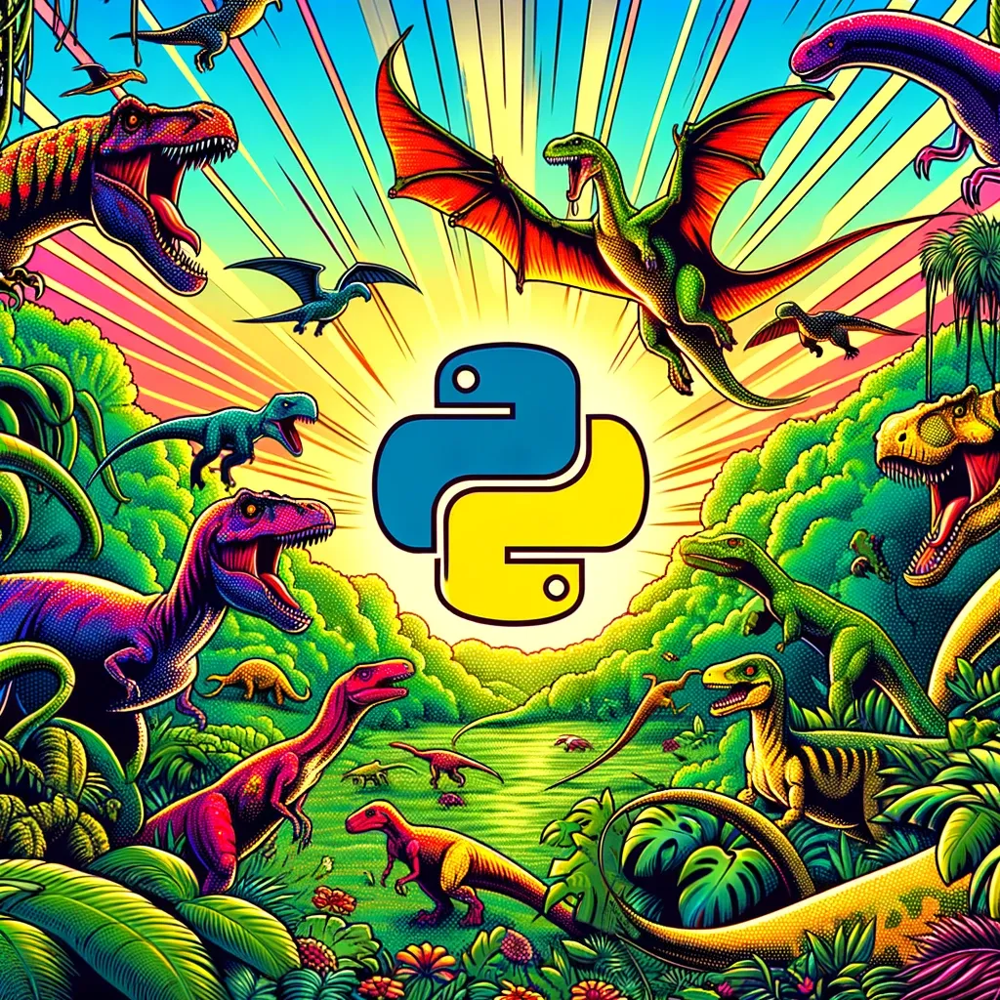

Have you ever wanted to animate the hue of an image? We did recently but we didn’t quite know how so we developed an application using python to help us do just that.

Before we get started, though, let’s take a moment to learn **what exactly is hue?**

Hue, in the context of color theory, refers to the attribute of a color that enables us to classify it as red, blue, green, or any other color in the spectrum. It represents the pure spectrum colors found on the color wheel, which range from red through to violet, plus magenta.

So to shift the hue is to change it’s color to a different one corresponding to a 360 degree color wheel/spectrum.

Red, green, and blue are often placed at 120-degree intervals on the wheel (0° for red, 120° for green, 240° for blue). Colors like cyan, magenta, and yellow are located at the halfway points between the primary colors. For example, cyan is at 180°, halfway between green (120°) and blue (240°).

## Animating Hue in a still image

So to recap, we knew if we could achieve this, it would look great, to say the least. And that was good enough for us to get started.

To demonstrate our progress we first used [DALL-E](https://labs.openai.com/) to generate a colorful image, with jungles, and dinosaurs, and the Python logo because we would be using the Python coding language to generate the animation:

We’ve used Dalle to generate colorful image with dinosaurs and the python logo.

Now that we’ve chosen a very colorful base image to begin with, we run it through [code base](https://github.com/gbti-labs/py-animate-hue) with an instruction to animate from **\-180 to 180 degrees** over **30 frames** and a few minutes later we have generated this **animation**:

The animation above is a WebP that loops automatically and stays under **1mb**, so it loads nearly instantly on this blog post (autoplay may not work on mobile).

We also generated the original as an mp4 and as a gif. The gif, being **30 frames** at **1024 x 1024**, came out to a whopping **18mb**, which is why the lightweight WebP above is the version shown here.

## Py Animate Hue – How to Download and Features

[Py Animate Hue](https://github.com/gbti-labs/py-animate-hue) has been released as open source software and is available on GitHub to download.

[https://github.com/gbti-labs/py-animate-hue](https://github.com/gbti-labs/py-animate-hue)

In addition to Hue, we coded in the ability to animate Brightness as well as Contrast.

In the future we may add more support for different animation features, but for now, please feel free to star our repository, fork it if you like, and join our discord and socials to follow more open source opportunities.

## Thanks for reading!

If you like our content, please consider following us! If you like our free [open-source assets](https://github.com/gbti-labs), please give them a github star. We’re also happy to have lurkers on our [Discord community](#join-gbti) where we manage our syndication network and curate together.

-   [X](https://twitter.com/gbti_network)
-   [GitHub](https://github.com/gbti-labs)
-   [YouTube](https://www.youtube.com/channel/UCh4FjB6r4oWQW-QFiwqv-UA)
