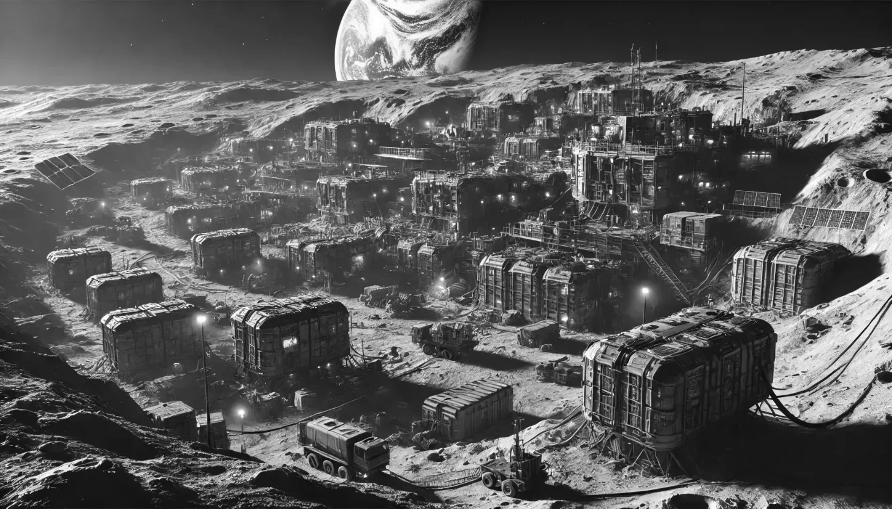

**Kip Russell** was in his junior year at high school and had one dream, to visit the moon.

Good thing national soap company, **Skyway Soap**, just happened to be running a competition inviting its customers to create a new slogan for their soap product with the grand prize being, you guessed it, an all expense paid trip to the Lunar Facilities on the moon.

Determined and inspired by his dream, Kip noticed a loophole in the competition; well… not entirely a loophole, but a caveat stating that there was no limit on the number of entries an individual could submit.

With imagination and hope ignited, Kip goes onto submit several hundred entries over the course of his summer vacation.

When the time came for Skyway Soap to announce the winner of the contest, Kip, with grounded expectations, would learn that he did not win the grand prize. Yet all was not in vain. Kip did manage to win a runner-up prize; an retired space suit. A relic of space travel.

Needless to say our young Kip was disappointed. He was disappointed that his efforts over the past summer did not pay off for his goal of visiting the moon. However, his fascination of space travel was not unrewarded. Kip would go on to closely study/investigate his spacesuit to the point of obsession, brining it back into working condition, restoring the pressure systems, radio, air conditioning systems, water delivery systems, chin-powered feedback HUD, and even the medication delivery systems.

One evening Kip was putting his hard work to the test and taking his space suit to the creek behind his house to see if his oxygen tanks were operational and his seals waterproof. To his delight the suit performed exceptionally well with his oxygen working and no water leaking into his inner areas when submerged under the creek water. While awkwardly navigating his backyard stream, he heard something over his suit’s radio coms something far from expected. A Mayday call.

Confused and believing he was participating in a prank, he responded to the call, guiding the caller to his coordinates where they, to Kip’s astonishment, crash land in the field beside his house, shortly followed by a second craft, landing close behind the first craft. From the first craft emerges a human in a spacesuit not too different from his own running toward him when then, before Kip can greet his unexpected guest, he abruptly loses consciousness.

When Kip awakes, he is no longer in his space suit and is instead in a cell with another person beside him: who happens to be a girl.  
  
Scrambling to make sense of his situation, our Kip learns that he has been kidnapped along with his new colleague, his caller under duress, and the both of them were now prisoners of a mysterious alien.

Not only were they now prisoners, they were only minutes away from landing on no other than… the moon… for a rendezvous with an unknown purpose.

—

[Have Spacesuit Will Travel](https://amzn.to/3FH6HV6) is a short but thrilling fiction book by Robert Heinlein, author of world-renowned books like [The Moon is a Harsh Mistress](https://en.wikipedia.org/wiki/The_Moon_Is_a_Harsh_Mistress) and [Starship Troopers](https://en.wikipedia.org/wiki/Starship_Troopers).

Not only is _Have Spacesuit Will Travel_ a great short story, it is a deep dive into the technologies that power a space suit and how a spacesuit serves an astronaut as they brave the unforgiving frontiers of outer space.

If you enjoy an educational adventure about space travel, _Have Spacesuit Will Travel_ should offer a fun and thrilling escape.

We hope you enjoyed this article by **Hudson Atwell**, GBTI Member.

Python, NextJS, NodeJS, JavaScript, PHP, WordPress, Developer Relations, Novelty, Curation, DevOps, Blockchain, IoT, and more.

-   [X](https://https://)
-   [GitHub](https://github.com/atwellpub)
-   [WordPress](https://profiles.wordpress.org/hudson-atwell/)
-   [LinkedIn](https://www.linkedin.com/in/hudsonatwell)
