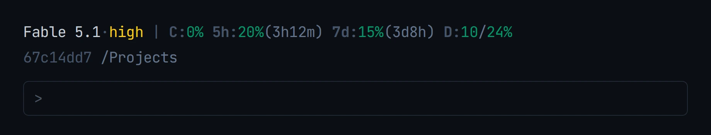

I only recently learned that you can modify Claude Code's terminal behavior directly, by dropping in a script of your own.

The feature is called the [status line](https://code.claude.com/docs/en/statusline), and it is a supported part of Claude Code rather than a hack. You point a `statusLine` setting at any shell script. Claude Code hands that script the session data as JSON on stdin on every render, and prints whatever the script prints in the bar at the bottom of the terminal.

That matters because of what is in the JSON. The payload carries `rate_limits`, with your five hour and seven day windows, each as a used percentage and a reset time. So a script drop-in can put your model usage in the CLI permanently, visible while you work, instead of something you stop and ask for. Once it is in the bar you stop running `/usage` to find out where you stand.

Stefano Ginella ([GitHub](https://github.com/stefanoginella), [Codeable](https://www.codeable.io/developers/stefano-ginella/?ref=MzT91)) wrote [a single-file status line](https://gist.github.com/stefanoginella/ffe56f293baf6241abe74c3883082755) that does exactly this, and it is the one I installed:



Left to right on the first line: the model and its effort level, how full the context window is, the share of the five hour rate limit spent and how long until it resets, the same for the seven day limit, and a daily pace figure that says whether today's rate reaches the weekly reset. The second line carries the session id, the project path, and the git branch.

Two things about the data are worth knowing before you install anything. The `rate_limits` object is only present for Claude.ai Pro and Max subscribers, and only after the session's first API response, so a good script has to handle it being absent rather than print an error. And none of it costs an API call, because Claude Code is already handing the numbers to your script.

## Installing it

Save the file as `~/.claude/statusline/statusline.mjs`, then add a `statusLine` block to `~/.claude/settings.json`:

```json
{
  "statusLine": {
    "type": "command",
    "command": "node /Users/you/.claude/statusline/statusline.mjs"
  }
}
```

Use your own absolute path. Putting it in `~/.claude/settings.json` applies it everywhere; putting the same block in a project's `.claude/settings.json` tries it on one repo first.

If you run Claude Code inside VS Code, the status bar renders in terminal mode only. It does not appear in the sidebar chat.

Claude Code also ships a `/statusline` command that writes a script and updates your settings for you from a plain description, which is the fastest way to get any status line at all. The prompt below is for installing this specific one.

## What it leaves on disk

Three small state files under `~/.claude/statusline/`, all of them recoverable by deletion:

- `.usage-cache.json`, the last rate limit values it saw, reused to bridge the gap before the first API response of a session
- `.daily-state.json`, a snapshot taken at local midnight that the daily pace figure is measured against
- `.effort-state.json`, the transcript offset and last known effort level

Deleting any of them costs you one render of accuracy and nothing else.

## Install it globally with one prompt

Paste this into Claude Code and it will do the whole installation, including the parts that are easy to get wrong.

```text
Install Stefano Ginella's Claude Code status line for me, globally.

1. Create ~/.claude/statusline/ and download the script into it as statusline.mjs:
   https://gist.githubusercontent.com/stefanoginella/ffe56f293baf6241abe74c3883082755/raw/statusline.mjs
   Make it executable and run `node --check` on it before going further.

2. Read my existing ~/.claude/settings.json first, then MERGE a statusLine block
   into it. Do not overwrite the file and do not disturb any other key:

   "statusLine": { "type": "command", "command": "node <absolute path to that file>" }

   Use my real home directory in the command, not a tilde, and confirm the JSON
   still parses afterwards.

3. Prove it works before telling me it is done. Pipe a realistic payload into the
   script and show me the output, using a throwaway HOME so my real state files
   are untouched:

   HOME=$(mktemp -d) node ~/.claude/statusline/statusline.mjs <<'JSON'
   {"model":{"display_name":"Opus 5"},"effort":{"level":"high"},
    "session_id":"test","workspace":{"current_dir":"."},"cwd":".",
    "rate_limits":{"five_hour":{"used_percentage":20,"resets_at":9999999999},
                   "seven_day":{"used_percentage":15,"resets_at":9999999999}}}
   JSON

4. Tell me if the status line needs a restart to appear, and confirm you changed
   nothing else in my settings.
```

The verification step is the part worth keeping. A status line that fails silently just leaves the bar empty, and it is not obvious whether the script is broken or the setting never took.

## Credits

Credit to Stefano Ginella for the script, and for writing it to run entirely offline. You can find his work on [GitHub](https://github.com/stefanoginella), and he takes on client work through [Codeable](https://www.codeable.io/developers/stefano-ginella/?ref=MzT91).

**Disclosure:** the Codeable links here are referral links. GBTI Network is a longstanding fan of the Codeable community for WordPress and React work.
