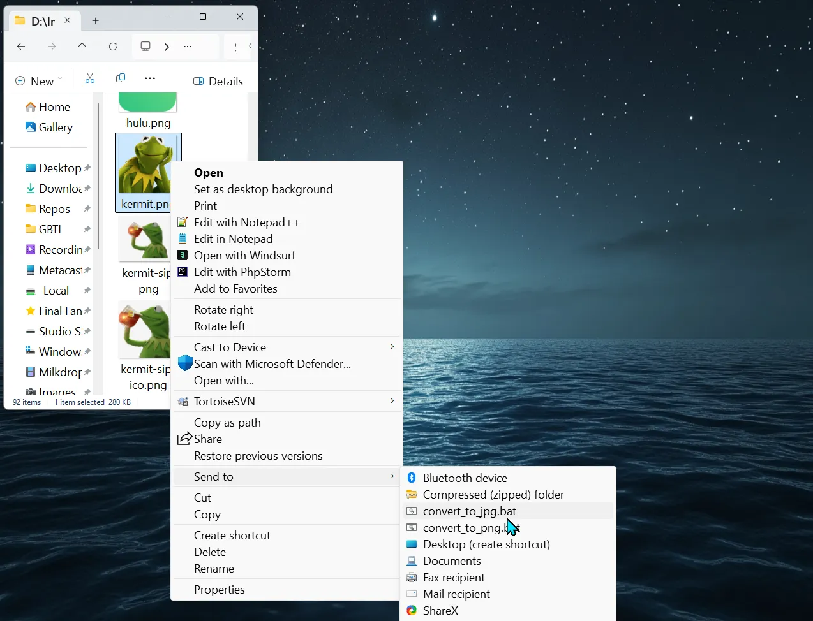
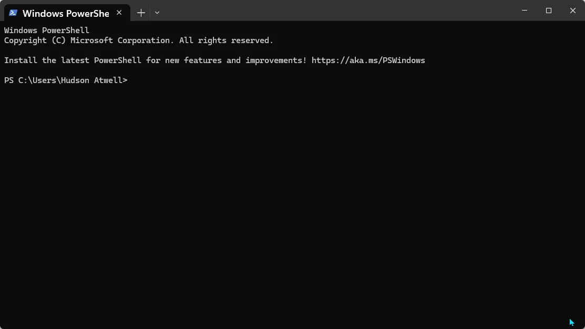
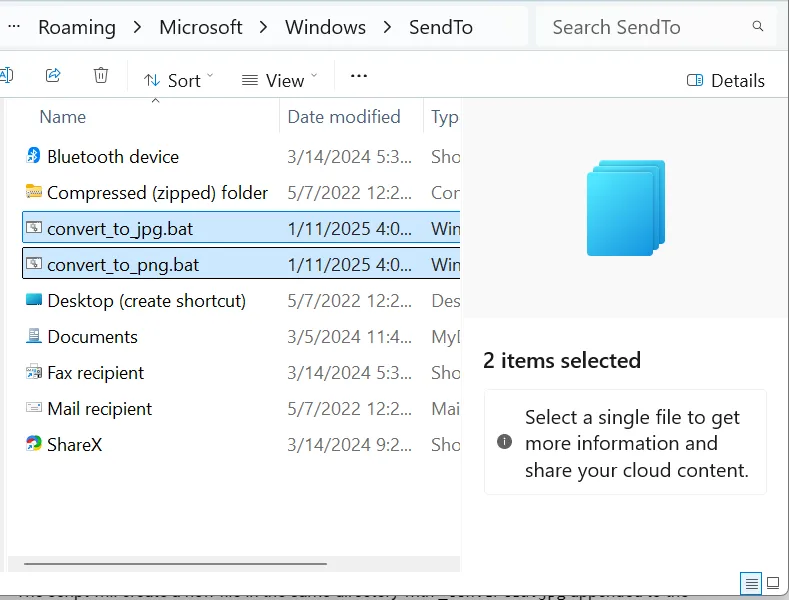

_[ImageMagick](https://imagemagick.org/)_ is a powerful image-processing tool that can handle a wide range of image conversion and editing tasks. With a little setup, you can integrate ImageMagick into Windows’ **SendTo** menu, enabling you to convert images via a right-click context menu.

In this guide, you’ll learn how to:

1.  Install ImageMagick.
2.  Create batch scripts for conversion (e.g., JPG to PNG and PNG to JPG).
3.  Add these scripts to the **SendTo** menu for quick access.

### Step 1: Install ImageMagick

1.  Download ImageMagick:
    -   Visit the [ImageMagick official website](https://imagemagick.org/script/download.php) and download the appropriate version for your Windows system (64-bit or 32-bit).
2.  Install ImageMagick:
    -   Run the installer and ensure the **“Add application directory to your system path”** option is checked. This will make the `magick` command available in the command line.
3.  Verify Installation:
    -   Open a Command Prompt and type: `magick -version`
    -   If installed correctly, it will display the version and other details of ImageMagick.

### Step 2: Create Batch Scripts for Conversion

To use the **SendTo** menu, you need to create batch scripts that handle specific image conversions.

#### 1\. Create a Batch Script to Convert JPG to PNG

-   Open Notepad and paste the following code:

`batCopy code<code>@echo off :: Check if the input file is a JPG set "ext=%~x1" if /i "%ext%"==".jpg" (     magick "%~dpnx1" "%~dpn1_converted.png"     echo Successfully converted "%~nx1" to PNG.     pause ) else (     echo This script only processes JPG files.     pause ) </code>`
-   Save the file as `` `convert_to_png`.bat ``.

#### 2\. Create a Batch Script to Convert PNG to JPG

-   Open Notepad and paste the following code:

`batCopy code<code>@echo off :: Check if the input file is a PNG set "ext=%~x1" if /i "%ext%"==".png" (     magick "%~dpnx1" "%~dpn1_converted.jpg"     echo Successfully converted "%~nx1" to JPG.     pause ) else (     echo This script only processes PNG files.     pause ) </code>`
-   Save the file as `` `convert_to_jpg`.bat ``.

### Step 3: Add Batch Scripts to the Right Click “SendTo” Menu

1.  **Locate the SendTo Folder**:
    -   Press **Win + R**, type **cmd**, and press **Ctrl + Shift + Enter** to run Command Prompt as Administrator.
    -   In the Command Prompt window, type: batchCopyEdit`explorer shell:sendto`
    -   Press **Enter**. This should open the **SendTo** folder with administrative privileges.
2.  **Add the Batch Scripts**:
    -   Copy `convert_to_jpg.bat` and `convert_to_png.bat` into the SendTo folder.

### Step 4: Test the Right-Click Conversion

1.  **Convert a JPG to PNG**:
    -   Right-click a `.jpg` file.
    -   Navigate to **Send To > ConvertJPGToPNG.bat**.
    -   The script will run and create a new file in the same directory with `_converted.png` appended to the name.
2.  **Convert a PNG to JPG**:
    -   Right-click a `.png` file.
    -   Navigate to **Send To > ConvertPNGToJPG.bat**.
    -   The script will create a new file in the same directory with `_converted.jpg` appended to the name.

### Optional: Batch Process Multiple Files

You can modify the batch scripts to handle multiple files at once:

`batCopy code<code>@echo off for %%I in (%*) do (     set "ext=%%~xI"     if /i "!ext!"==".jpg" (         magick "%%~dpnxI" "%%~dpnI_converted.png"         echo Successfully converted "%%~nxI" to PNG.     ) else if /i "!ext!"==".png" (         magick "%%~dpnxI" "%%~dpnI_converted.jpg"         echo Successfully converted "%%~nxI" to JPG.     ) else (         echo Skipping "%%~nxI" - unsupported file type.     ) ) pause </code>`
This script processes all selected files at once, skipping unsupported formats.

### Tips for Using ImageMagick with SendTo

**Advanced Image Manipulation**:

Add ImageMagick options for resizing, compressing, or applying effects to your images. For example:batCopy code`magick "%~dpnx1" -resize 50% "%~dpn1_converted.png"`

…

By integrating ImageMagick with the Windows **SendTo** menu, you can quickly convert images with a simple right-click. This approach is lightweight, customizable, and leverages the full power of ImageMagick for batch processing or advanced image manipulation.

We hope you enjoyed this article! Please leave a comment below with your tips and recommendations.

## Convert SVG to PNG

`@echo off setlocal enabledelayedexpansion  :: Set default width and height set width=24 set height=24  :: Prompt user for width and height (Press Enter to keep default) set /p inputWidth="Enter the desired width (default: 24): " if not "%inputWidth%"=="" set width=%inputWidth%  set /p inputHeight="Enter the desired height (default: 24): " if not "%inputHeight%"=="" set height=%inputHeight%  for %%I in (%*) do (     set "ext=%%~xI"     set "ext=!ext:~1!"      if /i "!ext!"=="svg" (         echo Converting "%%~nxI" to PNG with dimensions %width%x%height%...          :: Convert SVG to PNG, maintaining transparency and optimizing size         magick "%%~dpnxI" -density 300 -resize %width%x%height% -define png:compression-level=9 -define png:compression-filter=5 -define png:compression-strategy=1 -strip "%%~dpnI.png"          echo Successfully converted "%%~nxI" to PNG with dimensions %width%x%height%.     ) else (         echo Skipping "%%~nxI" - unsupported file type.     ) ) pause`
