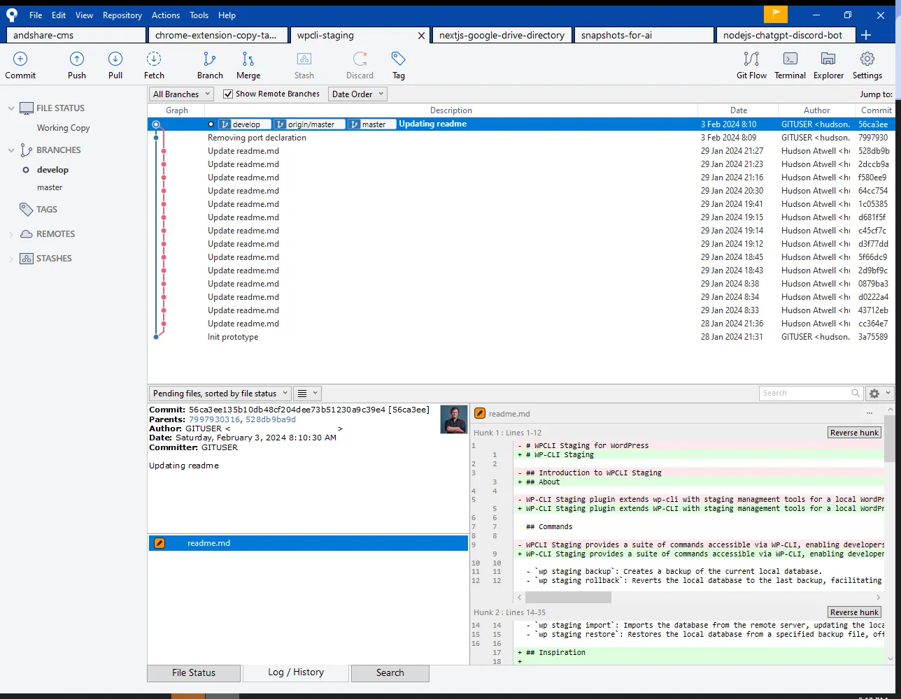

Like a lot of other developers working with WordPress, I like to build locally when creating new plugins, themes, or anything else for clients and side projects.

I also am a fan UI management tools that help manage my workflows like [SourceTree](https://www.sourcetreeapp.com/) which It helps me manage my git repos:

SourceTree App – A Git Repository Management Tool

And [Local WP](https://www.localwp.com/), for quickly spinning and managing up docker containers for WordPress sites:

LocalWP is an application for managing local WordPress instances

Because I enjoy working locally, I’ve always wanted a way to treat my local wp instance as my staging environment. Even though I was a Local WP user, I was not a Flywheel or WPEngine customer so I could not use their native “[Connect](https://localwp.com/connect/)” feature that would automatically allow me to pull production down locally and push staging back.

I was already using [PHP Storm](https://www.jetbrains.com/phpstorm/) to manage the downloads/uploads to the production site via SFTP connections (GBTI is currently being hosted on [CloudWays](https://gbti.network/hostings/cloudways)) but I did not have a way to quickly clone the database. The overhead expense of exporting and importing via plugin was going to be too great to be considered efficient. I would rather push my code directly to production than make manual exports and manual imports; but that’s not right either. So I needed another way.

I was considering writing a python script, but I had heard through conversations with senior developers at [Codeable](https://gbti.network/outsourcing/codeable/wp-cli) that they were successful at managing large migrations at the command line through a utility called [WP-CLI](https://wp-cli.org/), developed by [Alain Schlesser](https://www.cloudways.com/blog/wp-cli-maintainer-alain-schlesser-interview/?id=644779).

I knew that Local WP and CloudWays both provide WP-CLI support, too so I took a shot at developing [WP-CLI Staging](https://github.com/atwellpub/wpcli-staging/) as a WordPress plugin that would extends WP-CLI with a `staging` command and in addition several sub-commands that could be run inside the terminal.

In this video the \`wp staging import\` command is executed, pulling the production db down from the CloudWays server and setting it up locally.

Let’s take a look at the progress I was able to make:

-   `wp staging backup`: Creates a backup of the current local database.
-   `wp staging rollback`: Reverts the local database to the last backup, facilitating easy undo of recent changes.
-   `wp staging rollforward`: Advances the local database to a more recent backup if available, useful after performing a rollback.
-   `wp staging import`: Imports the database from the remote server, updating the local environment with production data.
-   `wp staging restore`: Restores the local database from a specified backup file, offering flexibility in managing local data states.

In this screenshot the settings area of the wp-cli staging plugin is being displayed.

At the moment, I’ve only coded in subcommand for _pulling_ staging db from production to local. I have not created sub-commands that _push_ staging to production. I think that is the next step for the asset. But to be very honest, it is not a rush on this end. I am very happy to have the pull capabilities.

What do you think? Maybe **you** could help? 😎

WP-CLI staging is open source and available for pull requests and merge requests on [github](https://github.com/atwellpub/wpcli-staging). If you help out, I would love to add your name to the contributors list.

Also, If the repo gets over [25 stars](https://github.com/atwellpub/wpcli-staging) I will list it on the [WordPress Plugins Directory](https://wordpress.org/plugins/).

**To close out this article,** I wanted to throw an honorable mention to fellow WordPress colleague [J Michael Ward](https://jmichaelward.com/using-wp-cli-to-import-a-remote-database/) and his article that shows a different but also effective route at doing this same thing using wp-cli native commands, no plugins needed.
