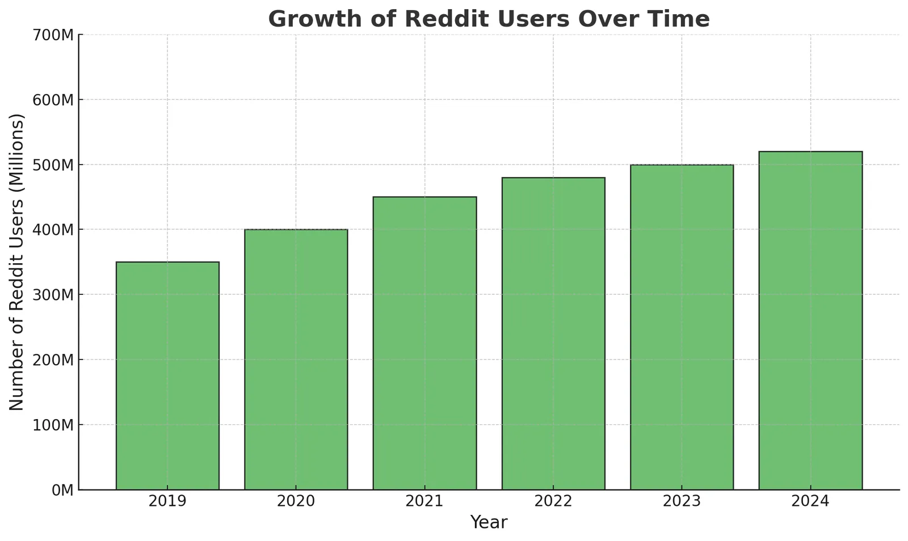
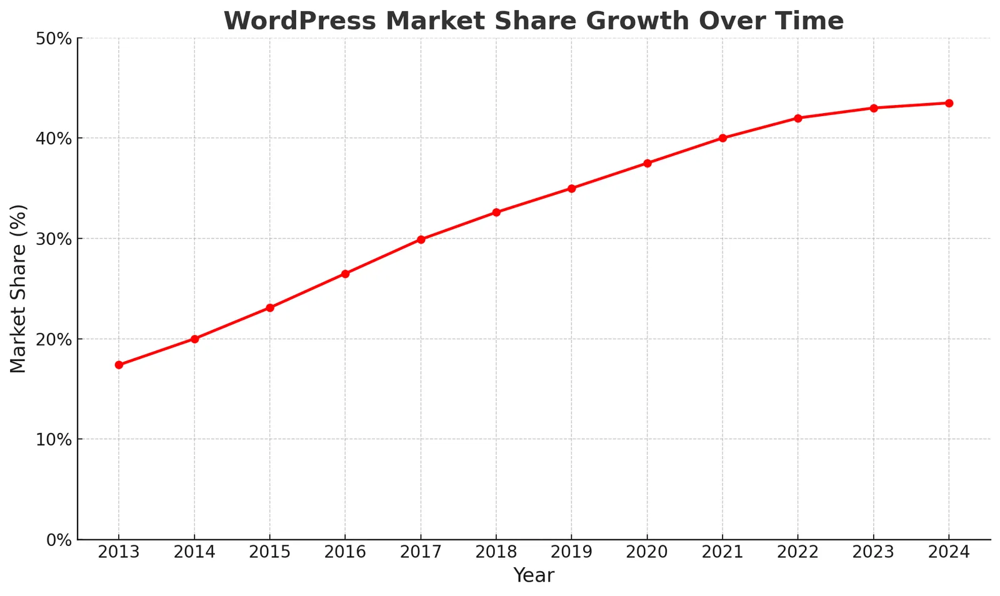
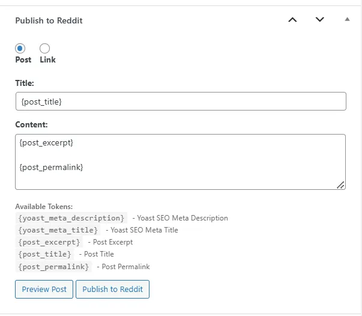
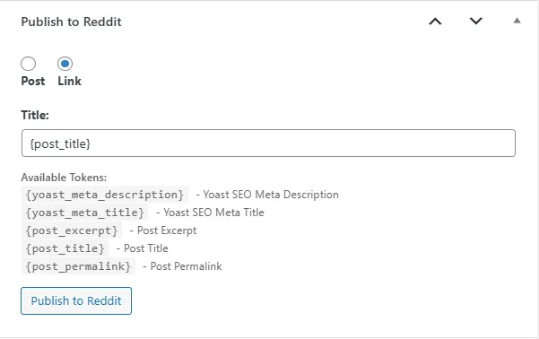
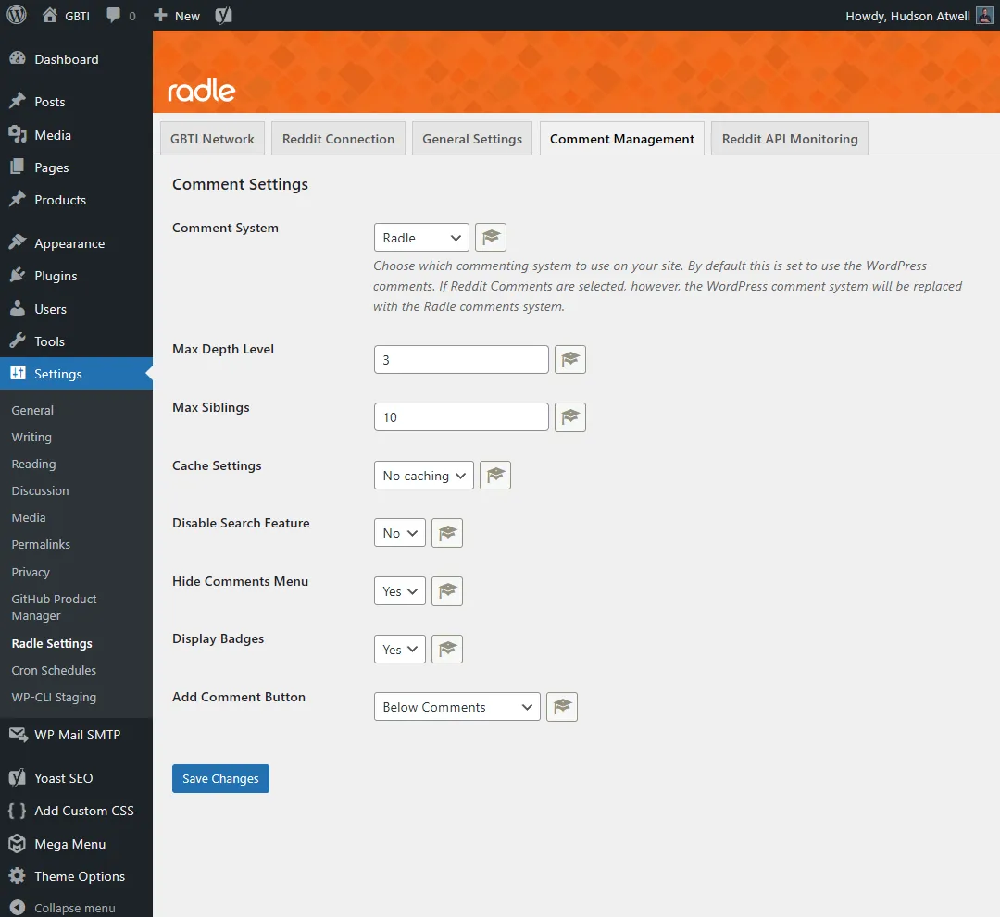
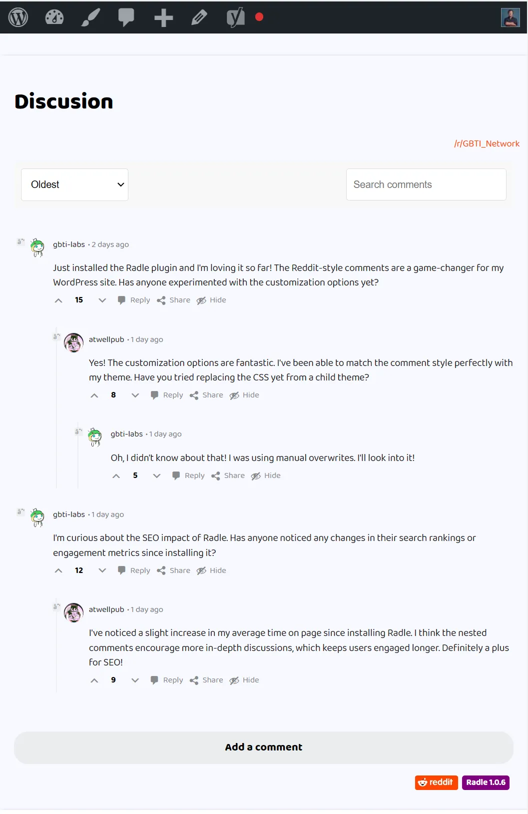
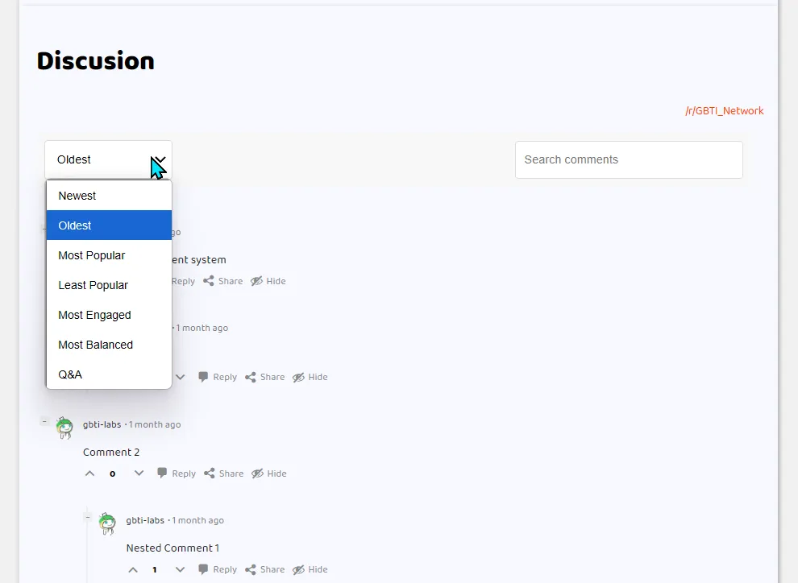
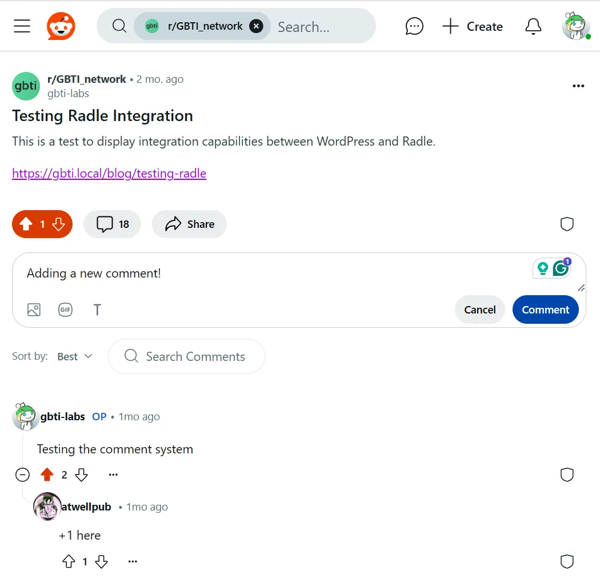
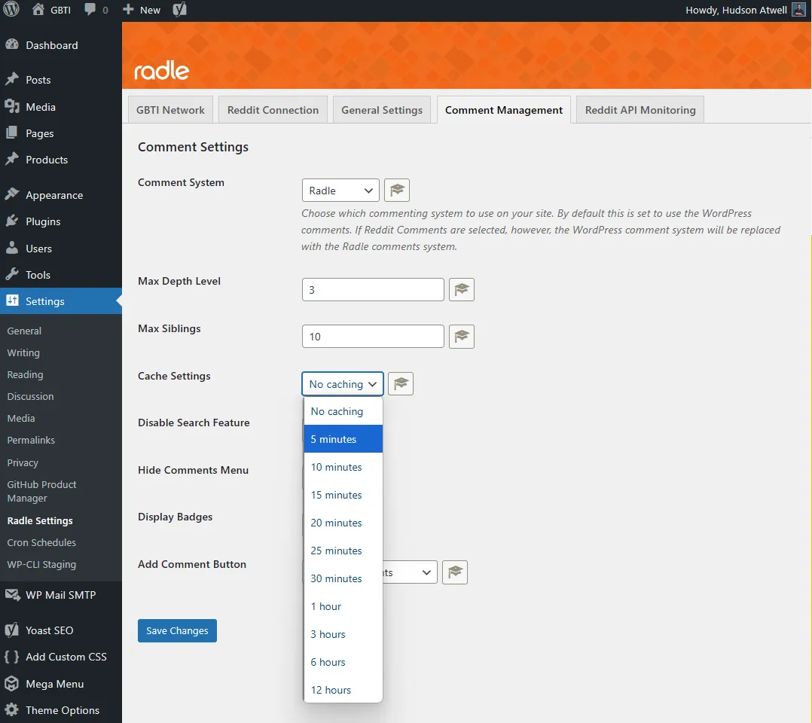
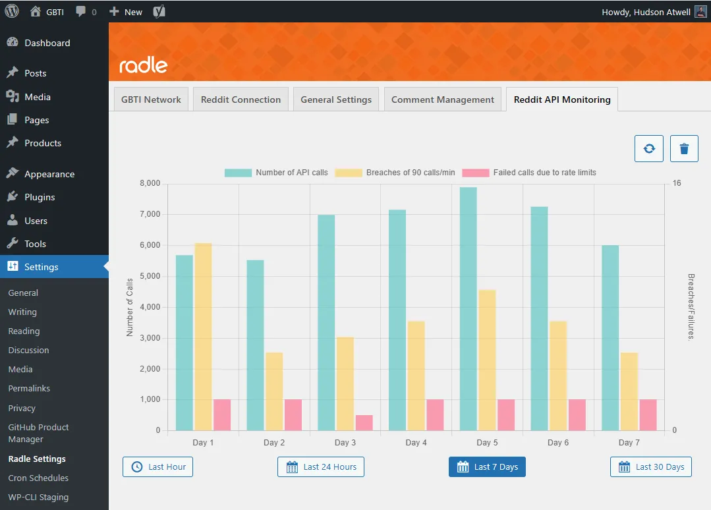

> **Update (June 2026):** Radle is now a single free plugin on the [WordPress plugin directory](https://wordpress.org/plugins/radle-lite/). The former Radle Pro has been sunset and all of its features are now built into the free plugin, with no license, sponsor check, or upsell. Some of the early access notes below are kept for history.

Inside this article you’ll learn about the Radle plugin for WordPress, what drove us to develop it, and a few of the features that have been built into it to help replace the default WordPress commenting system with a Reddit powered commenting system.

At the bottom of this article you’ll see an example of the plugin in action. This article will be published both here and to our [subreddit](https://www.reddit.com/r/GBTI_network/) where we will synchronize all discussion back to this page.

Let’s dive into the reveiw!

## What is Radle?

Radle is a WordPress plugin that replaces the default comments engine provided by WordPress with a comments engine powered by the Reddit API in such a way that every blog post shares a corresponding post on a Reddit subreddit while keeping discussion synchronized between the two locations.

## The Reddit and WordPress ecosystems

Over the last decade, we have seen a migration away from discussion platforms like [vBulletin](https://www.vbulletin.com/), [Discourse](https://www.discourse.org/), and [PHPBB](https://www.phpbb.com/) towards the [Reddit](https://www.reddit.com/) platform. Internet goers have appreciated Reddit’s ability to cover nearly all topics while allowing the users to own and manage their own sub-communities.

The exodus away from legacy discussion platforms towards _Reddit_ has become so pervasive that many people readily append “Reddit” to their Google searches to see what the people are saying about a topic or event, neglecting to look for other sub-communities that the Internet has to offer.  
  
In 2024, [Reddit even initiated an IPO](https://www.wsj.com/finance/stocks/reddit-files-for-ipo-8fa2e55f), nodding to their success over the past decade where Reddit has reported growth to over [500 million reddit accounts](https://explodingtopics.com/blog/reddit-users) and [2.8 million subreddits](https://frontpagemetrics.com/history/month).

Data pulled from: [https://backlinko.com/reddit-users](https://backlinko.com/reddit-users)

WordPress, on the other side, is powering [43% of the world’s known](https://www.wpzoom.com/blog/wordpress-statistics/) websites (which is over [478 million sites](https://www.wpzoom.com/blog/wordpress-statistics/)).

Data pulled from [https://www.wpzoom.com/blog/wordpress-statistics/](https://www.wpzoom.com/blog/wordpress-statistics/)

With both markets being gigantic in their own right, we were very surprised to see that neither Reddit nor the WordPress community had placed much effort into the idea having WordPress comments powered by Reddit.

### People are using the WordPress comments engine less

The comments system provided by WordPress is powered by PHP and MySQL. It’s not the best, but it can get the job done well in certain circumstances such as private membership communities or other account gated discussion.

Although we do not have any data to present to prove the decline, it is something we’ve noticed anecdotally over time within the WordPress ecosystem. Generally the comments are turned off on most WordPress websites. However, many WordPress users are seeking out different methods for supporting discussion in a more public way,.

### Alternative discussion engines that people are using:

We’ve notice that there has been an increase in the use of 3rd party embedded solutions like the [Disqus comments engine](https://help.disqus.com/en/articles/1717053-what-is-disqus), or [Jetpack Comments](https://wp101.com/tutorial/jetpack-comments/).

#### Disqus Comments Engine

For _Discus_, the service is feature rich and offer filtering tools that the native WordPress comments engine doesn’t have. Site visitors that engage using Discus will find that the comments engine is similar across different websites and this leads to a branded experience.

#### Jetpack Comments

_Jetpack Comments_ offer various SSO options to allow to reader to comment directly to the site while logged in through their X account, or their WordPress.com account. The unique presentational format of Jetpack comments once again offers readers a familiar commenting UI that they recognize from other websites.

### Radle: Powered by Reddit

The Radle has been our attempt to bring Reddit to the table as a viable discussion engine for WordPress.

The truth is that Reddit is an excellent solution for discussion management, and subreddits provide an alternative channel for content distribution as well as handles discussion in a more open and social way that the readers should theoretically already be familiar with using.

### WordPress and Reddit, BFFs?

WordPress and Reddit appear as a win-win couple where both outfits would benefit from offering additional support for each other.

#### How WordPress benefits

WordPress benefits from the recognizable and branded UX that reddit provides for managing discussion as well as its platform, which is an easy switch from browser to app, or browser to tab. People enjoy discussing through Reddit. The brand familiarity combined with the ease of use will increase the liklihood of engagement. Subreddits also serve as a secondary channel for content distribution and engagement, similar to other social platforms like X, YouTube, and RSS aggregaters like [Feedly](https://feedly.com/).

#### How Reddit benefits

From the Reddit perspective, they receive increased brand and user presence through WordPress publishers creating and managing active subreddit communities on their pltform. They also enjoy the data retained by hosting the discussions, which in this age aggregated data becomes a priceless commody to be sold or leased to super comupters as well as LLMs trainers.

#### 1v1Conclusion

Reddit wins the round, and WordPress still grows stronger.

#### Propositions for Reddit Sponsorship

Reddit if you are reading and want to sponsor Radle, we’ve done all the hard work and have the experience to keep the tool in good shape. We’d love to be officialy sponsored and funded in order to ship Radle as a 100% free plugin available to 478 million WordPress websites out there in the world right now.  
  
Radle, either way, intends to be WordPress’s most sophisticated, developer-friendly bridge to the Reddit API.

## Key Features of Radle

### Publishing Content Directly to a Subreddit

Let’s talk briefly about what Radle is not. It’s not a backlinking and traffic-baiting tool designed to publish content to multiple subreddits at one time. Radle is is designed to hook one website up to one subreddit that the WordPress site owner manages.

Radle will allow the WordPress site admin to one-click-publish content directly to a subreddit.

Just like inside the Reddit platform UI, we provide for publishing content as either a normal post with a text body, or a richly embedded link:  

Once the post is published to the subreddit, it is syced. If a post already exists on the subreddit, a new one will not be created and instead the already created post will be synced with the WordPress content.

### Reddit-Powered WordPress Comments

Having the ability to quickly send content to a subreddit is already a valuable feature, but Radle goes further by allowing the WordPress admin to compeltely switch the WordPress comments system with our Radle comments engine powered by the Reddit API.

With this feature enabled, the default WordPress comments system will be compeltely switched out for the Radle comments engine.

If a piece of content has been sent to Reddit and is synced, any discussion that occurs on that post within the subreddit will also be shown below the post:

The comments template file (PHP) and comments CSS file can easily be overwritten at the child-theme level, allowing for very unique customization opportunities.  
  
The filtering mechanisms are also provided by the Reddit API, as well as the search. All operate very swiftly and in a manner similiar to the Reddit UI itself.  

### Adding Comments

Currently the plugin does not permit adding new comments directly from the WordPress page. Although technically possible, it was not included in our original vision because we want our readers to go directly to Reddit for discussion. We want them arriving from Reddit as well.

In the future we will possibly add same-site SSO and commenting, but this was not something we wanted for ourselves, so it is not included in the initial releases.  
  
For the above reasons, and you can test this out below in the discussion section, all engagement links link directly to the Reddit post, either through opening a new tab in your browser, or by directly launching the Reddit mobile app if the reader is reading from a smart device:

### Moderation Features

When we were developing Radle we knew that administrators would need to be able to prevent some comments from beign featured on the branded website while not neccecarily wanting to remove them from the subreddit. We’re not hear to judge why this would be done, we just know it will be needed and we’ve added on support for it.

### Rate Limiting and API Calls

Radle will require you to create an app on Reddit to suppor your API activity. We’ve done everything in our power through caching mesasures and rate monitoring to help the WordPress owner balance caching with API usage.

For the most part, Reddit is pretty generous with up to [100 API calls per minute](https://support.reddithelp.com/hc/en-us/articles/16160319875092-Reddit-Data-API-Wiki).

For a high traffic website, if there were no caching, this could quickly cause the API to be throttled and comment loading to fail.  
  
For this reason we’ve added comment caching to help equip the administor with knowledge about how their site’s traffic is affecting their Reddit API performance:

## Looking Ahead

The GBTI Network is a fairly new open source development factory who is looking to expand its co-op of developers and development stragies. Radle is just one of the more recent products produced by the GBTI Network..  
  
Radle is available as a free WordPress plugin on the [WordPress plugin directory](https://wordpress.org/plugins/radle-lite/). What started as an early access tool for sponsors and network members is now free for everyone: the former Radle Pro has been sunset and all of its features are folded into the single free release.

  
We’re not quite ready to release yet, so please keep an eye out for new updates by following our [subreddit](https://www.reddit.com/r/GBTI_network/) and [X](https://x.com/gbti_network) accounts.  
  
If you like this concept, please check it out by using the discussion feature below, powered by Radle.

We hope you enjoyed this article by **Hudson Atwell**, GBTI Member.

Python, NextJS, NodeJS, JavaScript, PHP, WordPress, Developer Relations, Novelty, Curation, DevOps, Blockchain, IoT, and more.

-   [X](https://twitter.com/atwellpub)
-   [YouTube](https://www.youtube.com/@HudsonAtwell)
-   [GitHub](https://github.com/atwellpub)
-   [WordPress](https://profiles.wordpress.org/hudson-atwell/)
-   [LinkedIn](https://www.linkedin.com/in/hudsonatwell)

## HOW TO DOWNLOAD

Radle was officially released on December 1, 2024 and is now free for everyone on the WordPress plugin directory:  
  
[https://wordpress.org/plugins/radle-lite/](https://wordpress.org/plugins/radle-lite/)

* * *
