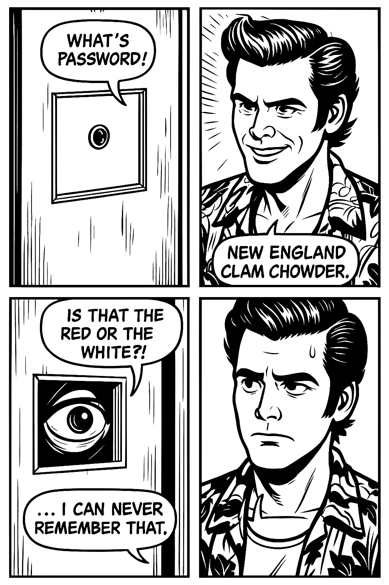
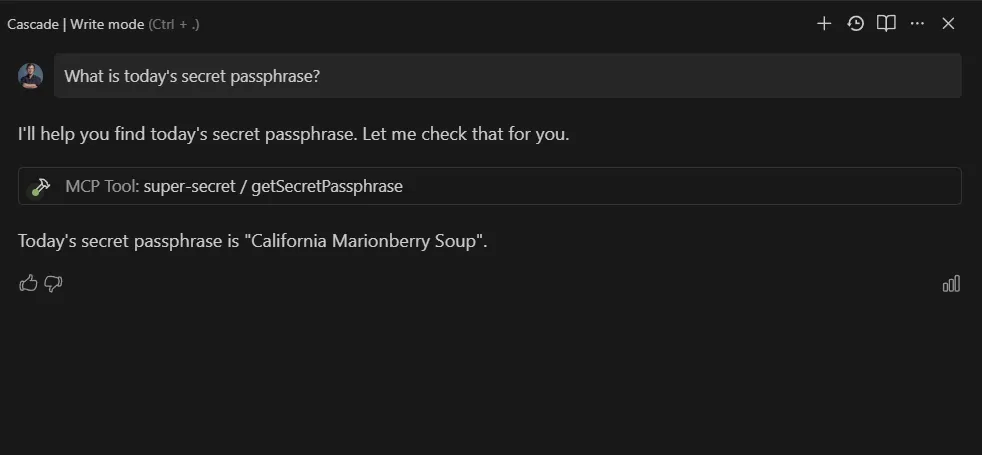
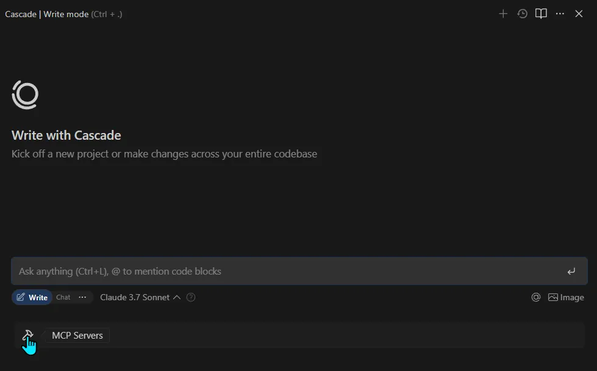
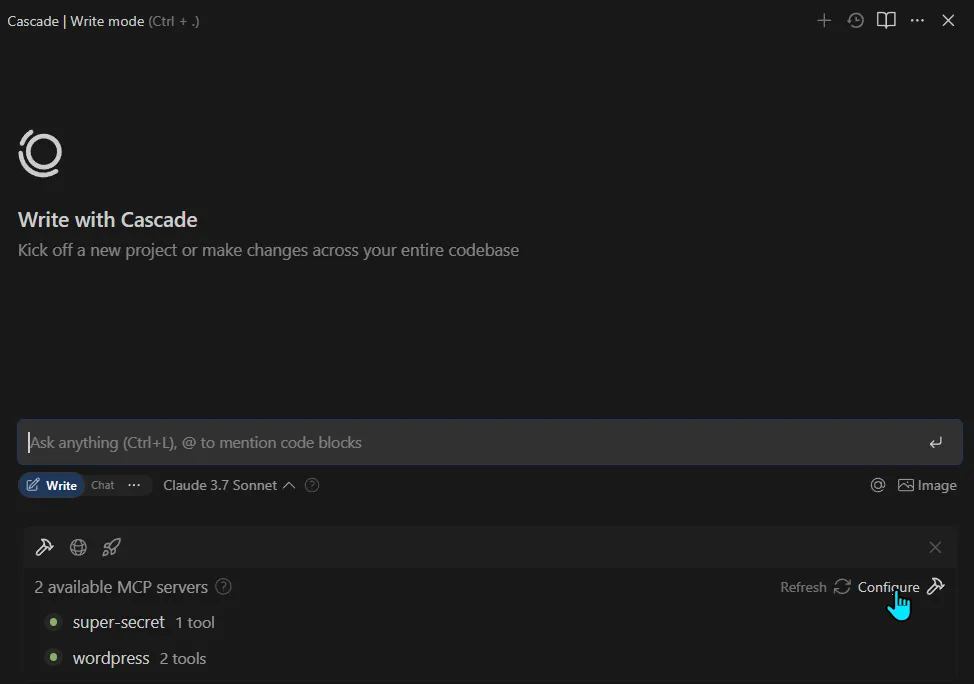
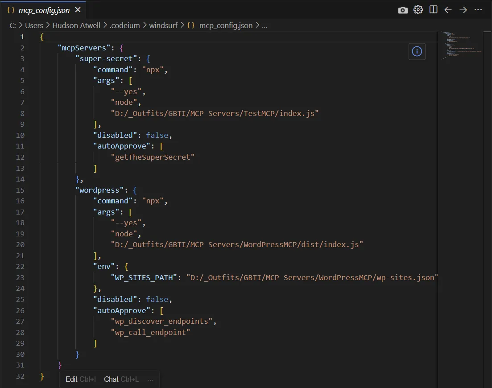
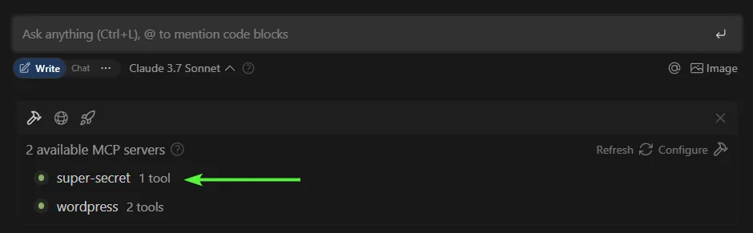
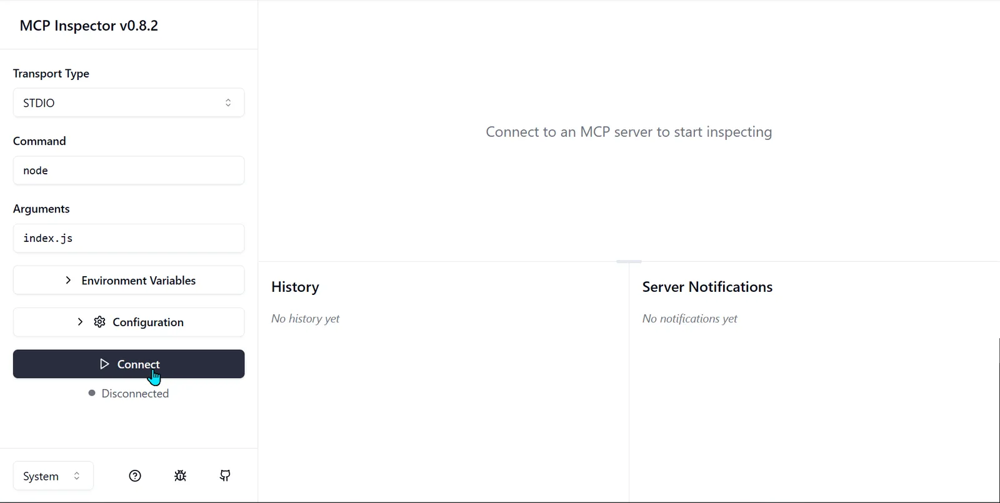
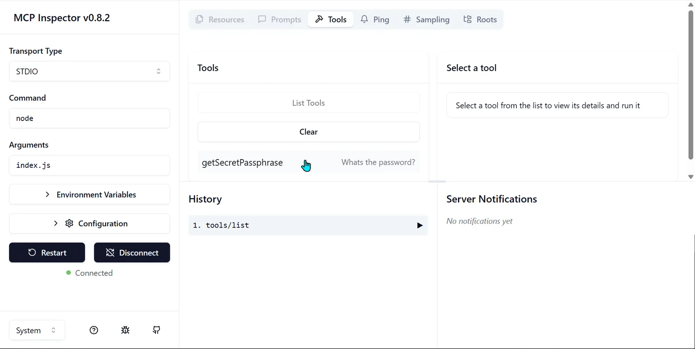
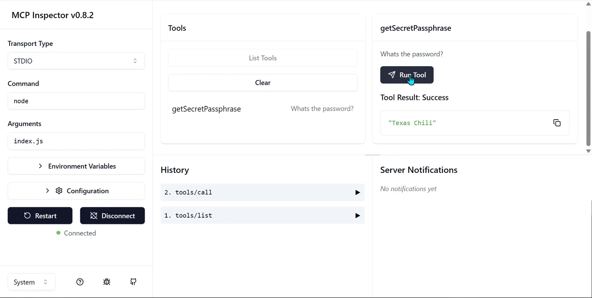

It’s 1994 and Jim Carrey stars in the iconic movie, Ace Ventura: Pet Detective.  
  
_Open Scene._  
  
Protagonist _Ace Ventura_ visits a techno-hippie named Woodstock in the basement of club where the band Cannibal Corpse is playing. Ace is visiting Woodstock, animal rights activist and hacker, to try and find out who might have recently purchased equipment for transferring a large aquatic animal. Ace is trying to find out who recently stole the team mascot from the Miami Dophin’s football club.

In order to get access into his friend’s underground hideout, Ace first has to provide a password to the doorman.  
  
_“What’s the password!?”_ someone shouted behind the door.  
  
_“New England Clam Chowder”,_ Ace replied. In which the door man responds:  
  
_“Is that the red or the white!?”_



_End Scene._  
  
Let’s fast forward to real life events circa November of 2024, where AI company _Anthropic_, founders of the Claude Large Language Model, [announced the creation of a new protocol](https://www.anthropic.com/news/model-context-protocol) for serving data to LLM models called **MCP**, short for **Model Context Protocol.**

—  
  
In today’s article we are going to talk about **what MCP servers are**, as well as provide a [boilerplate repo](https://github.com/gbti-network/mcp-whats-the-passphrase) that you can start using today to build your next MCP server.

What _kind_ of boilerplate server, you might ask?

One that provides us with a **_super secret passphrase_** that combines a US State and a type of soup.  
  
EG:

> `ALABAMA GUMBO`

or

> `TENNESSEE GREEN CHILI STEW`

Fun right? Our own spin off of a Hello World. 90s style.



In sections below we will explain more about how a MCP server works as well as how we set up a MCP server locally and make it available to our [Windsurf IDE](https://windsurf.com/editor).

We’ll also talk about the tools we use to test our MCP servers that are under development.

## First off: What is an MCP server in more detail?

An **MCP server** is essentially a way to let AI models (like Claude, ChatGPT, or others) “call” external tools, services, or databases dynamically during a conversation.

You can think of it like this:

-   Instead of the AI just answering based on its training, it can **ask your server** for fresh, real-time, or highly specific data.
-   The MCP server listens for these requests, performs the task (like running a query, doing a calculation, calling an API), and sends back the result to the AI.

### Example use cases:

-   Querying live weather data from your own weather database
-   Fetching customer info from your CRM
-   Running a real-time calculation or simulation
-   Automating actions like sending emails or notifications from inside an AI chat
-   Accessible indexed knowledge or documentation.

It’s a bit like giving the AI a toolbox it can use to go beyond just text generation and web search (which is limited to what the model can access from browsing the web).

## What tech stacks power a MCP server?

The [key requirements for an MCP server](https://modelcontextprotocol.io/specification/2025-03-26) are:

1.  **Protocol Compliance**: It must implement the [JSON-RPC 2.0](https://www.jsonrpc.org/specification) based protocol with the specific MCP methods (initialize, tools/list, tools/call, etc.)
2.  **Transport Support**: It needs to support at least one of the defined transport mechanisms (typically [STDIO](https://www.npmjs.com/package/stdio), but could also be HTTP, WebSockets, or other protocols)
3.  **Tool Schema Definition**: It must provide proper schema definitions for its tools. More about this below.

You could implement an MCP server in various languages such as:

-   JavaScript / Node
-   Python
-   Go
-   Rust
-   Java
-   C#/.NET
-   Ruby
-   PHP
-   And many others

The choice of language depends on your specific requirements, and what you are comfortable working with, and the data/tools you are hoping to serve.

For this article, our tutorial [example / boilerplate](https://github.com/gbti-network/mcp-whats-the-passphrase) uses the following tech stack:

1.  **Node.js** – The core runtime environment for executing JavaScript code
    -   Using ES Modules
    -   No external dependencies beyond the Node.js standard library
2.  **JSON-RPC 2.0** – The communication protocol used for message exchange
    -   Implemented manually with JSON parsing/stringifying
    -   Following the JSON-RPC 2.0 specification with methods, params, and results
3.  **STDIO Transport** – Using standard input/output streams for communication

### **Tool Schema Definition**: What is this?

Tool Schema Definition in the context of MCP servers refers to the formal description of what inputs a tool accepts and what format they should be in. It’s essentially a contract that defines how an AI assistant (like [Cascade](https://windsurf.com/cascade)) should interact with the tool.

Here we define the tool `getSecretPassphrase` that we use in our [boilerplate](https://github.com/gbti-network/mcp-whats-the-passphrase) (which is the only tool our example has registered):

``registerTools() {         this.tools.set('getSecretPassphrase', {             name: 'getSecretPassphrase',             description: 'What\s the password?',             inputSchema: {                 type: 'object',                 properties: {},                 additionalProperties: false,                 required: []             },             handler: async () => {                 const states = [                     'New England', 'Louisiana', 'Texas', 'California', 'Michigan',                     'Wisconsin', 'Maine', 'Florida', 'Washington', 'Oregon',                     'New Mexico', 'Kentucky', 'Tennessee', 'Minnesota', 'Illinois'                 ];                                  const soups = [                     'Clam Chowder', 'Gumbo', 'Chili', 'Cioppino', 'Cherry Soup',                     'Beer Cheese Soup', 'Lobster Stew', 'Conch Chowder', 'Salmon Chowder', 'Marionberry Soup',                     'Green Chile Stew', 'Burgoo', 'Hot Chicken Soup', 'Wild Rice Soup', 'Corn Chowder'                 ];                  const randomState = states[Math.floor(Math.random() * states.length)];                 const randomSoup = soups[Math.floor(Math.random() * soups.length)];                  return `${randomState} ${randomSoup}`;             }         });     }``
The schema our tool generally follows is:

1.  **Tool Name**: `getSecretPassphrase`
    -   Identifies the tool in the MCP server
    -   Used when calling the tool via `tools/call` method
2.  **Display Name**: `getSecretPassphrase`
    -   Human-readable name for the tool
    -   Displayed in tool listings and documentation
3.  **Description**: `What's the password?`
    -   Brief explanation of the tool’s purpose
    -   Helps AI assistants understand when to use this tool
4.  **Input Schema**: JSON Schema object defining the expected input format
    -   **Type**: `object` – Specifies that the input should be a JSON object
    -   **Properties**: `{}` – Empty object indicating no specific properties are defined
    -   **AdditionalProperties**: `false` – Prevents any properties not defined in the schema
    -   **Required**: `[]` – Empty array indicating no properties are required
5.  **Handler Function**: Asynchronous function that implements the tool’s functionality
    -   Takes input parameters (none in this case)
    -   Contains the business logic:
        -   Defines arrays of US states and signature soups
        -   Randomly selects one state and one soup
        -   Combines them into a passphrase
        -   Returns the resulting string
6.  **Return Value**: String in the format `"{State} {Soup}"`
    -   Examples: “New England Clam Chowder”, “Louisiana Gumbo”, etc.
    -   The MCP server wraps this in a standardized response format with content type

Our example tool is intentionally simple with no input parameters, making it easy to call without any configuration. The randomization happens entirely on the server side, ensuring each call produces a different result.

For more complex tools, the schema would define:

-   What parameters the tool accepts
-   The data types of those parameters (string, number, boolean, array, object, etc.)
-   Whether parameters are required or optional
-   Any constraints on the parameters (minimum/maximum values, patterns for strings, etc.)
-   Nested object structures if needed

For example, if we had a tool that searched for weather information, its schema might look like:

``registerTools() {         this.tools.set('getWeatherInfo', {             name: 'getWeatherInfo',             description: 'Get weather information for a specific location',             inputSchema: {                 type: 'object',                 properties: {                     location: {                         type: 'string',                         description: 'City name or zip code',                         minLength: 2,                         examples: ['New York', '90210', 'London, UK']                     },                     units: {                         type: 'string',                         enum: ['metric', 'imperial'],                         default: 'metric',                         description: 'Temperature units (metric: Celsius, imperial: Fahrenheit)'                     },                     forecast: {                         type: 'boolean',                         default: false,                         description: 'Include 5-day forecast in the response'                     },                     details: {                         type: 'array',                         items: {                             type: 'string',                             enum: ['humidity', 'wind', 'pressure', 'uv', 'visibility']                         },                         uniqueItems: true,                         description: 'Additional weather details to include'                     }                 },                 required: ['location'],                 additionalProperties: false             },             handler: async (params) => {                 // In a real implementation, this would call a weather API                 // This is just a mock implementation for demonstration                                  const location = params.location;                 const units = params.units || 'metric';                 const tempUnit = units === 'metric' ? '°C' : '°F';                 const speedUnit = units === 'metric' ? 'km/h' : 'mph';                                  // Mock weather data                 const weather = {                     location: location,                     temperature: units === 'metric' ? 22 : 72,                     condition: 'Partly Cloudy',                     humidity: 65,                     wind: {                         speed: units === 'metric' ? 15 : 9,                         direction: 'NE'                     },                     pressure: 1012,                     uv: 4,                     visibility: units === 'metric' ? 10 : 6.2                 };                                  // Build response                 let response = `Weather for ${weather.location}: ${weather.temperature}${tempUnit}, ${weather.condition}`;                                  // Add requested details                 if (params.details && params.details.length > 0) {                     response += '\n\nDetails:';                                          if (params.details.includes('humidity')) {                         response += `\nHumidity: ${weather.humidity}%`;                     }                                          if (params.details.includes('wind')) {                         response += `\nWind: ${weather.wind.speed} ${speedUnit} ${weather.wind.direction}`;                     }                                          if (params.details.includes('pressure')) {                         response += `\nPressure: ${weather.pressure} hPa`;                     }                                          if (params.details.includes('uv')) {                         response += `\nUV Index: ${weather.uv}`;                     }                                          if (params.details.includes('visibility')) {                         response += `\nVisibility: ${weather.visibility} ${units === 'metric' ? 'km' : 'miles'}`;                     }                 }                                  // Add forecast if requested                 if (params.forecast) {                     response += '\n\n5-Day Forecast:';                                          const forecasts = [                         { day: 'Tomorrow', temp: weather.temperature + 2, condition: 'Sunny' },                         { day: 'Day 2', temp: weather.temperature - 1, condition: 'Cloudy' },                         { day: 'Day 3', temp: weather.temperature + 1, condition: 'Rain' },                         { day: 'Day 4', temp: weather.temperature + 3, condition: 'Sunny' },                         { day: 'Day 5', temp: weather.temperature, condition: 'Partly Cloudy' }                     ];                                          forecasts.forEach(day => {                         response += `\n${day.day}: ${day.temp}${tempUnit}, ${day.condition}`;                     });                 }                                  return response;             }         });     }``
Following the schema is crucial because:

1.  It allows AI assistants to validate inputs before sending them to the tool
2.  It enables AI assistants to generate appropriate UI for tool parameters
3.  It provides documentation for how to use the tool correctly
4.  It helps prevent runtime errors by ensuring inputs match what the tool expects

## Once a server is created, how can I set it up in my IDE?

When creating an MCP server locally, we are going to need to tell our IDE where it exists by adding information on how to launch inside our MCP configuration file being loaded by our IDE.

### For Windsurf

We will want to click on the MCP hammer icon:



Then click on the configure button to open our global configuration file:





You can see where we have added our “super-secret” server configurations.  
  
This entry includes the command that will be used to launch the server, which for our server this is a node `NPX` command. It also provides additional parts of the command as “args” that will be concatenated for the final command. One of these args, the last one, as well as the arguments that will follow the `npx` command that includes the full path to where the server exists.

Let’s break down this further:

`"command": "npx", "args": [     "--yes",     "node",     "D:/_Outfits/GBTI/MCP Servers/TestMCP/index.js" ],`
This translates to running the following command in the terminal:

```
npx --yes node D:/_Outfits/GBTI/MCP Servers/TestMCP/index.js
```

#### Breaking Down Each Argument

1.  `--yes`: This is a flag for `npx` that automatically answers “yes” to any prompts that might come up during execution. It’s equivalent to the `-y` shorthand flag.
2.  `node`: This tells `npx` to run the Node.js executable. In this context, `npx` is being used to ensure the correct version of Node.js is used.
3.  `D:/_Outfits/GBTI/MCP Servers/TestMCP/dist/index.js`: This is the path to the JavaScript file that should be executed by Node.js. This is the entry point for your WordPress MCP server.

Once the global config file is updated, try restarting your agent and see if the servers are loaded. If you see the servers listed with a green dot indicator, then they are live and accessible. They should work now!



You can see that from the screenshot above, I am actually running two MCP servers, one is the [boilerplate](https://github.com/gbti-network/mcp-whats-the-passphrase) that we are showcasing here today and the other is a [MCP server designed to connect to a WordPress website](https://github.com/emzimmer/server-wp-mcp) for interfacing with this (The GBTI Network) website.

Let’s take a look at our MCP server in action:

### For Cursor

I’m not actually a Cursor user, so this information might require improvement. For now please check these instructions.

1.  Open Cursor Settings (Ctrl+Shift+j)
2.  Select Features
3.  Click on `Add new MCP server`
    -   For more information visit [https://docs.cursor.com/context/model-context-protocol](https://docs.cursor.com/context/model-context-protocol)

## How to Test MCP Server Development

In the instance that you are able to take the [example MCP server](https://github.com/gbti-network/mcp-whats-the-passphrase) shared here today and begin to create something original with it, you are most likely going to want to take advantage of some of the open source tools available for testing MCP servers.  
  
Inside a terminal in your application, run the following command:

`npx @modelcontextprotocol/inspector -- node index.js`
[Modelcontextprotocol/inspector](https://github.com/modelcontextprotocol/inspector) will install and launch a testing portal that looks like this:



You can then connect to your server and list the registered tools:



Your registered tools can then be selected and run in a simulated test, showing the generated output:  



Here’s a video that YouTuber [J-Hayer](https://www.youtube.com/@J-HAYER) has produced that shows the inspector in action. Their server example will be different from our created server, but the example still will show how the inspector works:

## Conclusion

There you have it! We hope this article has helped you get started on developing you own MCP server.

Please use the button below to access our example super secret passphrase MCP server to help you get started on your next MCP project.

If you do download or fork the repo, please consider giving it a ⭐ on GitHub to let me know you appreciated the share.

Also, if you like this article, please consider supporting the [GBTI Network](https://gbti.network/) directly by [joining our professional network](https://gbti.network/membership/).

—

Thanks for reading and paying attention! 🏆  
  
Now, is it the **Red**, or the **White**? Watch the original scene in full to find out.
