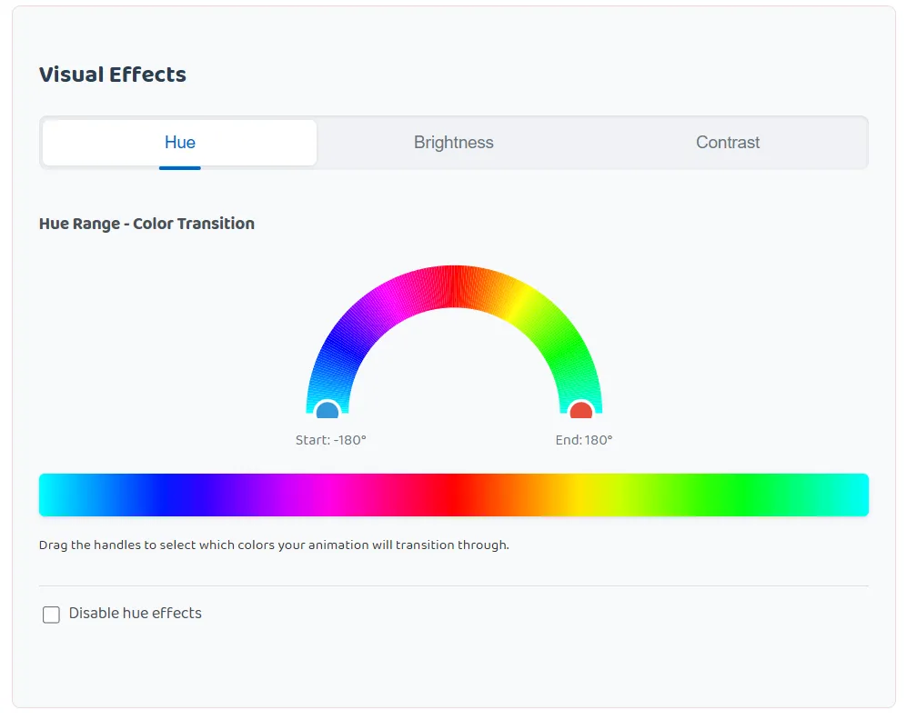
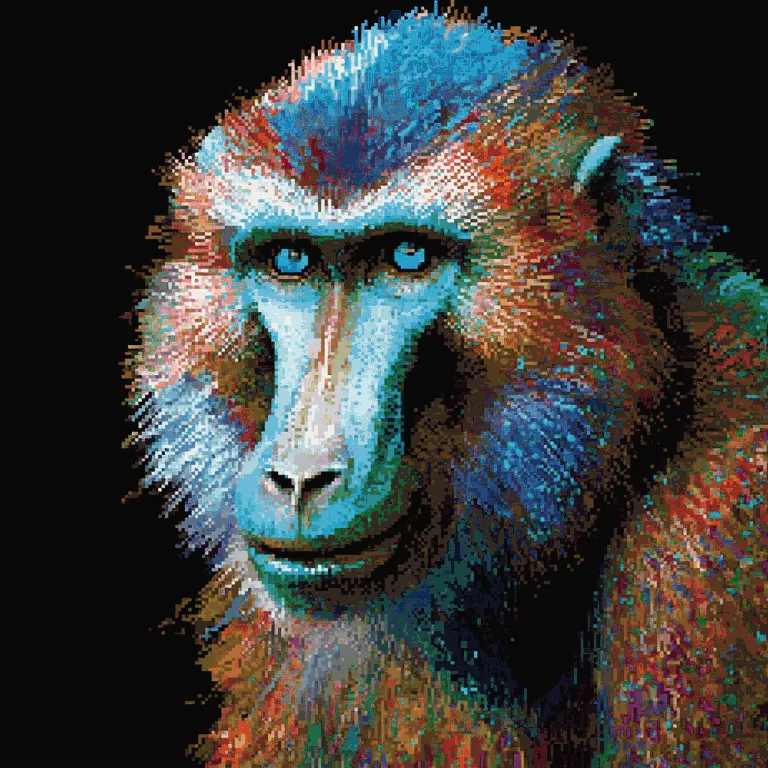

I’m very excited to share our latest coding experiment:

> [Hue Animator Utility](https://gbti.network/utilities/js-animate-hue/)

## The Origin Story

While I spend most of my time writing code and creating products, I’ve always had a soft spot for digital art. My toolkit is pretty straightforward: I love playing with hue shifts, brightness adjustments, contrast tweaks, and saturation changes. Whether it’s classic Photoshop or modern web tools like Photopea, there’s something satisfying about watching an image transform as you slide those color controls around.

When watching an image cycle through the entire color spectrum – from natural tones to electric blues, vibrant magentas, and sunset oranges, I often find myself thinking, “This transition would make an incredible animation.”

So this month, I decided to scratch that itch and build exactly that: a JavaScript tool that transforms any image into a mesmerizing color-shifting animation.

## What it does

The tool takes any image you upload and creates smooth animations by cycling through hue transformations. But it goes beyond just basic hue shifts – you can also animate brightness and contrast changes to create some truly psychedelic effects.

**Core Controls:**

-   **Interactive SVG color wheel** – Drag handles on a half-circle hue selector to define exactly which colors your animation cycles through (-180° to +180°)
-   **Hue range selector** – Choose specific color segments or go full spectrum for rainbow effects
-   **Brightness animation** – Ranges from -100 (completely dark) to +100 (super bright) with presets like “Sunrise Effect” and “Fade to Black”
-   **Contrast animation** – Adjust from -100 (flat/washed out) to +100 (ultra-sharp) with options like “Dramatic Reveal” and “Vintage Film”
-   **Animation timing** – Control frame count (1-360 frames), speed (1-60 FPS), and seamless looping
-   **Resolution scaling** – Output from 50% to 150% of original size for file size optimization

[View the full application here](https://gbti.network/utilities/js-animate-hue/)

> Notice in our controller that we can select the color range of Hue we would like to apply and cycle then cycle through in our animation.

**Smart Presets:** The tool includes thoughtfully designed presets for each effect:

-   **Hue**: Full spectrum rainbow, warm sunset tones, cool ocean shifts
-   **Brightness**: Sunrise/Dawn Effect, Fade to Black, Flash/Glow, Breathing Light, Reveal Effect
-   **Contrast**: Dramatic Reveal, Dreamy to Vivid, Pop Effect, Sharp to Soft, Vintage Film

## The technical bits & export formats

What started as a simple hue-shifting experiment evolved into a pretty robust image processing tool. Under the hood, it uses:

-   **[Canvas API](https://developer.mozilla.org/en-US/docs/Web/API/Canvas_API)** for real-time image manipulation and frame generation**  
    Web Workers** with [gif.js](https://github.com/jnordberg/gif.js) and [gifenc](https://github.com/skyra-project/gifenc) libraries for smooth GIF encoding without freezing the browser
-   **[MediaRecorder API](https://developer.mozilla.org/en-US/docs/Web/API/MediaRecorder)** for high-quality WebM and MP4 video output with configurable bitrates
-   **SVG-based controls** for that smooth, interactive color wheel

**Export Options:** The tool supports three major formats, each optimized for different use cases:

-   **GIF Animation** – Universal compatibility, perfect for web embedding and social sharing
-   **WebM Video** – Modern codec with excellent compression, ideal for web platforms
-   **MP4 Video (H.264)** – Industry standard with multiple quality settings:
    -   Low (5 Mbps) – Smaller files for quick sharing
    -   Medium (10 Mbps) – Balanced quality and size
    -   High (20 Mbps) – Professional quality
    -   Lossless (50+ Mbps) – Maximum quality for final output

**Social Media Ready:** The output formats work perfectly across all major platforms:

-   **X (Twitter)** – MP4 with H.264 codec (up to 512MB, 140 seconds)
-   **LinkedIn** – MP4 with H.264 and AAC audio (up to 5GB, 10 minutes)
-   **Instagram** – MP4 with H.264 for Feed, Reels, and Stories (up to 4GB)

The codec implementations include built-in brightness and contrast adjustments that work at the pixel level, giving you smooth transitions that would be difficult to achieve without video editing software.

The whole thing runs entirely in your browser – no servers, no uploads, no tracking. Your images never leave your device.

## What’s next

This started as a personal “what if” project, but I’m surprised by how much I’ve been using it. There’s something addictive about taking ordinary photos and giving them this dynamic, almost hypnotic quality.

I’m already thinking about v2 features: maybe saturation animations, or sharpness/blur transitions.

I’ve also been exploring support for modern animation formats like **WebP animations**[3](#footnotes) and **AVIF animations**, which offer superior compression and quality. However, implementing these has proven surprisingly challenging in browser environments:

-   **WebP animation encoding** requires [libwebp](https://developers.google.com/speed/webp), which needs compilation to WebAssembly using Emscripten
-   **AVIF animation support** is even more complex, requiring [libavif](https://github.com/AOMediaCodec/libavif) compilation and only has partial browser support for animations (currently just Chrome)
-   **WebAssembly complexity** – While libraries like [@jsquash/avif](https://www.npmjs.com/package/@jsquash/avif) exist for static images, animated versions require extensive C++ knowledge and custom WASM builds
-   **Performance trade-offs** – WASM implementations are significantly slower than native codecs, making real-time animation generation impractical

The current JavaScript ecosystem for these formats is still maturing. Most available libraries focus on static image processing, and animated versions often require server-side processing or complex build toolchains that don’t translate well to browser-based tools.

For now, I’m sticking with the proven GIF/WebM/MP4 combination that gives users immediate results without technical barriers. But as WebAssembly tooling improves and browser support standardizes, these next-gen formats could be amazing additions.

## Enjoying the fruits of labor

To help drive up the entertainment factor of this article, we’ve prepare a few examples we liked when working with this tool ourselves along with some comments about their renders.

We hope you enjoy! Starting with this pixel art of a Mandrill.

Below is an example of an animation who’s number of frames captured is very large (~340 frame) and who’s FPS is fairly low (8 per second), creating slow atmospheric change effect.

It almost appears as if tiny lights begin to come on in the tower as time passes.

Below we’ve included another atmospheric surreal landscape example. The landscape images, especially if the landscapes are surreal, make for really impressive animation sequences.

A wild _Snape_ appears on the dance floor:

The below example reminds me of a character we might see out of the Dragon Ball series. Who even is this guy? Great colors though.

These eyes[1](#footnotes) have seen a lot of love:

And a night cityscape[2](#footnotes) to conclude examples:

Thanks for reading and we hope you enjoy this novelty tool we’ve created! Have fun and if you create something cool, [upload it to giphy](http://giphy.com/upload/) and share it with us in the comments below!

## Footnotes / References

1.  The Guess Who – These Eyes – [https://www.youtube.com/watch?v=xcLdbsrSngA](https://www.youtube.com/watch?v=xcLdbsrSngA&list=RDxcLdbsrSngA&start_radio=1)
2.  Brassica – New Jam City –[https://www.youtube.com/watch?v=F1Lcfjk3\_i8](https://www.youtube.com/watch?v=F1Lcfjk3_i8)
3.  Why WebP is the best format for performance [https://performance.startumproject.com/why-webp-is-the-best-image-format-for-performance/](https://performance.startumproject.com/why-webp-is-the-best-image-format-for-performance/)
