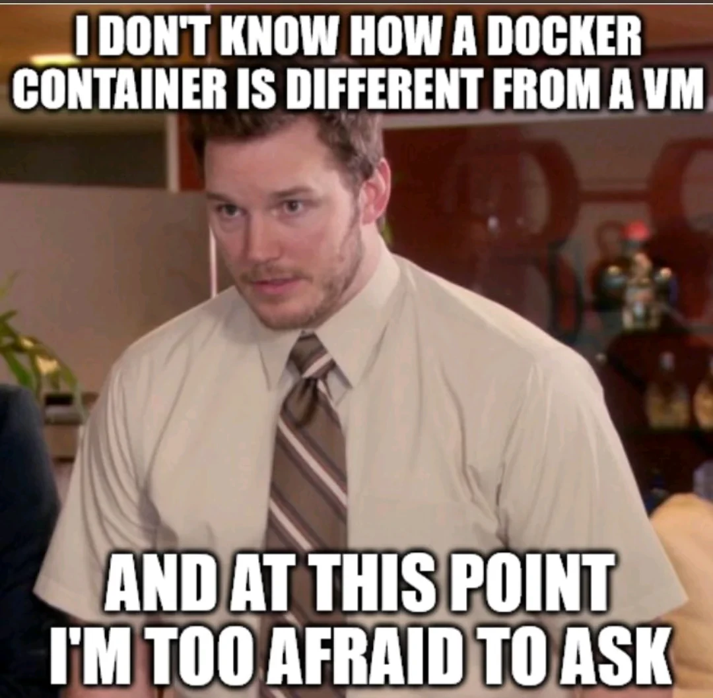
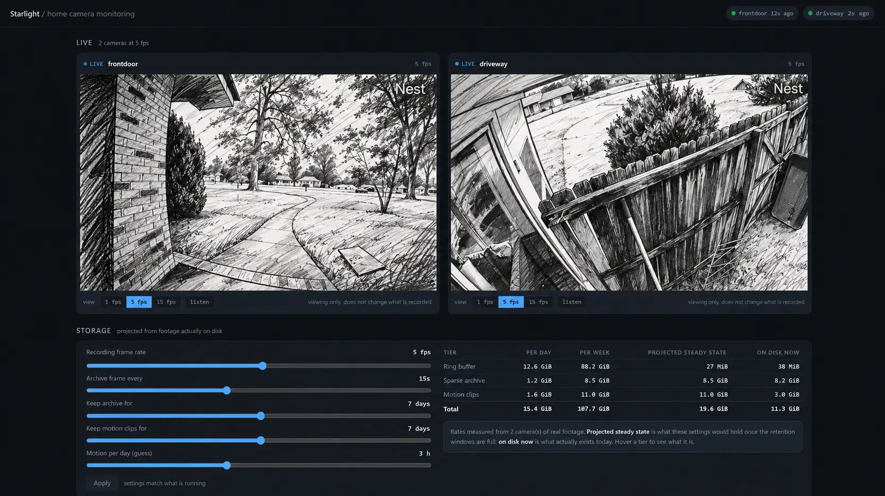
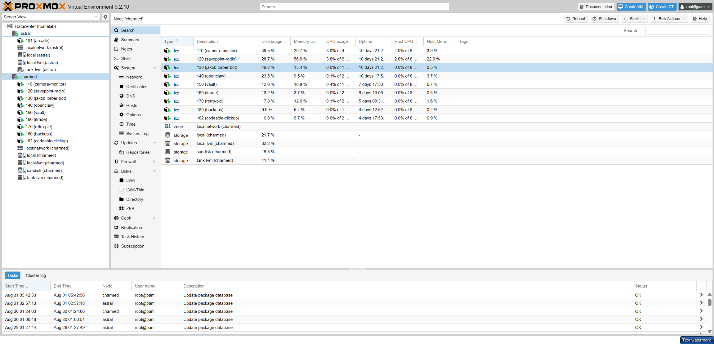

12gb ram, 100gb SSD, 1TB external HD. i7-7700 CPU.

Not much, but these are the specs of my home server and until recently I've been running a copy of [Windows Tiny 10](https://archive.org/details/tiny-10-NTDEV) on it while leveraging its Windows Sublinux system to run a copy of [SavePoint Station Manager](https://savepoint.fm) for a community radio project.

As a developer neck deep in the AI boom, I am building (and downloading) more self-hosted software than ever. 100GB is a good amount of space, and Windows, even though *Tiny*, takes up too much of it. Not only that, Windows has been a great OS for direct use over the years, but with my home server, my use is more and more remote; which makes the need for a user-first OS less important. What is more important is claiming and delgating resources across linux first applications.

On my Windows home server I was frequently using WSL and it is [not an ideal development environment](https://www.xda-developers.com/wsl-great-run-linux-natively-instead/). Now, I have finally come to the point where I want my home server environment to be more singular purposed, like the VPN I rent on [Cloudways](https://gbti.network/outbound/cloudways) that I can tunnel into (saving 100USD a year) .

So I've ditched Windows, and on the recommendation of a colleague, installed **[Proxmox](https://www.proxmox.com/en/) **as my new home server OS.

## Part 1: Proxmox and the "ProxMoxBox"

Proxmox is a linux-first OS platform that manages virtual machines and LXC containers from one web interface.

Proxmox offers a specialized operating system that allows segmentation of machines and containers. Think of it as your own linux container manager; similar to a collection of Dropbox instances.

Instead of piling every self-hosted application into WSL under Windows, each service can live in its own container environment. This makes applications easier to install, start up, back up, restart, move, upgrade, and occasionally break without taking the rest of the server down with them.

Proxmox can do this with full virtual machines, but many self-hosted Linux applications can run in much lighter *LXC *containers.  Proxmox OS can even bind multiple machines together under a single cluster/interface. So if you have two home server machines, they can combine into one network accessible singular OS.

Proxmox OS was built in such a way that home server management is a primary and not a secondary consideration, where as Windows was not created for compartmentalized application management (though it can support it).

## Part 2: What LXC is, and how it differs from a virtual machine

I used the word LXC earlier, which for me was a brand new term when I started my ProxMox journey. It stands for "Linux Container", plainly.

One of the first questions my AI agent proposed to me during my first home server application setup was, "Do you want to install this application as a virtual machine or a LXC?" while simultaneously advising that I choose LXC.

When asking why it recommended an LXC over a virtual machine, I was informed that an LXC container and a virtual machine require different resource commitments. The VM required an upfront delegation of resources that subsequent LXC containers would share resources from. If I delegated 50% machine resources to VM One, then I would have 50% resources for VM two. They would not share the resources. While rather if I only created VM One, and then created several LXC containers within that VM, these sub containers would share.

Without a distinct need to create multiple VMs on one computer, I would be better off with just one and then all my sub-linux containers would share the whole of that machines resources (which would be better for my purpouse).

A virtual machine emulates a computer. It boots its own kernel, runs its own device drivers through
QEMU, and holds its own memory. When you give a VM 4 GB, that 4 GB is allocated to it and the host cannot
use it for anything else, whether the VM is busy or idle.

An LXC container shares the host's kernel. There is no guest kernel to boot, no QEMU, no virtio device state. What you get instead is a set of isolated namespaces and cgroup limits around a normal Linux process tree.   

In practice a bare Debian container idles at something like 30 to 60 MB of RAM before you run anything, where the same services in a VM cost 200 to 400 MB just to exist. A container starts in under a second. A VM takes 15 to 30 seconds to boot.

## Part 3: Using Tailscale with Poxmox

Converting Windows to Poxmox was the first part of my home server migration.

{full}

The second part of the home network setup was making my server applications accessible inside my home network (as well as outside of it).

To solve this, we have used a service called **<a href="https://tailscale.com/" rel="noopener" target="_blank">Tailscale</a>.**

Let's give an example...

At home I have two Nest Cameras (Google) and instead of paying the 5USD a month to store and access doorbell+driveway footage from Google's cloud, **I built my own surveillance storage that stores the footage on a spare USB HD.** 

With **Tailscale**, I can type `http://homesurveillance` into a browser on any device connected to my Tailscale network and reach the server as though I were still at home.

{full}

Access to these host endpoints are controlled by policies I define, so only approved devices and users can connect.  

Under the hood, Tailscale creates an encrypted WireGuard connection between my devices and gives each one a stable private address and hostname. On an iPhone, the Tailscale app uses iOS's built-in VPN interface to route that private traffic securely back to the home server.  

The best part about the TailScale solution has been their extremely generous free tier offering that covers nearly all personal usage. I already have several devices connected and host addresses for almost 8 different home server applications (this number seems to keepgrowing as I add more containers to my PoxMoxBox.

## The final migration; ProxMox in use:

Since starting this small article, the ProxMox server is not only completely setup. I've added a second machine to it, 8gb more ram, an addition 1tb SSD, a Zotec 1060 with 6gb virtual memory, and I've reformatted two external hard drives from NFTS to EXT4 so they are compatable with the Linux machines.   

The only thing left to do now is share some screenshots of my servers and let you know how I am using it to improve my personal computing experience:

So what are we running?   

I've created a members-only breakdown of the current contents of my home server, with links to the open-source software that helps me run these apps.   

Happy to discuss any of these applications or my setup in the comments or on Discord. Thanks for reading, and good luck with your home server build 🙌
