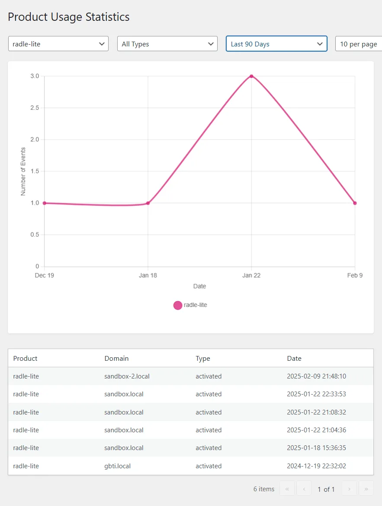

> **Update (June 2026):** Since this post, Radle Pro has been sunset and all of its features were folded into the free plugin. Radle is now a single free release on the [WordPress plugin directory](https://wordpress.org/plugins/radle-lite/), with no license, sponsor check, or upsell. The "lite vs full" framing below is kept for history.

Wow, I am so excited to finally see the release of a limited feature version of our [Radle plugin](https://gbti.network/products/radle/) onto the WordPress directory. It has been nearly 5 years since I’ve personally published a plugin to the WordPress plugin directory and I am happy to announce that on **Feb 8th 2025**, [Radle Lite](https://wordpress.org/plugins/radle-lite/) was accepted and published.

> [Radle Lite](https://wordpress.org/plugins/radle-lite/)

[Radle](https://gbti.network/products/radle/) has been the first WordPress plugin that I have published exclusively for the [GBTI Network](https://gbti.network/membership/). After some time, a lite version has finally been prepared and published under the [GBTI WordPress profile](https://profiles.wordpress.org/gbti/) on the [WordPress plugin directory](https://wordpress.org/plugins/). At the time it shipped with almost all features the full version had, minus a few bells and whistles like advanced comment sorting, caching controls, user badges and thread level controls. Those remaining features have since been folded in, so the free plugin now carries the complete feature set.

Radle’s functionality has helped this website to offload discussion to our [Reddit subredit](https://www.reddit.com/r/GBTI_network/), rather than relying on the traditional WordPress comments system. This integration also helps expand the reach of content, offering our readers potentially more familiar way to keep track of news and new content all the while hoping to encourage discussion through the familiarity of the Reddit platform.

If you are interested in more about the “why” of Radle, please have a read of the following article. It goes over the goals and painpoints that lead me to take this route:

> [Introduction to Radle: A WordPress Plugin for Subreddit Integration and Reddit Powered Comments](https://gbti.network/devops/frameworks/wordpress/introduction-to-radle/)

## Piloting into the future

The exercise of creating Radle has been very valuable to the future work of the GBTI network. Radle has existed as a pilot program, paving the way for our future work with WordPress. Through converting Radle into a product, we have managed to develop a custom licensing API that is tied to GitHub sponsorship. We also developed systems to provide updates tied directly into our Github version control systems. These frameworks and systems will be used on future projects and they needed to be created.  
  
In addition to updates, and licensing systems, we also anticipated needing to track usage of our products, and so we have developed standards for tracking asset usage that can be applied to future products.

This screenshot is from inside the gbti.network WordPress administration dashboard.

## Fears and Worries: A world of politics and daggers

Building on another’s ecosystem is a privilege that allows consumers to also be creators, but these circumstances can come with some glaring instabilities.

One click from a Reddit employee can quickly end efforts to build and maintain a subreddit community on the Reddit platform. Not only are subreddits vulnerable to unknowns, API access can be disabled for any reason, anytime, with no explanation owed or given.  
  
Recently, WordPress (the organization) took control and rebranded [Advanced Custom Fields](https://wordpress.org/plugins/advanced-custom-fields/), a major asset that belonged to a direct competitor to the private arm of WordPress, Automattic. When WordPress was confronted about the breach of status quo, WordPress pointed to the nature of the GPL license and said they were within their right to do this [\[source\]](https://www.advancedcustomfields.com/blog/acf-plugin-no-longer-available-on-wordpress-org/)[\[source\]](https://blog.room34.com/archives/9346/the-lesson-of-the-advanced-custom-fields-pro-secure-custom-fields-debacle-dont-gpl-your-paid-plugins/). WordPress has always operated somewhat on the honor system that GPL licensed code would not be stolen even though we all knew it was possible as well as legal for anyone to do so; so this was a new event that raised a lot of eye brows.

We live in a world of daggers and politics and its not given that these platforms will be always be kind and fair. Tomorrow, for any reason, Reddit could determine that [Radle](https://gbti.network/products/radle/) and the GBTI Network are undesirable, and they could terminate our own subreddit and then on the very next day, in a play of comedy, WordPress could rebrand Radle as _Redle_ under their ownership. And what could be done? It’s something to keep in mind.

Reddit if you are reading, I’ve made Radle so that it can only work with one subreddit so the asset shouldn’t be used for spamming to multiple subreddits. I have also built in API monitoring and caching tools to be as light on your APIs as possible. I’ve even made sure that contributing to discussion requires commenting on the Reddit platform itself; bringing in rich data for Reddit to consume; all while tying the WordPress CMS and Reddit together in what I believe to be a [healthy way.](https://gbti.network/devops/frameworks/wordpress/introduction-to-radle/) Reddit, please feel free to contact me anytime to discuss ideas and continuity.  
  
WordPress, if you are reading; I love you and trust your organization in like 95% of cases to do the right thing from an honor system standpoint. The GBTI Network is no competitor to Automattic and will most likely never compete with anyone at the level of the [Silver Lakes and Black Rocks](https://medium.com/@kelliepeterson/what-is-the-wordpress-v-wp-engine-drama-really-about-3a82a54e7553) of the world. The likelihood a tool produced by this shop would find itself a target of a large reactionary campaign is slim to none. So I am not worried. But, its good to keep your head on a swivel about these things.

## Gratitudes and a hopefully a publishable case study about what it is like to publish a plugin on the WordPress directory.

I personally want to thank [the plugin review team](https://make.wordpress.org/plugins/handbook/the-team/) for working patiently with me to re-learn how the publishing process works as well as for helping me to improve my codebase. I was very worried going into the process because, lets face it, its sort of scary to interact with people and systems that have power over whether or not a personal vision or work can go through. But after a handful of weeks and several rounds of _polishing the apple_ 🍎, Radle Lite was accepted and I have to say, overall, I was impressed with the process and… I made it through!  
  
_I’ll write more about my experience later_ and update the article here with a link when it is ready. If I forget, @ me in the reddit comments and I’ll remember.

## What’s next? Hopes and aspirations.

So the Radle WordPress plugin pilot project, designed to be a small to medium size plugin, is now complete. Because we completed Radle, I now have good understanding of publishing process as well as I now have tools to handle difficult parts of product delivery: delivering version controlled updates, licensing usage gating, usage tracking, product pages, etc and more.  
  
Radle now represents the quality of product that this shop can make and ship and now we have an established pipeline to support scaling and shipping, faster.

Alone, I plan to publish at least 1 more small-to-medium sized WordPress plugin this year, and if things go well, I’ll also publish a larger one that I have been working on for quite some time. Also do not forget that the GBTI Network is developing into a co-op profit-share model where its members will have a chance to give back and earn distributions for participation. In reality, the co-op is our best product in development. We will see and I am looking forward to the future.  
  
For now, we’ll continue to provide our best work for [GBTI Network Members](https://gbti.network/membership/), and where it makes sense we will release that work free on the WordPress plugin directory, as we have now done with Radle in full.  
  
Thanks for reading.

We hope you enjoyed this article by **Hudson Atwell**, GBTI Member.

Python, NextJS, NodeJS, JavaScript, PHP, WordPress, Developer Relations, Novelty, Curation, DevOps, Blockchain, IoT, and more.

-   [X](https://twitter.com/atwellpub)
-   [YouTube](https://www.youtube.com/@HudsonAtwell)
-   [GitHub](https://github.com/atwellpub)
-   [WordPress](https://profiles.wordpress.org/hudson-atwell/)
-   [LinkedIn](https://www.linkedin.com/in/hudsonatwell)
