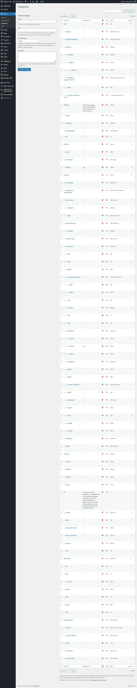
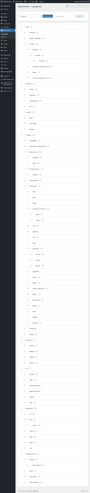
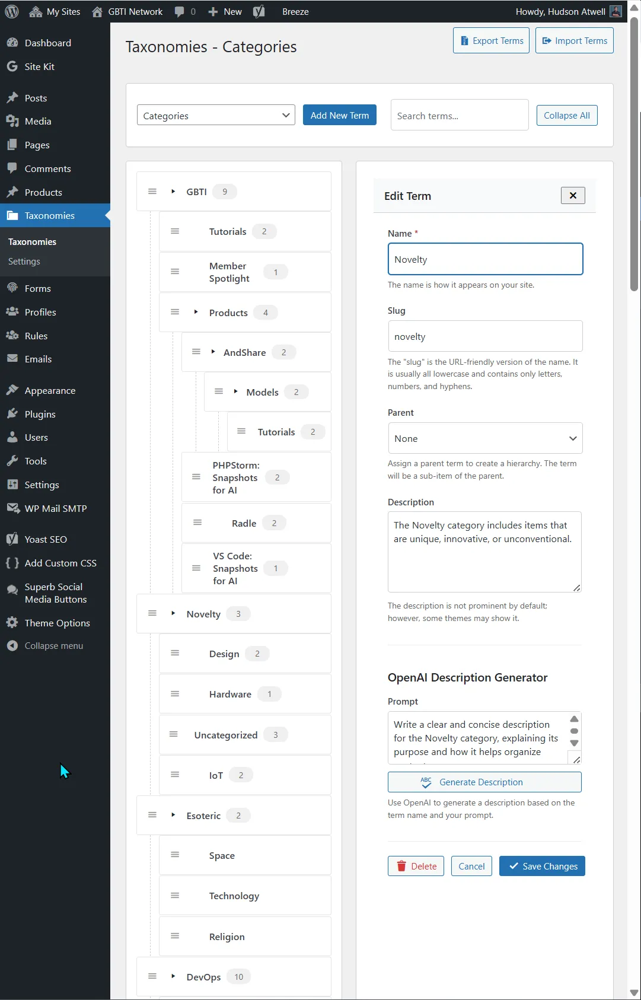

> **Update (June 2026):** Advanced Taxonomy Manager is now completely free on the [WordPress plugin directory](https://wordpress.org/plugins/better-category-manager/). The separate category-only tool was merged in, so there is no longer a members-only version and a free version; it is one free plugin for everyone. The original framing below is kept for history.

One of the things that drives me to build WordPress products is the need to improve this website.  
  
This was the case with one of the products I recently published, [Radle](https://gbti.network/products/radle/), which is a bridge between Reddit and WordPress that helps readers discuss WordPress articles on a [sub-reddit.](https://www.reddit.com/r/GBTI_network/)

As a product developer it often isn’t enough to create a tool and keep it proprietary. Publishing _Radle_ was both good practice as well as an opportunity to generate revenue for this [co-op](https://gbti.network/co-op) model I have been creating. I even made a [free version](https://gbti.network/gbti/radle-lite-is-now-on-the-wordpress-plugin-directory/) available on the WordPress plugins directory. This was a lot of fun, and also a lot of work; but it was worth it.  
  
Recently I ran into a _new_ problem when building the GBTI Network website. I have a lot of categories; over 81. These categories are surprisingly difficult to manage on WordPress’s core category management system and as long as I have been a WordPress user, it _feels_ like there has never been an overhaul on the category management system. It’s been _“same same”_ for a very long time.

When porting categories into WordPress I become frustrated with the clunky nature of adding and editing. Nearly every aspect is managed though hard PHP refreshes. I cannot quick-edit the category parent, children, or description. I also cannot drag or drop categories where I want them to be in hierarchy.  
  
Channel management on platforms like Slack and Discord have made me spoiled over the years with “categories” and “channels” being not too dissimilar at all.  
  
Let’s take a quick look at what the core WordPress category manager looks like (click to open).

> With over 81 categories to manage, the majority being child categories, the PHP powered native category manager experience felt antiquated after working with Discord channel management; even untenable.

And what does a developer do when they believe their is a better way? They get to work and build it themselves! I did not find anything out there that made me think I could not do a better job if I put myself to the work.

And that’s exactly what’s been done here, with the [Advanced Taxonomy Manager](https://gbti.network/products/better-taxonomy-manager/), a WordPress plugin that improves the UX of every registered taxonomy in a WordPress website. It began as a network-member tool alongside a category-only free version, and the two have since been merged into one plugin that is now [free for everyone on the WordPress plugin directory](https://wordpress.org/plugins/better-category-manager/).  
  
Get ready… this screenshot of Advanced Taxonomy Manager is large… _click to expand_:

And here is a screenshot of what the edit screen looks like (click to open).

This WordPress category management plugin is _mostly_ powered by AJAX and JavaScript, there are zero hard refreshes required when editing categories. There is only a small refresh when adding new ones.

Editing categories opens up a drawer to the right, which can be closed to save screen real-estate and better visualize all categories at once.  
  
We can quickly drag and drop categories as nested items and un-nest them as needed, without ever experiencing a PHP hard refresh.

We’ve even added in OpenAI support for generating category descriptions, if you need description rich categories.

It may not be much, but at the same time its everything we wanted for ourselves and it represents one person’s signature style about what makes a better taxonomy/category management experience.

Anyone can enjoy the [Advanced Taxonomy Manager](https://gbti.network/products/better-taxonomy-manager/) plugin today, free on the WordPress plugin directory:

> [Advanced Taxonomy Manager on WordPress.org](https://wordpress.org/plugins/better-category-manager/)

Thanks for reading and paying attention! Please consider becoming a [network member](https://gbti.network/membership) to support our work!
