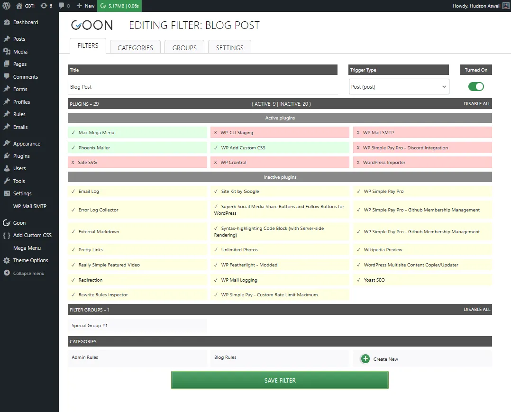
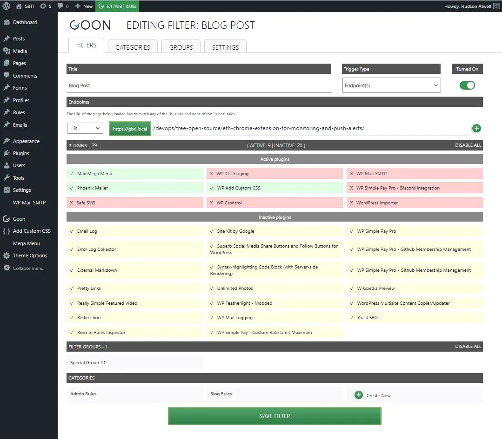
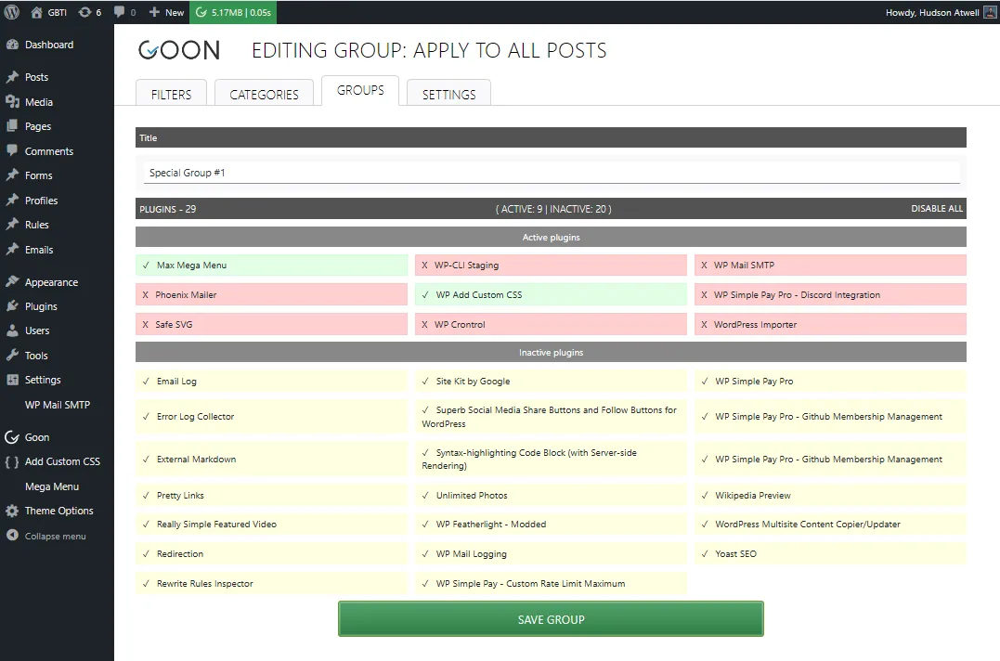
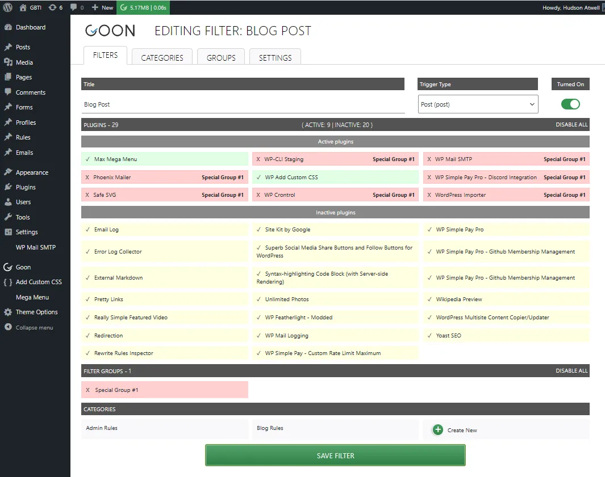

We were recently looking at plugins that might help with performance optimization and came across a unique plugin: [Goon](https://wordpress.org/plugins/goon-plugin-control/), which conditionally loads plugins based on user-defined rules.

In this article, we briefly review the features of the free and paid versions of the Goon plugin. We also interview the lead developer, [Andrija Naglic](#andrija-naglic), to learn even more about what inspired him to develop the Goon plugin and how it has helped him in the past with clients.

## Goon: Key Features

### Custom Filters

Goon allows administrators to create filter rules that help disable specific plugins based on pre-defined triggers, such as all posts, all pages, custom post types, and custom endpoints.

For custom endpoints, users can paste the full URL of the page we would like to target, and whatever rules (or groups) we set will be applied to that individual page.

### Group Configurations

Groups are like pre-defined rules that remember a specific configuration.

Groups that the user creates are accessible when creating filters. If we enable a group, the filter will inherit that group’s configuration.

## Goon: Free vs. Paid Version

#### **Free Version** [🔗](https://wordpress.org/plugins/goon-plugin-control/)

-   Selective plugin loading for posts, pages, custom post types, and specific endpoints.
-   Basic filter creation and management
-   Integration with popular caching plugins

#### **Pro Version** [🔗](https://getgoon.pro/)

-   Advanced filter options, including blocking plugins during Ajax requests
-   Import and export of filters and their categories
-   Identification and blocking of unused CSS and JS files
-   Enhanced support and updates

## An interview with the plugin author

I had a moment to sit down and speak with the lead developer of Goon, [Andrija Naglic](https://www.linkedin.com/in/naglic-andrija/), and ask a few questions about the Goon plugin, what inspired its development, and how he’s personally used it to help with his clients.

**Andrija Naglic**

_Andrija has led teams for international groups in numerous projects, worked with clients of all sizes and industries, and delivered over $2 million in increased revenue along with $200,000 in cost savings in the past year alone, serving as a technology consultant._

-   [LinkedIn](https://www.linkedin.com/in/naglic-andrija/)
-   [WordPress](https://profiles.wordpress.org/andrija/)
-   [X](https://x.com/a_naglic)

### When did you come up with the idea to build Goon?

**Andrija:** _“The idea for Goon came up during a paid project for one of my long-term clients at the time – they had a really old website with more than 70 active plugins and it was creeping.  
  
They didn’t have plans or budget to rebuild the entire website from scratch, but they did want to improve their user experience in any way possible, especially the low-hanging fruit that would produce immediate results with the least effort.  
  
I got the idea of turning off unneeded plugins on some pages so I looked in the repository to see if a plugin with such features already exists, and it did!  
  
I think there were two or three plugins, but they were either broken and not working well, clumsy to use, or lacking some capabilities._  
  
_So we took one of them and customized it to our needs.  
  
That’s how the first version was created, we took [Plugin Organizer](https://wordpress.org/plugins/plugin-organizer/) and created [Plugin Optimizer](https://wordpress.org/plugins/plugin-optimizer/)_ 🙂  
  
_The results were so great that I decided to team up with my colleague to create a new version from scratch and then sell it as a premium plugin._  
  
_He was supposed to finance the development and I was supposed to be the only developer.  
But as things in life don’t always go as planned, he paid some low-cost developers to develop it from scratch and then wanted me to polish it and complete it._

_Their code was so awful plus that wasn’t our initial agreement, so I have left that project._

_A year after that I was working on another paid project for a Hawaiian tourist agency, where I saw that they could benefit from turning off some plugins on some pages, so I forked Plugin Organizer and improved it as I thought it should look and work, under a new name._

_That’s when Goon was born.  
  
I have greatly improved the original code, added some missing features and released almost all of them in the free version so that everyone can benefit from this plugin.  
  
During my career I have seen a lot of slow website with 30, 40 or more active plugins.  
  
One fine example I always like to point out is Contact Form 7, a plugin that’s 16 years old, used on 10+ million websites and in the top 3 most used plugin in the central repository.  
  
That plugin is loading it’s assets (CSS and JS files) on every page and not just on the contact page, or the page where you are using their forms.  
  
If I remember correctly, they are doing so in the wp-admin area as well.  
  
Imagine having 50 plugins that do the same, loading stuff on every page request or Ajax request.”_

### How many hours do you think went into its development?

**Andrija:**  _“It’s hard to estimate as it was built in several stages by different people until I took its final fork under my command, and since then, I have spent a couple of hundred hours so far.”_

### Are you the only developer currently working on Goon?

**Andrija:** _“Yes.”_

### Goon is pretty new, do you have a paid subscriber base yet?

**Andrija:**  _“I don’t have subscribers at this stage since I’m offering lifetime licenses at a pretty low price. I do have a few supporters that are happy with the results, but they are also share valuable feedback when something is not working well or if they come up with a feature that they would like to see added.”_

### Are there any real-world examples where you are using Goon for performance optimization?

**Andrija:** _“After the initial version (Plugin Optimizer) was already forgotten, about a year later, the Hawaiian tourist agency I was working for had close to 100 active plugins on their website.  
  
They wanted to improve their page ranking on SERPs and they thought that slow speed is a huge blocker in achieving that.  
  
Once Goon was installed and set up, we have witnessed up to 90% page speed improvements!  
The page that was previously loaded in 7-8 or more seconds got loaded in under a second!  
  
Those were the immediate results, and the overall results were – they got promoted on Google SERPs, which resulted in more traffic, and they ended up breaking their monthly sales records, for several consecutive months.  
  
They were already pretty old and big agency, so we are talking about additional income of 7 figures, per month.”_

### Your plugin directory listing for the free version has a pretty heavy disclaimer about the potential of this plugin to break sites if not used correctly. Can you provide some examples of issues you’ve seen by using this plugin incorrectly?

**Andrija:** _“One of the first examples that comes to mind is when a theme requires a function from a plugin to operate properly, and you disable that plugin on a certain page – it will create a fatal error because now the function is missing.  
  
Another example is that plugins often add pages, blocks or shortcodes – disabling that plugin would mean that a shortcode or block is never defined during a page load, or an entire page or page template could be missing.  
  
In an ideal world, a proper code will always check for the existence of a function it’s calling, but in our example of CF7 we can see that even top plugins are not always built with best practices applied.”_

### Do you have any other WordPress projects or plugins you would like readers to know about?

**Andrija:**  _“No, and it will be a while until I achieve my goal – the development of free and premium plugins as a full-time occupation.  
  
At the moment, I’m spending most of my time doing client work and trying to find a way to achieve that.  
  
Eventually, the switch will happen and the plan is to have a dedicated team of developers that will produce quality plugins at reasonable prices.”_

### Are you available for priority support or custom WordPress projects? If yes, what is the best way to get in touch with you?

**Andrija:** _“As the sole developer of Goon, I am the only one who will help you with it, whether it’s a bug or a feature request.  
  
You can always reach me through [getgoon.pro](http://getgoon.pro), even if you just want to share some awesome results that Goon has helped you achieve.  
  
You can also reach me at my usual “workplace” for this or any other project: [https://www.codeable.io/developers/andrija-naglic/](https://www.codeable.io/developers/andrija-naglic/?ref=99TG1)“_

### Finally, what’s next for Goon?

**Andrija:** _“Goon has a major overhaul in line, a major version that will have the entire code base rewritten from scratch. The plugin has proved its usefulness and it surely can provide results.  
  
Conditional logic will be greatly improved, it will use something like ACF where you’ll be able to combine different types of conditions and have condition groups._

_Currently, the [free version](https://wordpress.org/plugins/goon-plugin-control/) allows blocking plugins on specific pages with URL conditions (you can use wildcard symbols).  
  
The [premium version](https://getgoon.pro/) also allows blocking plugins during Ajax requests – I wanted to speed up the WooCommerce loading spinner when you’re on the checkout page so much_ 🙂 _)_

_I’m planning to add several other types of conditions, like:_

-   _Is it the front end or back end of your website_
-   _Is the user logged in or not_
-   _By the user’s role_
-   _By the user’s capability”_
-   _Also, the plugin currently has a basic option of disabling JS and CSS assets during the page load, which will be improved._

## Conclusion

Goon appears to be a lightweight performance-seeking tool that can help WordPress users discover additional savings by allowing control over where and when plugins are loaded. We highly recommend trying out the [free version here](https://wordpress.org/plugins/goon-plugin-control/) and considering purchasing a [lifetime license](http://getgoon.pro/) as well if you like the plugin asset.
