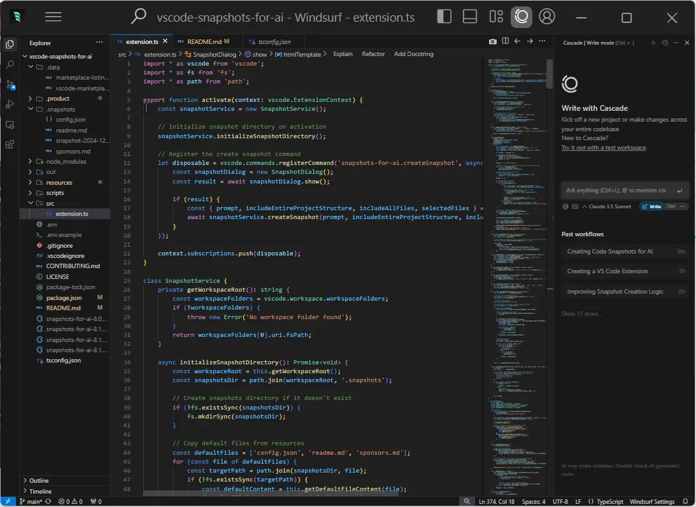

# Announcing Snapshots for AI: Now Available for VS Code!

We’re excited to announce that our prompt engineering tool, [Snapshots for AI](https://marketplace.visualstudio.com/items?itemName=GBTI.snapshots-for-ai), is now available for the [Visual Studio Code IDE](https://code.visualstudio.com/)! Originally developed as a PhpStorm plugin, we’ve successfully ported and enhanced this tool to serve the VS Code community and its growing forks [Windsurf](https://codeium.com/windsurf) and [Cursor](https://cursor.sh/).

## The Challenge of LLM Context Management

One the challenges when working with large language models is that they need to be prepared with context in order to respond well to our requests. The better we are able use natural language and share artifacts with the LLM, the higher quality the response from the model will be.

When coding over a session, context often becomes lost or diluted across a broadening number of parameters for the model to consider.

Managing divergence is why we built Snapshots for AI, but there are currently stronger tools out there that require significantly less “manual” intervention and recontexting.

## The Rise of “Flowstate” IDEs

The development landscape is changing fast… [VS Code](https://code.visualstudio.com/) has been recently forked twice into the pioneering AI-focused IDEs; Windsurf and Cursor. There is also [Cognition Labs’ Devin](https://cognition.ai/blog/introducing-devin) which has recently entered the scene.  
  
“Flowstate” IDEs will act as middle managers between a user’s prompt and the LLM. They allow the IDE to read/write your application directly in real-time. They also add their own form of version control so you can accept or reject proposed changes.  
  
We really like Windsurf’s approach to UX as an easy AI-IDE code editor. We purchased their 60-a-month Pro Ultimate package and cancelled our Claude subscription because the separate subscription has become redundant.  
  
Our eye is on Devin, too, and at the time of writing this article, Devin costs 200 USD a month, and bootstrapping the GBTI Network on Devin does not appear to be worth it when working with Windsurf already feels like an unreasonable productivity speed boost.

## Snapshots for AI attempts to bridge a gap

The _Snapshots for AI_ plugin provides very simple features native to the modern IDE experience that will help collect application code in an organized, easy-to-“machine”-read markdown document. You can limit which files are shared through a select checkbox that lists your open files, or you can include the entire application minus your ignored patterns.

Our approach is simple but powerful:

-   Selectively include open files opened in the IDE view port.
-   Include the entire application in an export including a file heigharchy breakdown
-   Provide configurable exclusion patterns .
-   Control the proceeding prompt at the generation level

Really simple stuff! We hope a lot of developers use this tool in their project. Thanks for reading and paying attention generally. That makes you a super star.

## Start using Snapshots for AI today

Install it from the [VS Code marketplace](https://marketplace.visualstudio.com/items?itemName=GBTI.snapshots-for-ai) or [Open VSX Registry](https://open-vsx.org/extension/GBTI/snapshots-for-ai) and start engineering code context for your LLM interactions. The extension is completely free, and your support through sponsorship helps us continue developing tools that make developers’ lives easier.

## Join our membership community for opportunities

We’re thrilled to announce that the GBTI Network is now accepting new members! Visit our [membership page](https://gbti.network/membership/) to learn more about the benefits and application process.
