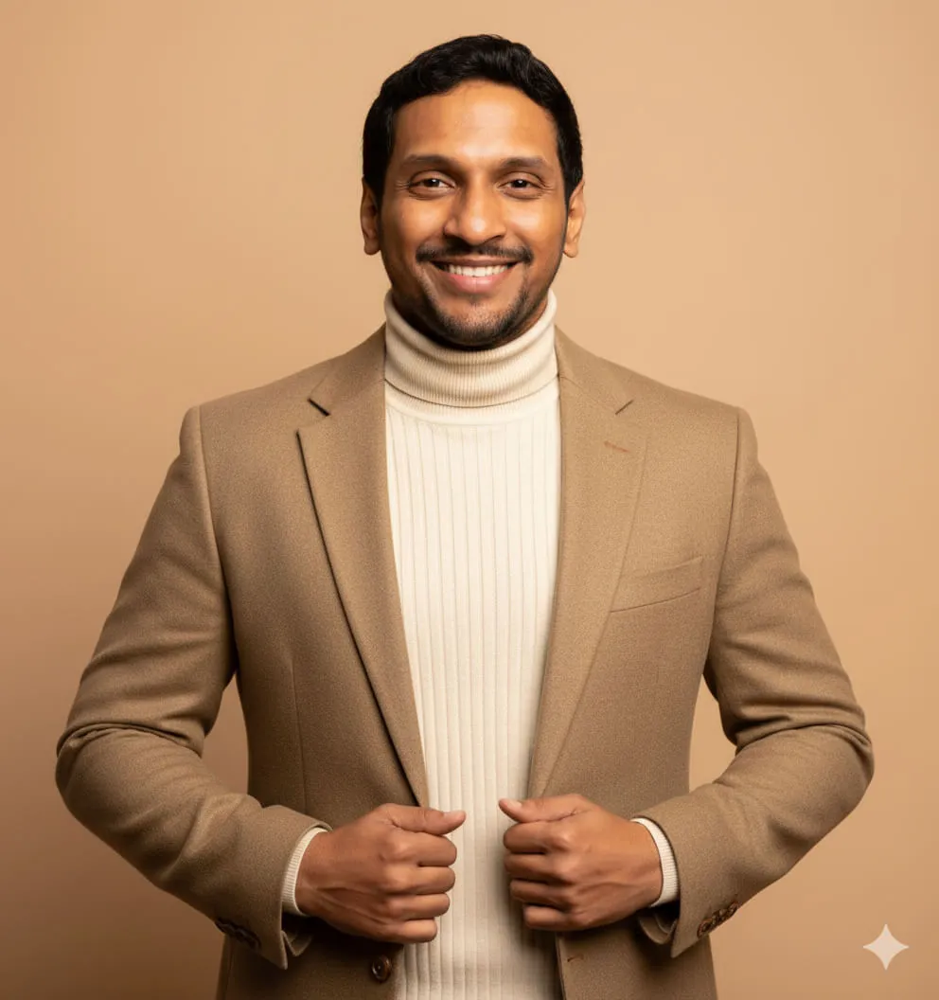
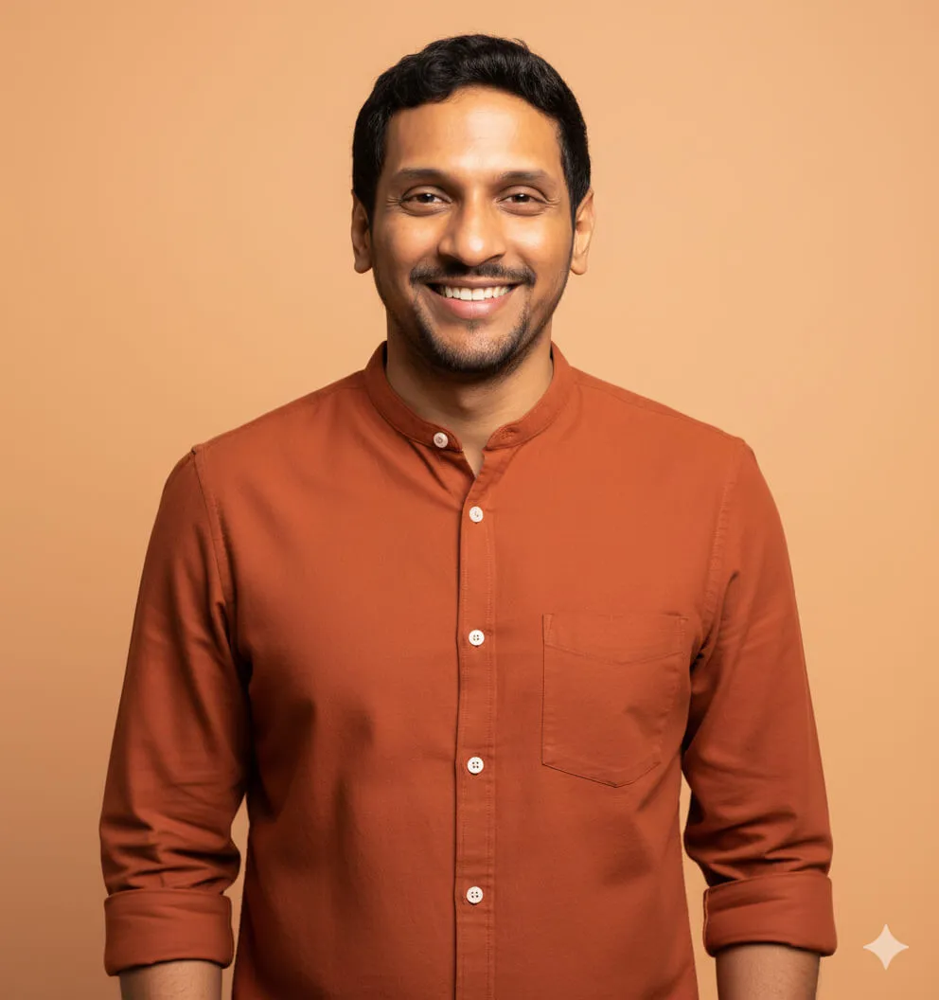
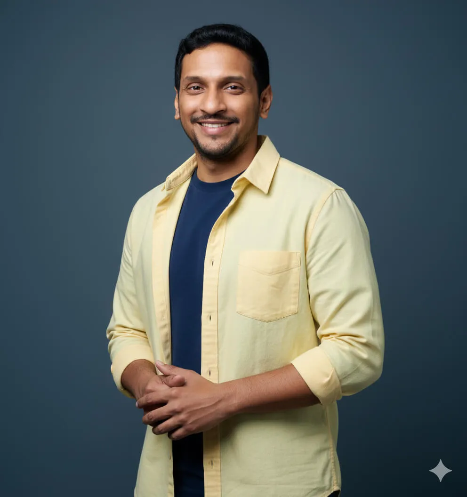

**Nano Banana** is great at generating professional headshots.

For example, I have uploaded my original picture to Nano Banana (Nano Banana can be easily accessed from the chat box of [Google Gemini](https://gemini.google.com/) or [Google AI Studio](https://aistudio.google.com/)).

And entered the following prompt:

For the uploaded picture, generate an image of:

**Expression:** Warm, genuine smile

**Clothing:** Dark gray textured suit with light blue dress shirt and navy blue tie with small dot pattern

**Clothing shadows:** Visible shadows under suit lapels, along tie, and in jacket fabric folds

**Lighting:** Soft, natural outdoor lighting from front

**Facial shadows:** Face evenly lit with minimal shadows

**Background:** Blurred outdoor corporate/office building environment (bokeh effect) with modern glass windows and architectural elements visible, blue-gray and white tones

**Background shadows:** Background is out of focus, no distinct shadows visible

**Framing:** Head and upper torso to mid-chest level

**Position:** Body angled slightly to left, face turned toward camera at slight angle

**CRITICAL RESTRICTIONS:**

-   NO multiple backgrounds or layered backgrounds
-   NO rounded corners or circular crops
-   NO additional background colors or borders
-   NO dramatic background gradients – background should be evenly lit or have only minimal, natural lighting variation
-   Standard rectangular crop only
-   DO NOT add shadows if none exist in the reference image

And Nano Banana generated the following picture:

The picture is not only professional, but it also looks realistic.

My colleagues couldn’t recognize that it was AI-generated.

That’s why it works perfectly as a profile picture on LinkedIn.

**In this article I have prepared for you 15 example prompts for creating professional headshots using Nano Banana.**

**(Bonus!)** At the end of the article I will also share how I generated these prompts.

## 15 ready-to-use prompts for creating professional LinkedIn headshots

### Prompt 1: A person wearing a black suit jacket with a light blue dress shirt and a dark navy tie

For the uploaded picture, generate an image of:

**Expression:** Slight smile, professional expression

**Clothing:** Black suit jacket with light blue dress shirt and dark navy tie

**Clothing shadows:** Visible shadows under suit lapels, along tie, and in jacket fabric folds

**Lighting:** Soft, even frontal lighting

**Facial shadows:** Face evenly lit with minimal shadows

**Background:** Blurred bookshelf environment (bokeh effect) with colorful books visible on wooden shelf – blue, yellow, pink, red, and purple book spines out of focus, white wall above

**Background shadows:** Background is out of focus, no distinct shadows visible

**Framing:** Head and upper torso to mid-chest level

**Position:** Face and body directly facing camera

**CRITICAL RESTRICTIONS:**

1.  NO multiple backgrounds or layered backgrounds
2.  NO rounded corners or circular crops
3.  NO additional background colors or borders
4.  NO dramatic background gradients – background should be evenly lit or have only minimal, natural lighting variation
5.  Standard rectangular crop only
6.  DO NOT add shadows if none exist in the reference image

Expected result from Nano Banana:

### Prompt 2: A person wearing a beige textured blazer with brown buttons over a cream ribbed turtleneck sweater

For the uploaded picture, generate an image of:

**Expression:** Bright, warm smile

**Clothing:** Tan/beige textured blazer with brown buttons over cream ribbed turtleneck sweater

**Clothing shadows:** Visible shadows under blazer lapels and in jacket fabric folds

**Lighting:** Soft, even frontal lighting

**Facial shadows:** Face evenly lit with minimal shadows

**Background:** Peachy-tan/beige background (warm tone), evenly lit with no visible variation

**Background shadows:** No visible background shadow

**Framing:** Head and upper body to waist level, hands visible at waist

**Position:** Face and body directly facing camera, hands at waist holding blazer lapels

**CRITICAL RESTRICTIONS:**

-   NO multiple backgrounds or layered backgrounds
-   NO rounded corners or circular crops
-   NO additional background colors or borders
-   NO dramatic background gradients – background should be evenly lit or have only minimal, natural lighting variation
-   Standard rectangular crop only
-   DO NOT add shadows if none exist in the reference image

Expected result from Nano Banana:

### Prompt 3: A person wearing a dark gray/charcoal blazer over a white dress shirt with an open collar

For the uploaded picture, generate an image of:

**Expression:** Warm, friendly smile

**Clothing:** Dark gray/charcoal blazer over white dress shirt with open collar

**Clothing shadows:** Visible shadows under blazer lapels and in jacket fabric folds

**Lighting:** Soft, even frontal lighting

**Facial shadows:** Face evenly lit with minimal shadows

**Background:** Light gray background (neutral/cool tone), evenly lit

**Background shadows:** Soft shadow visible behind subject on right side of background

**Framing:** Head and upper torso to mid-chest level

**Position:** Face and body directly facing camera

**CRITICAL RESTRICTIONS:**

-   NO multiple backgrounds or layered backgrounds
-   NO rounded corners or circular crops
-   NO additional background colors or borders
-   NO dramatic background gradients – background should be evenly lit or have only minimal, natural lighting variation
-   Standard rectangular crop only
-   DO NOT add shadows if none exist in the reference image

Expected result from Nano Banana:

### Prompt 4: A person wearing a beige/cream blazer over a white collared button-down shirt with buttons visible

For the uploaded picture, generate an image of:

**Expression:** Slight smile and approachable expression

**Clothing:** Beige/cream blazer over white collared button-down shirt with buttons visible

**Clothing shadows:** Visible shadows under blazer lapels and in jacket fabric folds

**Lighting:** Soft, warm lighting from front

**Facial shadows:** Face evenly lit with minimal shadows

**Background:** Very blurred background (strong bokeh effect) with warm golden/amber circular light bokeh spots scattered throughout, dark areas between lights creating depth

**Background shadows:** Background is completely out of focus with bokeh light effects, no distinct shadows visible

**Framing:** Head and upper torso to mid-chest level

**Position:** Face and body directly facing camera

**CRITICAL RESTRICTIONS:**

-   NO multiple backgrounds or layered backgrounds
-   NO rounded corners or circular crops
-   NO additional background colors or borders
-   NO dramatic background gradients – background should be evenly lit or have only minimal, natural lighting variation
-   Standard rectangular crop only
-   DO NOT add shadows if none exist in the reference image

Expected result from Nano Banana:

### Prompt 5: A person wearing a light gray blazer over a navy blue and white horizontal striped shirt

For the uploaded picture, generate an image of:

**Expression:** Bright, warm smile

**Clothing:** Light gray blazer over navy blue and white horizontal striped shirt

**Clothing shadows:** Visible shadows under blazer lapels and in fabric folds

**Lighting:** Soft, even frontal lighting

**Facial shadows:** Face evenly lit with minimal shadows

**Background:** Light gray/off-white background (neutral/cool tone), evenly lit

**Background shadows:** No visible background shadow

**Framing:** Head and upper torso to mid-chest level

**Position:** Body positioned on right side of frame, face and body facing camera

**CRITICAL RESTRICTIONS:**

-   NO multiple backgrounds or layered backgrounds
-   NO rounded corners or circular crops
-   NO additional background colors or borders
-   NO dramatic background gradients – background should be evenly lit or have only minimal, natural lighting variation
-   Standard rectangular crop only
-   DO NOT add shadows if none exist in the reference image

Expected result from Nano Banana:

### Prompt 6: A person wearing a tan blazer over white collared shirt

For the uploaded picture, generate an image of:

**Expression:** Warm, friendly smile

**Clothing:** Beige/tan blazer over white collared shirt

**Clothing shadows:** Visible shadows under blazer lapels, in fabric folds, and where arms are crossed

**Lighting:** Soft, even frontal lighting

**Facial shadows:** Face evenly lit with minimal shadows

**Background:** Light gray/off-white background (neutral/cool tone), evenly lit

**Background shadows:** No visible background shadow

**Framing:** Head and upper torso, showing arms crossed at chest level

**Position:** Face and body directly facing camera, arms crossed at chest

**CRITICAL RESTRICTIONS:**

-   NO multiple backgrounds or layered backgrounds
-   NO rounded corners or circular crops
-   NO additional background colors or borders
-   NO dramatic background gradients – background should be evenly lit or have only minimal, natural lighting variation
-   Standard rectangular crop only
-   DO NOT add shadows if none exist in the reference image

Expected result from Nano Banana:

### Prompt 7: A person wearing a black blazer over a white dress shirt with an open collar

For the uploaded picture, generate an image of:

**Expression:** Slight smile and warm expression

**Clothing:** Black blazer over white dress shirt with open collar

**Clothing shadows:** Visible shadows under blazer lapels and in jacket fabric folds

**Lighting:** Soft, even frontal lighting

**Facial shadows:** Face evenly lit with minimal shadows

**Background:**White/light gray background (neutral/cool tone), evenly lit

**Background shadows:** Soft shadow visible behind subject on background

**Framing:** Head and upper torso to mid-chest level

**Position:** Face and body directly facing camera

**CRITICAL RESTRICTIONS:**

-   NO multiple backgrounds or layered backgrounds
-   NO rounded corners or circular crops
-   NO additional background colors or borders
-   NO dramatic background gradients – background should be evenly lit or have only minimal, natural lighting variation
-   Standard rectangular crop only
-   DO NOT add shadows if none exist in the reference image

Expected result from Nano Banana:

### Prompt 8: A person wearing a burnt orange button-down shirt with mandarin collar and white buttons

For the uploaded picture, generate an image of:

**Expression:** Bright, warm smile

**Clothing:** Rust/burnt orange button-down shirt with mandarin collar and white buttons shirt with open collar

**Clothing shadows:** Visible shadows in fabric folds, particularly in sleeves and along button placket

**Lighting:** Soft, even frontal lighting

**Facial shadows:** Face evenly lit with minimal shadows

**Background:** Solid peachy-orange background (warm tone), evenly lit with no visible variation

**Background shadows:** No visible background shadow

**Framing:** Head and upper torso to waist level

**Position:** Face and body directly facing camera

**CRITICAL RESTRICTIONS:**

-   NO multiple backgrounds or layered backgrounds
-   NO rounded corners or circular crops
-   NO additional background colors or borders
-   NO dramatic background gradients – background should be evenly lit or have only minimal, natural lighting variation
-   Standard rectangular crop only
-   DO NOT add shadows if none exist in the reference image

Expected result from Nano Banana:

### Prompt 9: A person wearing a dark navy blue blazer over a light blue-gray crew neck t-shirt

For the uploaded picture, generate an image of:

**Expression:** Slight smile, friendly expression

**Clothing:** Dark navy blue blazer over light blue-gray crew neck t-shirt

**Clothing shadows:** Visible shadows in blazer fabric folds, particularly where arms are crossed and along lapels

**Lighting:** Soft lighting from left side, creating dimensional lighting

**Facial shadows:** Left side of face well-lit, right side has subtle shadow creating dimension, shadow visible under chin

**Background:** Dark charcoal/black background (neutral/cool tone), evenly dark

**Background shadows:** No visible background shadow

**Framing:** Head and upper torso to waist level

**Position:** Head tilted slightly to right, body angled to right, arms crossed at chest level

**CRITICAL RESTRICTIONS:**

-   NO multiple backgrounds or layered backgrounds
-   NO rounded corners or circular crops
-   NO additional background colors or borders
-   NO dramatic background gradients – background should be evenly lit or have only minimal, natural lighting variation
-   Standard rectangular crop only
-   DO NOT add shadows if none exist in the reference image

Expected result from Nano Banana:

### Prompt 10: A person wearing a light gray suit jacket with white dress shirt and gray and white diagonal checkered pattern tie

For the uploaded picture, generate an image of:

**Expression:** Bright, warm smile

**Clothing:** Light gray suit jacket with white dress shirt and gray and white diagonal checkered pattern tie

**Clothing shadows:** Visible shadows under suit lapels, along tie, and in jacket fabric folds

**Lighting:** Soft, natural outdoor lighting from front

**Facial shadows:** Face evenly lit with minimal shadows

**Background:** Blurred outdoor foliage/greenery background (bokeh effect) with dark green and olive tones, natural vegetation out of focus

**Background shadows:** Background is out of focus, no distinct shadows visible

**Framing:** Head and upper torso to mid-chest level

**Position:** Face and body directly facing camera

**CRITICAL RESTRICTIONS:**

-   NO multiple backgrounds or layered backgrounds
-   NO rounded corners or circular crops
-   NO additional background colors or borders
-   NO dramatic background gradients – background should be evenly lit or have only minimal, natural lighting variation
-   Standard rectangular crop only
-   DO NOT add shadows if none exist in the reference image

Expected result from Nano Banana:

### Prompt 11: A person wearing a pale yellow button-down shirt with chest

For the uploaded picture, generate an image of:

**Expression:** Warm smile

**Clothing:** Pale yellow button-down shirt with chest pocket and white buttons, worn over navy blue t-shirt

**Clothing shadows:** Visible shadows in yellow shirt fabric folds, particularly under collar and along button placket

**Lighting:** Soft, even frontal lighting

**Facial shadows:** Face evenly lit with minimal shadows

**Background:** Dark slate blue-gray background (cool tone), evenly lit with no visible variation

**Background shadows:** No visible background shadow

**Framing:** Head and upper torso, hands clasped together visible at waist level

**Position:** Body angled slightly to left, face turned toward camera, hands clasped at waist

**CRITICAL RESTRICTIONS:**

-   NO multiple backgrounds or layered backgrounds
-   NO rounded corners or circular crops
-   NO additional background colors or borders
-   NO dramatic background gradients – background should be evenly lit or have only minimal, natural lighting variation
-   Standard rectangular crop only
-   DO NOT add shadows if none exist in the reference image

Expected result from Nano Banana:

### Prompt 12: A person wearing a light blue suit jacket with white dress shirt and navy blue tie with white anchor and red dot pattern, brown leather belt visible at waist

For the uploaded picture, generate an image of:

**Expression:** Warm smile

**Clothing:** Light blue suit jacket with white dress shirt and navy blue tie with white anchor and red dot pattern, brown leather belt visible at waist

**Clothing shadows:** Visible shadows under suit lapels, along tie, and in jacket fabric folds

**Lighting:** Soft, natural indoor lighting

**Facial shadows:** Face evenly lit with minimal shadows

**Background:** Blurred indoor office environment (bokeh effect) with dark screen/monitor visible on left, light beige/cream walls, wooden table or surface visible in mid-ground, framed picture visible on right side, warm neutral tones throughout

**Background shadows:** Background is out of focus, no distinct shadows visible

**Framing:** Head and upper torso to waist level, belt visible

**Position:** Body angled slightly to right, face turned toward camera

**CRITICAL RESTRICTIONS:**

-   NO multiple backgrounds or layered backgrounds
-   NO rounded corners or circular crops
-   NO additional background colors or borders
-   NO dramatic background gradients – background should be evenly lit or have only minimal, natural lighting variation
-   Standard rectangular crop only
-   DO NOT add shadows if none exist in the reference image

Expected result from Nano Banana:

### Prompt 13: A person wearing a dark gray textured suit with light blue dress shirt and navy blue tie with small dot pattern

For the uploaded picture, generate an image of:

**Expression:** Warm, genuine smile

**Clothing:** Dark gray textured suit with light blue dress shirt and navy blue tie with small dot pattern

**Clothing shadows:** Visible shadows under suit lapels, along tie, and in jacket fabric folds

**Lighting:** Soft, natural outdoor lighting from front

**Facial shadows:** Face evenly lit with minimal shadows

**Background:** Blurred outdoor corporate/office building environment (bokeh effect) with modern glass windows and architectural elements visible, blue-gray and white tones

**Background shadows:** Background is out of focus, no distinct shadows visible

**Framing:** Head and upper torso to mid-chest level

**Position:** Body angled slightly to left, face turned toward camera at slight angle

**CRITICAL RESTRICTIONS:**

-   NO multiple backgrounds or layered backgrounds
-   NO rounded corners or circular crops
-   NO additional background colors or borders
-   NO dramatic background gradients – background should be evenly lit or have only minimal, natural lighting variation
-   Standard rectangular crop only
-   DO NOT add shadows if none exist in the reference image

Expected result from Nano Banana:

### Prompt 14: A person wearing a mustard yellow hoodie with drawstrings

For the uploaded picture, generate an image of:

**Expression:** Bright, warm smile

**Clothing:** Mustard yellow hoodie with drawstrings

**Clothing shadows:** Visible shadows in fabric folds, particularly under hood and in hoodie texture

**Lighting:** Soft, even frontal lighting

**Facial shadows:** Face evenly lit with minimal shadows, very subtle shadow on left side of neck

**Background:** Solid mustard yellow background (warm tone), evenly lit

**Background shadows:** Soft shadow visible on left side of background behind subject

**Framing:** Head and upper torso to mid-chest level

**Position:** Face and body directly facing camera

**CRITICAL RESTRICTIONS:**

-   NO multiple backgrounds or layered backgrounds
-   NO rounded corners or circular crops
-   NO additional background colors or borders
-   NO dramatic background gradients – background should be evenly lit or have only minimal, natural lighting variation
-   Standard rectangular crop only
-   DO NOT add shadows if none exist in the reference image

Expected result from Nano Banana:

Last but not least, my favourite headshot prompt powered by a highly detailed and the biggest headshot generation prompt you’ll ever see 😛

### Prompt 15: A person wearing a bright yellow-green or chartreuse casual shirt or sweater

For the photo uploaded, create a professional headshot suitable for LinkedIn with the following characteristics:  
  
**Composition & Positioning:**  
1\. Head and shoulders portrait: Cropped at mid-chest level  
2\. Angled pose: Slight head tilt creating dynamic, engaging positioning  
3\. Standing pose: Confident, relaxed posture facing camera  
4\. Creative positioning: Energetic, approachable professional stance  
  
**Attire Style:**  
1\. Bold color choice: Bright yellow-green or chartreuse casual shirt or sweater  
2\. Men’s casual professional: Crew neck sweater, polo shirt, or casual button-up  
3\. Textured fabric: Knit sweater or quality cotton material with visible texture  
4\. Contemporary styling: Modern, fashion-forward men’s professional wear  
5\. Color-forward approach: Vibrant, confident color choice for men’s business casual  
  
**Background & Environment:**  
1\. Vibrant solid background: Bright orange studio backdrop  
2\. Bold color contrast: High-impact orange background creating strong color pop  
3\. Studio setting: Clean, professional studio environment  
4\. Single color backdrop: Uniform, solid color without patterns or distractions  
  
**CRITICAL RESTRICTIONS:**  
1\. NO multiple backgrounds or layered backgrounds  
2\. NO rounded corners or circular crops  
3\. NO additional background colors or borders  
4\. Standard rectangular crop only  
5\. Single solid color background only  
  
**Lighting & Technical Specifications:**  
1\. Professional studio lighting: Even, controlled illumination  
2\. Color-accurate lighting: Lighting that brings out vibrant colors accurately  
3\. Soft directional light: Front-facing light with minimal harsh shadows  
4\. High saturation quality: Lighting that enhances bold color choices  
5\. Professional clarity: Sharp focus with studio-quality standards  
  
**Color Palette:**  
1\. High contrast combination: Yellow-green top against bright orange background  
2\. Complementary colors: Bold color pairing creating visual impact  
3\. Saturated tones: Rich, vibrant colors throughout composition  
  
**Overall Aesthetic**  
1\. Creative professional: Bold, artistic approach to business imagery  
2\. Contemporary confidence: Modern, fearless professional presentation  
3\. Industry-specific: Perfect for creative, design, marketing, or innovative industries  
4\. Memorable impact: Distinctive style that stands out in professional networks  
5\. Energetic professionalism: Dynamic, engaging business presence

This prompt was generated using the same three-step process, too.

But I included “Pay attention to the tiniest of the details” as an additional instruction.

Also, according to my experience so far, Gemini and ChatGPT provides shorter prompts even when you explicitly say things like “Highly detailed prompt” or “Pay attention to the tiniest of the details”.

On the other hand, Claude just needs to see “Highly detailed prompt” and it will provide a 16-mark detailed answer 😁

So, when I generate image creation prompts, I use different AI models such as Claude, ChatGPT, Gemini, etc., and compare outputs.

You never know which prompt’s final result you’ll end up liking.

Anyway, here is the expected result from Nano Banana:

After seeing the image, I was stunned and immediately uploaded it as my [LinkedIn profile picture](https://www.linkedin.com/in/naresh-devineni/), and my network just loved it.

If you are interested in how I generated these prompts, check out my other article **[How to Create Professional LinkedIn Headshots Using Nano Banana](https://gbti.network/ai/how-to-create-professional-linkedin-headshots-using-ai/)**.

And finally, for a more in-depth tutorial on working with Nano Banana, please visit my  [Nano Banana Master Class](https://gbti.network/courses/nano-banana-master-class) or book a professional session with me at [Codeable.io](https://gbti.network/codeable/naresh-devineni).

Thanks for paying attention! 🏆

We hope you enjoyed this article by **Naresh Devineni**, GBTI Member.

WordPress expert who loves to write helpful articles.

-   [GitHub](https://github.com/nareshdevineni)
