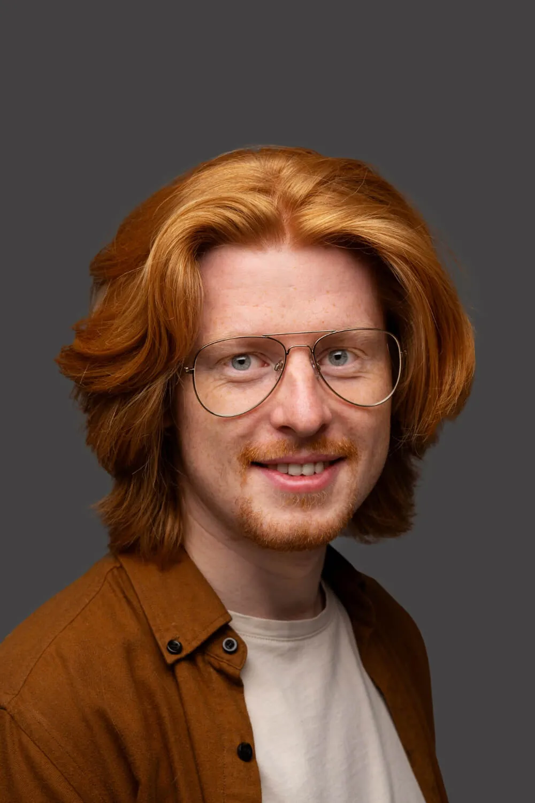
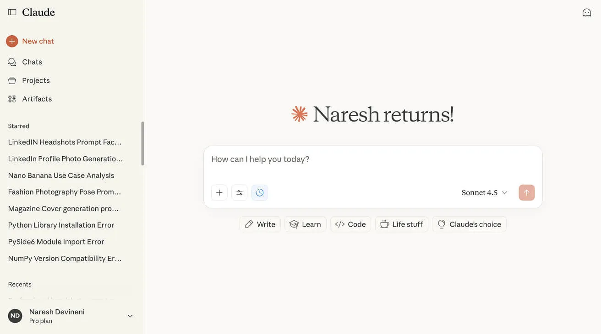
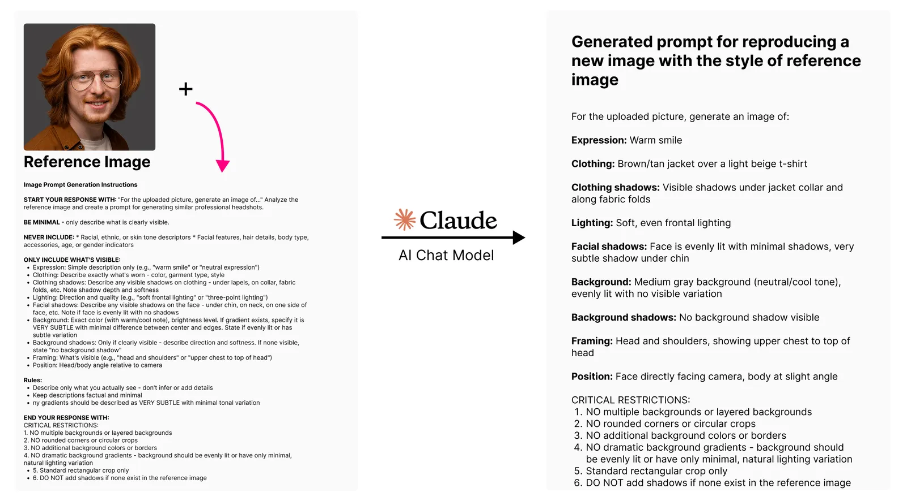
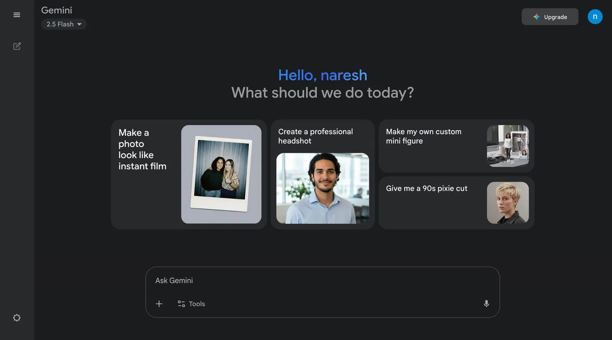
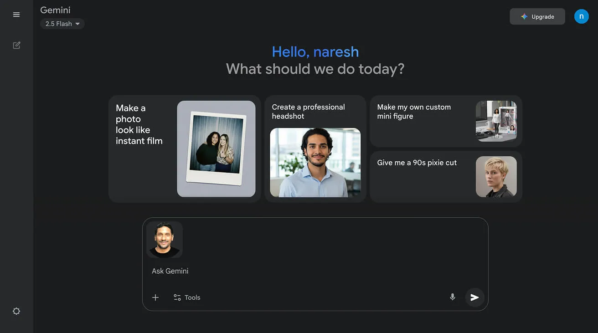
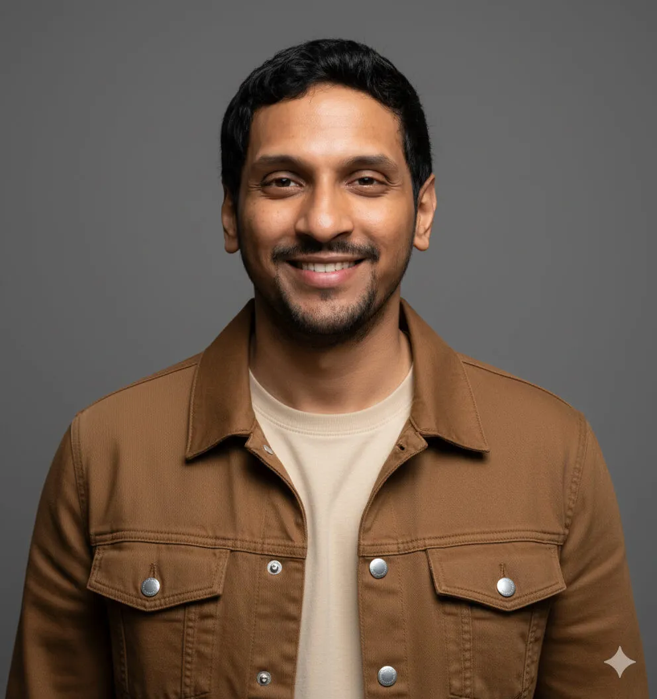
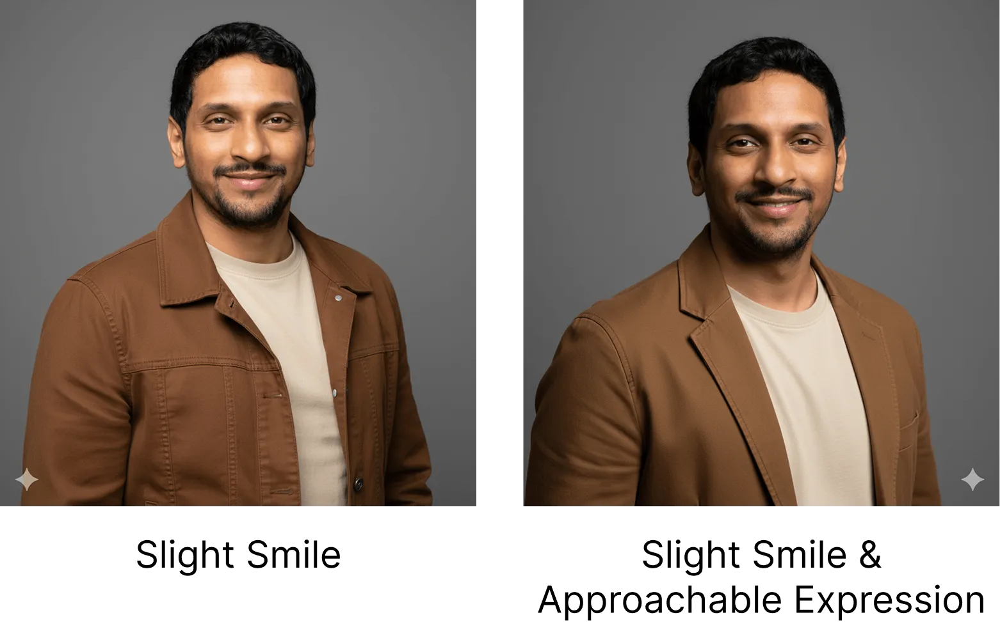
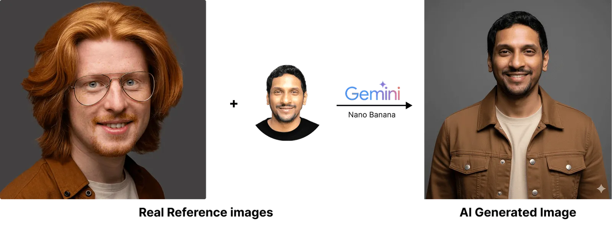

Nano Banana, an AI tool that can be easily accessed from the chat box of [Google Gemini](https://gemini.google.com/) or [Google AI Studio](https://aistudio.google.com/), is great at generating professional headshots for LinkedIn.

For example, here is my original headshot that I have been using for the past year. Notice that it is very plain and simple. It has a transparent background and a black shirt. You cannot see much of my body.

Inside Nano Banana I have uploaded this photo and then entered the following prompt:

For the uploaded picture, generate an image of:

**Expression:** Warm, genuine smile

**Clothing:** Dark gray textured suit with light blue dress shirt and navy blue tie with small dot pattern

**Clothing shadows:** Visible shadows under suit lapels, along tie, and in jacket fabric folds

**Lighting:** Soft, natural outdoor lighting from front

**Facial shadows:** Face evenly lit with minimal shadows

**Background:** Blurred outdoor corporate/office building environment (bokeh effect) with modern glass windows and architectural elements visible, blue-gray and white tones

**Background shadows:** Background is out of focus, no distinct shadows visible

**Framing:** Head and upper torso to mid-chest level

**Position:** Body angled slightly to left, face turned toward camera at slight angle

**CRITICAL RESTRICTIONS:**

-   NO multiple backgrounds or layered backgrounds
-   NO rounded corners or circular crops
-   NO additional background colors or borders
-   NO dramatic background gradients – background should be evenly lit or have only minimal, natural lighting variation
-   Standard rectangular crop only
-   DO NOT add shadows if none exist in the reference image

And Nano Banana generated the following picture:

The picture is not only professional, but it also looks realistic.

My colleagues couldn’t recognize that it was AI-generated.

That’s why it works perfectly as a profile picture on LinkedIn.

And I know what you might be saying (or thinking) at this point…

> “The photo is great, but the prompt looks too big! … I know the look I want, but I can’t put it into words.”

Yeah! I can understand 🙂

But don’t worry.

You don’t have to be able to write big prompts to generate professional headshots like above.

You can use reference images to generate them.

## Using Reference Images for generating believable LinkedIn Headshots

Reference images help when you can’t explain exactly what you want.

Instead of trying to explain _“I want soft lighting from the front, a navy blazer, and a warm gray background,”_ you can simply show an example of the exact look you’re going for.

Let me show you how you can easily build powerful prompts like the one I shared above.

**Find Your Reference Image**

Look for a professional headshot you like (make sure you’re using it ethically and legally).

**Let AI Describe It**

Upload the reference image to an AI chatbot and ask it to describe the photo.

**Generate Your Headshot**

Take that AI-generated description and provide it to Nano Banana along with your own profile picture. Nano Banana will then create a similar professional headshot using _your_ photo instead.

As a result, you get a headshot with the professional style you wanted, but with your face – no guesswork, no endless trial and error 🙂

Sounds easy?

“Yep!”

Good. Let’s get started!

### Step 1: Find Your Reference Image ethically and legally

Finding the perfect reference image takes some time and effort, but it’s worth it.

But you can find excellent LinkedIn-worthy headshots on free stock photo sites like:

-   [Freepik](https://www.freepik.com/)
-   [Pexels](https://www.pexels.com/)
-   [Unsplash](https://unsplash.com/)

These sites offer professional photos you can legally use as references.

Having said that, please do read and agree with the licensing terms before using any picture.

For the purposes of this lesson, we will go with this [image from Freepik](https://www.freepik.com/free-photo/handsome-sensitive-red-head-man-smiling_29018437.htm):

Once you have your reference image, it’s time to move to the next step.

### Step 2: Upload the reference image and ask an AI model to write a prompt describing the image

Now we need to upload the reference image to an AI chatbot ([Claude](https://claude.ai/), [Gemini](https://gemini.google.com/), or [ChatGPT](https://chatgpt.com/)) and ask it to describe the photo in detail.

I am going with Claude because I noticed it provides better image descriptions. It is a personal preference.

Anyway, once you are inside Claude:

1.  Open a new chat
2.  Upload your reference image
3.  Paste the following detailed prompt instructions

****Image Prompt Generation Instructions****

**START YOUR RESPONSE WITH:** “For the uploaded picture, generate an image of…” Analyze the reference image and create a prompt for generating similar professional headshots.

**BE MINIMAL – only describe what is clearly visible.**

**NEVER INCLUDE:** \* Racial, ethnic, or skin tone descriptors \* Facial features, hair details, body type, accessories, age, or gender indicators

**ONLY INCLUDE WHAT’S VISIBLE:**

-   **Expression:** Simple description only (e.g., “warm smile” or “neutral expression”)
-   **Clothing:** Describe exactly what’s worn – color, garment type, style
-   **Clothing shadows:** Describe any visible shadows on clothing – under lapels, on collar, fabric folds, etc. Note shadow depth and softness
-   **Lighting:** Direction and quality (e.g., “soft frontal lighting” or “three-point lighting”)
-   **Facial shadows:** Describe any visible shadows on the face – under chin, on neck, on one side of face, etc. Note if face is evenly lit with no shadows
-   **Background:** Exact color (with warm/cool note), brightness level. If gradient exists, specify it is VERY SUBTLE with minimal difference between center and edges. State if evenly lit or has subtle variation
-   **Background shadows:** Only if clearly visible – describe direction and softness. If none visible, state “no background shadow”
-   **Framing:** What’s visible (e.g., “head and shoulders” or “upper chest to top of head”)
-   **Position:** Head/body angle relative to camera

**Rules:**

-   1\. Describe only what you actually see – don’t infer or add details
-   2\. Keep descriptions factual and minimal
-   3\. Any gradients should be described as VERY SUBTLE with minimal tonal variation

**END YOUR RESPONSE WITH:**

-   CRITICAL RESTRICTIONS:
-   1\. NO multiple backgrounds or layered backgrounds
-   2\. NO rounded corners or circular crops
-   3\. NO additional background colors or borders
-   4\. NO dramatic background gradients – background should be evenly lit or have only minimal, natural lighting variation
-   5\. Standard rectangular crop only
-   6\. DO NOT add shadows if none exist in the reference image

This prompt teaches the AI chatbot exactly how to describe a reference photo.

So, I want you to take some time to read it and understand it carefully.

I spent about 30 minutes writing and improving this prompt with Claude’s help. The effort was worth it because:

-   **It works for anyone** – It doesn’t mention skin color, gender, or personal identity
-   **It keeps faces separate** – It won’t mix the reference person’s appearance with yours
-   **It focuses on what really matters** – Things like facial expression, what you’re wearing, photo angle, lighting, and background
-   **Clear and concise instructions get better results** – When the instructions are specific with no fluff, any AI chatbot will create better image descriptions

> **Long story short:**
> 
> This prompt is designed to work equally well for everyone.

Anyway, when I uploaded the reference image with the above prompt, Claude described the photo in the following way:

For the uploaded picture, generate an image of:

**Expression:** Warm smile

**Clothing:** Brown/tan jacket over a light beige t-shirt

**Clothing shadows:** Visible shadows under jacket collar and along fabric folds

**Lighting:** Soft, even frontal lighting

**Facial shadows:** Face is evenly lit with minimal shadows, very subtle shadow under chin

**Background:** Medium gray background (neutral/cool tone), evenly lit with no visible variation

**Background shadows:** No background shadow visible

**Framing:** Head and shoulders, showing upper chest to top of head

**Position:** Face directly facing camera, body at slight angle

**CRITICAL RESTRICTIONS:**

1.  NO multiple backgrounds or layered backgrounds
2.  NO rounded corners or circular crops
3.  NO additional background colors or borders
4.  NO dramatic background gradients – background should be evenly lit or have only minimal, natural lighting variation
5.  Standard rectangular crop only
6.  DO NOT add shadows if none exist in the reference image

As you can see, This description captures all the important details I wanted from the reference image.

It’s far more descriptive than I could ever describe the image myself.

Just to recap, we’ve used a reference image to get a description of it, and it will help Nano Banana to recreate the same professional style with your photo.

Anyway, now comes the final step.

### Step 3: Use the new prompt in Nano Banana (conditions apply)

Nano Banana can be easily accessed from the chat box of [Google Gemini](https://gemini.google.com/) or [Google AI Studio](https://aistudio.google.com/).

So, open up a new chat in Google Gemini:

Next, find a clear photo of yourself where your face is fully visible and upload it to the chat box:

For example, I used this photo where my facial features were clearly visible:

Finally, copy the entire reference photo description that AI Model created in Step 2 and paste it into Gemini.

In my case, that was the prompt shown above with the brown/tan jacket, warm smile, etc.

For the uploaded picture, generate an image of:

**Expression:** Warm smile

**Clothing:** Brown/tan jacket over a light beige t-shirt

**Clothing shadows:** Visible shadows under jacket collar and along fabric folds

**Lighting:** Soft, even frontal lighting

**Facial shadows:** Face is evenly lit with minimal shadows, very subtle shadow under chin

**Background:** Medium gray background (neutral/cool tone), evenly lit with no visible variation

**Background shadows:** No background shadow visible

**Framing:** Head and shoulders, showing upper chest to top of head

**Position:** Face directly facing camera, body at slight angle

**CRITICAL RESTRICTIONS:**

1.  NO multiple backgrounds or layered backgrounds
2.  NO rounded corners or circular crops
3.  NO additional background colors or borders
4.  NO dramatic background gradients – background should be evenly lit or have only minimal, natural lighting variation
5.  Standard rectangular crop only
6.  DO NOT add shadows if none exist in the reference image

And here is the result Nano Banana generated:

Come on, let’s quickly analyze this result:

1.  The style is not identical to the reference, but the prompt captured the **most** important details
2.  Nano Banana added a smile with clean teeth while keeping my facial features and personality intact.
3.  The background, lighting, and framing matched the description

In short, Nano Banana can keep ****you as you****, while changing everything else to make you look ****great****. 😜

## Fine-Tuning Your Results

Not happy with certain aspects? You can adjust the prompt!

For example, I am not happy with the big smile.

So, I will adjust the expression part of the prompt to say:

1.  “Slight smile”
2.  Or something like “Slight smile and approachable expression”

Play around with the above expression descriptors and finalize the picture you like.

You can also modify other descriptors like:

1.  **Clothing details** (different colors, styles)
2.  **Background color** (warmer, cooler, lighter, darker)
3.  **Lighting** (softer, more directional)
4.  **Framing** (closer, further away)

Play around with these descriptors until you get a result you love!

### Quick Visual Summary

And officially, we now live in a world where AI-generated images can be ****hard to tell**** from studio photos.

This is ****powerful.**** Please use it ****for good****. To help with ethical considerations of using AI for your professional LinkedIn headshots, I’ve created a quick guide below:

## Professional Headshot Ethics

**Before using AI headshots professionally:**

-   Check your company/industry policies on AI-generated professional photos
-   Consider whether authenticity expectations in your field make AI photos inappropriate
-   Always disclose when asked directly about your photos
-   Understand that some professional contexts require genuine photographs

**Platform Policies:**

-   LinkedIn: Check current terms regarding AI-generated profile photos
-   Other platforms may have specific disclosure requirements
-   Policies change frequently – verify current rules

**When to Use Human Photographers:**

-   Legal or medical professionals where authenticity is crucial
-   Executive positions requiring board approval
-   Situations where trust and authenticity are paramount
-   When budget allows supporting human creative professionals

And that’s it!

If you enjoyed this tutorial, be sure to check out my next article, **[15 Ready-to-Use Nano Banana Prompts for Realistic LinkedIn Headshots](https://gbti.network/ai/15-nano-bana-prompts-for-generating-linkedin-headshots/),** to see how I take this prompt generation strategy to the next level.

Also, be sure to check out my [**Nano Banana Master Class course**](https://gbti.network/courses/nano-banana-master-class), where I provide even more tips and tricks on working with AI prompts. I am also available for hire at [Codeable.io](https://gbti.network/codeable/naresh-devineni).

We hope you enjoyed this article by **Naresh Devineni**, GBTI Member.

WordPress expert who loves to write helpful articles.

-   [GitHub](https://github.com/nareshdevineni)
